# System Design Document (SDD)
## NIMR Intranet Management System

**Document Version**: 1.0.0  
**Date**: January 2025  
**Project**: NIMR Intranet Management System  
**Organization**: National Institute for Medical Research (NIMR)  
**Classification**: Internal Use Only

---

## Document Control

| **Field** | **Details** |
|-----------|-------------|
| **Document Title** | System Design Document - NIMR Intranet Management System |
| **Document ID** | SDD-NIMR-2025-001 |
| **Version** | 1.0.0 |
| **Date Created** | January 2025 |
| **Last Modified** | January 2025 |
| **Author(s)** | NIMR IT Development Team, System Architect |
| **Reviewer(s)** | Senior Developer, IT Director |
| **Approver** | IT Director |
| **Distribution** | Development Team, IT Management, System Administrators |

---

## Table of Contents

1. [Introduction](#1-introduction)
2. [System Architecture Overview](#2-system-architecture-overview)
3. [Technology Stack and Rationale](#3-technology-stack-and-rationale)
4. [Database Design](#4-database-design)
5. [Application Architecture](#5-application-architecture)
6. [Security Architecture](#6-security-architecture)
7. [User Interface Design](#7-user-interface-design)
8. [API Design and Integration](#8-api-design-and-integration)
9. [Data Flow and Process Design](#9-data-flow-and-process-design)
10. [Deployment Architecture](#10-deployment-architecture)
11. [Performance and Scalability Design](#11-performance-and-scalability-design)
12. [Design Patterns and Best Practices](#12-design-patterns-and-best-practices)

---

## 1. Introduction

### 1.1 Purpose

This System Design Document (SDD) provides a comprehensive technical design for the NIMR Intranet Management System. It serves as the primary reference for developers, system architects, and technical stakeholders involved in system implementation, maintenance, and evolution.

### 1.2 Scope

This document covers the complete technical design of the NIMR Intranet system, including:

- **System Architecture**: Overall system structure and component relationships
- **Database Design**: Data models, relationships, and storage strategies
- **Application Design**: Software architecture, patterns, and implementation approach
- **Security Design**: Security mechanisms, authentication, and data protection
- **Integration Design**: External system interfaces and API specifications
- **Deployment Design**: Infrastructure requirements and deployment strategies

### 1.3 Design Principles

The system design is guided by the following principles:

#### 1.3.1 Core Design Principles

**Modularity and Separation of Concerns**
- Clear separation between presentation, business logic, and data layers
- Modular component design for maintainability and reusability
- Loose coupling between system components

**Scalability and Performance**
- Horizontal and vertical scaling capabilities
- Efficient database design and query optimization
- Caching strategies for improved performance

**Security by Design**
- Security considerations integrated throughout the design
- Defense in depth approach with multiple security layers
- Principle of least privilege for access control

**Maintainability and Extensibility**
- Clean, well-documented code architecture
- Standardized coding practices and conventions
- Extensible design for future enhancements

#### 1.3.2 Quality Attributes

**Reliability**: System designed for 99.5% uptime with graceful failure handling
**Usability**: Intuitive user interface with responsive design
**Performance**: Sub-3-second response times for 95% of operations
**Security**: Multi-layer security with comprehensive access controls
**Maintainability**: Modular design with comprehensive documentation

### 1.4 Design Constraints

#### 1.4.1 Technical Constraints

- **Framework**: Must use Laravel 11.x framework
- **Database**: MySQL 8.0+ for data persistence
- **Server Environment**: Linux-based server infrastructure
- **Browser Support**: Modern browsers only (Chrome, Firefox, Safari, Edge)

#### 1.4.2 Business Constraints

- **Budget**: Limited budget requiring cost-effective solutions
- **Timeline**: 6-month development and deployment timeline
- **Resources**: Internal development team with limited external resources
- **Compliance**: Must meet organizational security and audit requirements

---

## 2. System Architecture Overview

### 2.1 High-Level Architecture

The NIMR Intranet system follows a three-tier web application architecture with clear separation of concerns:

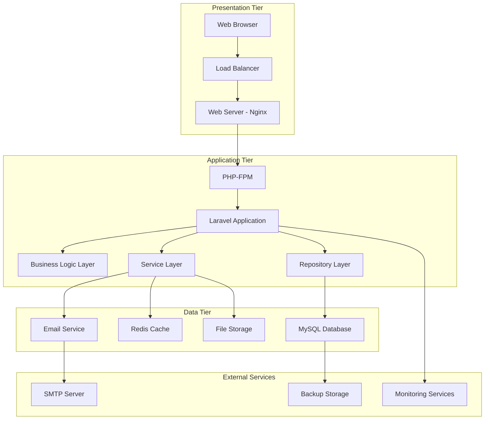

### 2.2 Component Architecture

#### 2.2.1 Core Components

**Web Server Layer**
- **Nginx**: Primary web server for HTTP request handling
- **SSL Termination**: HTTPS encryption and certificate management
- **Static Asset Serving**: Efficient delivery of CSS, JS, and image files
- **Request Routing**: Route requests to appropriate application instances

**Application Layer**
- **Laravel Framework**: Core application framework providing MVC structure
- **PHP-FPM**: FastCGI Process Manager for PHP execution
- **Middleware Stack**: Request/response processing pipeline
- **Service Container**: Dependency injection and service management

**Data Layer**
- **MySQL Database**: Primary data storage with ACID compliance
- **Redis Cache**: Session storage and application caching
- **File System**: Document and attachment storage
- **Queue System**: Asynchronous job processing

#### 2.2.2 Supporting Components

**Authentication & Authorization**
- **Laravel Auth**: Built-in authentication system
- **Role-Based Access Control**: Hierarchical permission system
- **Session Management**: Secure session handling with Redis

**Communication Services**
- **Email Service**: SMTP-based email notifications
- **Real-time Messaging**: WebSocket-based messaging system
- **Push Notifications**: Browser-based notification system

**Monitoring & Logging**
- **Application Logging**: Comprehensive application event logging
- **Performance Monitoring**: Response time and resource usage tracking
- **Error Tracking**: Exception monitoring and alerting

### 2.3 System Context Diagram

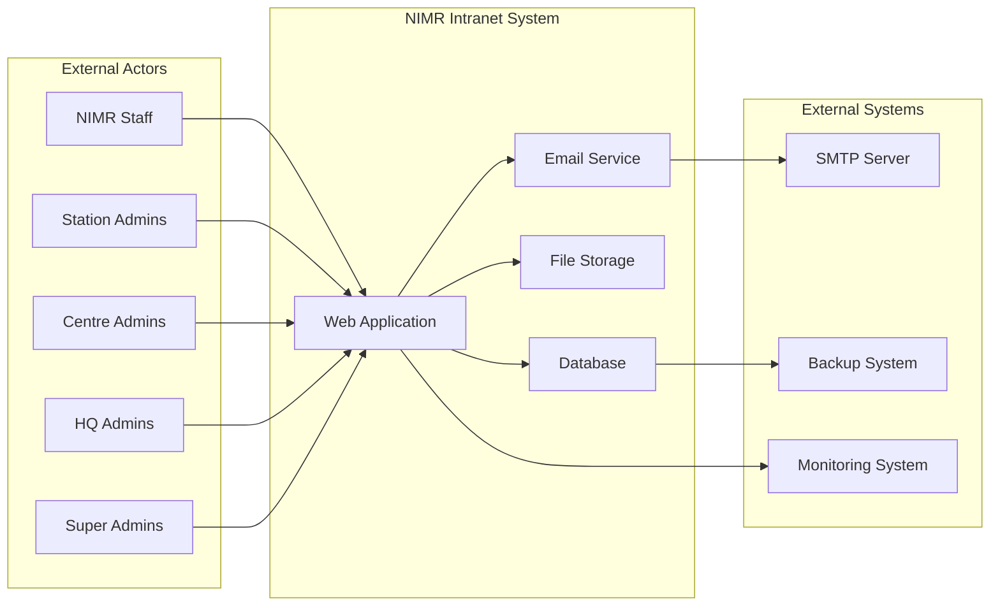

### 2.4 Deployment View

The system is designed for flexible deployment across different environments:

#### 2.4.1 Single Server Deployment (Initial)

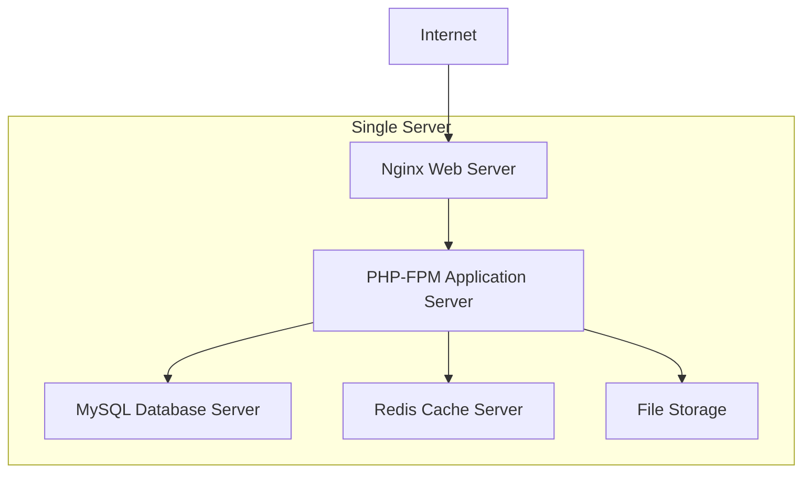

#### 2.4.2 Scalable Deployment (Future)

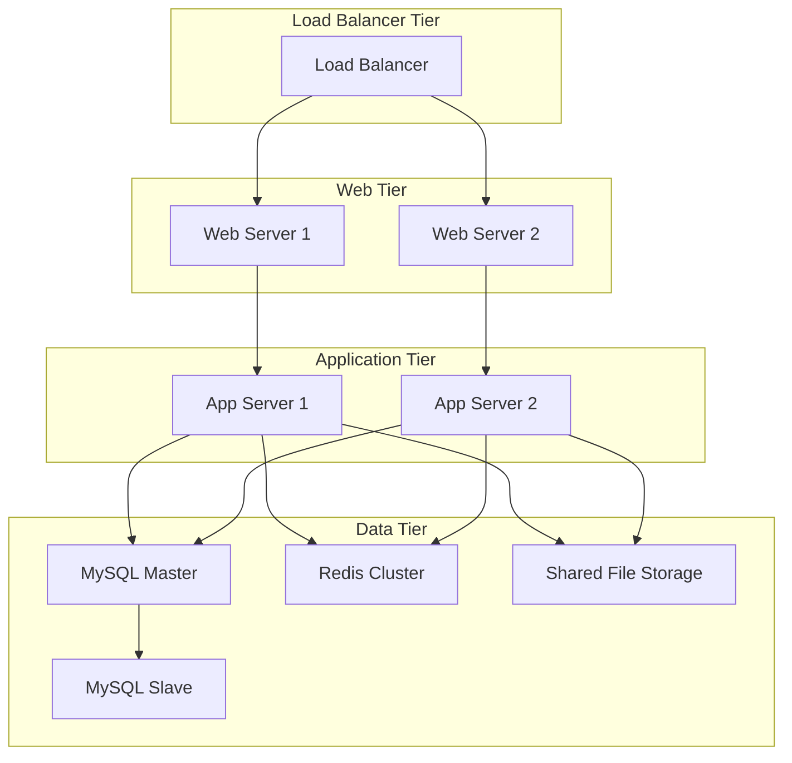

---

## 3. Technology Stack and Rationale

### 3.1 Backend Technologies

#### 3.1.1 Core Framework

**Laravel 11.x Framework**
- **Rationale**: 
  - Mature, well-documented PHP framework
  - Built-in security features and best practices
  - Extensive ecosystem and community support
  - Rapid development capabilities with Artisan CLI
  - Excellent ORM (Eloquent) for database operations
- **Key Features Used**:
  - MVC architecture pattern
  - Eloquent ORM for database interactions
  - Blade templating engine
  - Built-in authentication and authorization
  - Queue system for background jobs
  - Caching mechanisms
  - Event system for decoupled architecture

**PHP 8.2+**
- **Rationale**:
  - Latest stable PHP version with performance improvements
  - Enhanced type system and error handling
  - Improved security features
  - Better memory management and performance
- **Key Features Used**:
  - Strong typing for better code quality
  - Improved error handling and debugging
  - Performance optimizations
  - Security enhancements

#### 3.1.2 Database Technology

**MySQL 8.0+**
- **Rationale**:
  - Proven reliability and performance
  - ACID compliance for data integrity
  - Excellent Laravel integration
  - Cost-effective solution
  - Strong community and enterprise support
- **Key Features Used**:
  - InnoDB storage engine for ACID compliance
  - Full-text search capabilities
  - JSON data type for flexible data storage
  - Advanced indexing and query optimization
  - Replication support for scalability

**Redis**
- **Rationale**:
  - High-performance in-memory data store
  - Excellent for caching and session storage
  - Built-in Laravel support
  - Pub/Sub capabilities for real-time features
- **Use Cases**:
  - Session storage
  - Application caching
  - Queue backend
  - Real-time messaging support

### 3.2 Frontend Technologies

#### 3.2.1 User Interface Framework

**Tailwind CSS**
- **Rationale**:
  - Utility-first CSS framework for rapid development
  - Highly customizable and maintainable
  - Excellent responsive design capabilities
  - Small production bundle size
  - Great developer experience
- **Key Features Used**:
  - Responsive design utilities
  - Component-based styling
  - Dark mode support
  - Custom design system integration

**Alpine.js**
- **Rationale**:
  - Lightweight JavaScript framework
  - Excellent integration with server-side rendering
  - Minimal learning curve
  - Perfect for progressive enhancement
- **Use Cases**:
  - Interactive UI components
  - Form validation and enhancement
  - Modal dialogs and dropdowns
  - Real-time updates

#### 3.2.2 Build Tools

**Vite**
- **Rationale**:
  - Fast build tool with hot module replacement
  - Excellent Laravel integration (Laravel Vite)
  - Modern JavaScript and CSS processing
  - Optimized production builds
- **Features Used**:
  - Asset compilation and optimization
  - Hot module replacement for development
  - CSS and JavaScript bundling
  - Image optimization

### 3.3 Infrastructure Technologies

#### 3.3.1 Web Server

**Nginx**
- **Rationale**:
  - High-performance web server
  - Excellent reverse proxy capabilities
  - Efficient static file serving
  - SSL/TLS termination
  - Load balancing capabilities
- **Configuration Features**:
  - PHP-FPM integration
  - SSL certificate management
  - Gzip compression
  - Security headers
  - Rate limiting

#### 3.3.2 Process Management

**PHP-FPM (FastCGI Process Manager)**
- **Rationale**:
  - Efficient PHP process management
  - Better resource utilization
  - Process isolation and stability
  - Performance monitoring capabilities
- **Configuration**:
  - Process pool management
  - Resource limits and monitoring
  - Graceful process recycling
  - Performance optimization

### 3.4 Development and Deployment Tools

#### 3.4.1 Development Tools

**Composer**
- **Purpose**: PHP dependency management
- **Features**: Autoloading, package management, script automation

**NPM/Node.js**
- **Purpose**: Frontend dependency management and build tools
- **Features**: Package management, script running, build automation

**Git**
- **Purpose**: Version control and collaboration
- **Features**: Distributed version control, branching, collaboration

#### 3.4.2 Quality Assurance Tools

**PHPUnit**
- **Purpose**: Unit and integration testing
- **Features**: Test automation, code coverage, mocking

**Laravel Dusk**
- **Purpose**: Browser automation testing
- **Features**: End-to-end testing, JavaScript testing

**PHP CodeSniffer**
- **Purpose**: Code quality and standards enforcement
- **Features**: Coding standard validation, automated fixing

### 3.5 Technology Decision Matrix

| **Category** | **Technology** | **Alternatives Considered** | **Decision Rationale** |
|--------------|----------------|----------------------------|------------------------|
| **Backend Framework** | Laravel 11.x | Symfony, CodeIgniter | Rapid development, security features, ecosystem |
| **Database** | MySQL 8.0+ | PostgreSQL, MariaDB | Proven reliability, Laravel integration, cost |
| **Caching** | Redis | Memcached, File Cache | Performance, Laravel integration, features |
| **Frontend CSS** | Tailwind CSS | Bootstrap, Bulma | Utility-first approach, customization, performance |
| **JavaScript** | Alpine.js | Vue.js, React | Lightweight, server-side integration, simplicity |
| **Web Server** | Nginx | Apache | Performance, reverse proxy, modern features |
| **Build Tool** | Vite | Webpack, Mix | Speed, modern features, Laravel integration |

---

## 4. Database Design

### 4.1 Database Architecture

#### 4.1.1 Database Schema Overview

The database design follows a normalized approach with clear entity relationships supporting the organizational hierarchy and system functionality.

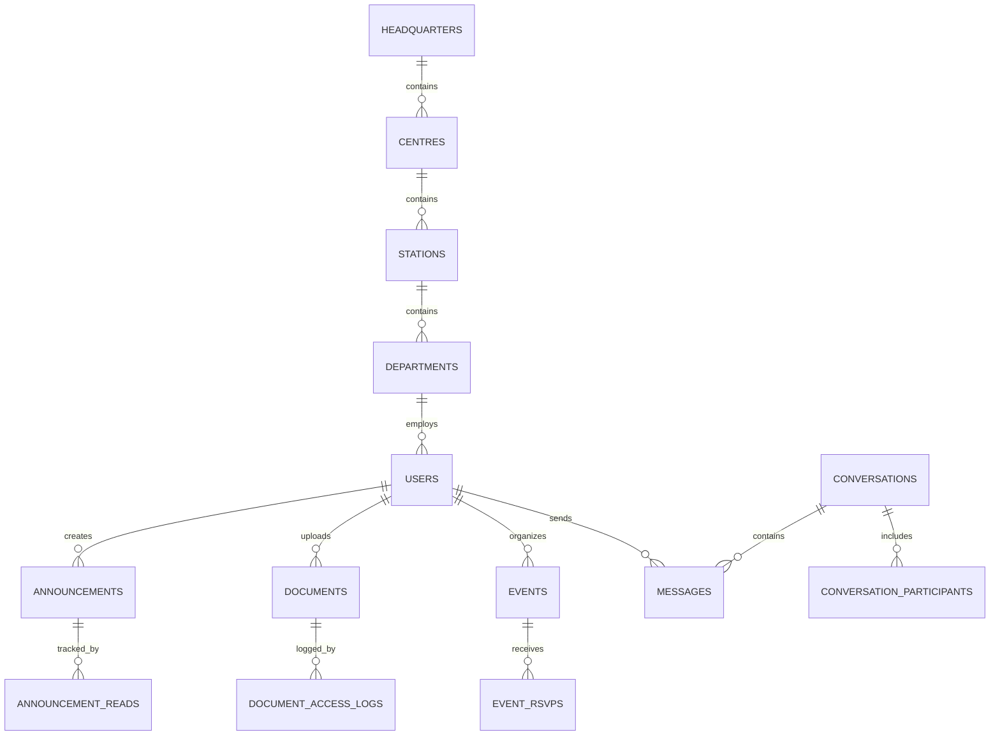

#### 4.1.2 Core Entity Relationships

**Organizational Hierarchy**
- Headquarters (1) → Centres (Many)
- Centres (1) → Stations (Many)  
- Stations (1) → Departments (Many)
- Departments (1) → Users (Many)

**Content Relationships**
- Users (1) → Announcements (Many) [Creator]
- Users (1) → Documents (Many) [Uploader]
- Users (1) → Events (Many) [Organizer]
- Users (Many) → Announcements (Many) [Readers - Many-to-Many]

**Communication Relationships**
- Conversations (1) → Messages (Many)
- Conversations (Many) → Users (Many) [Participants - Many-to-Many]
- Users (1) → Messages (Many) [Sender]

### 4.2 Core Entity Design

#### 4.2.1 User Management Entities

**Users Table**
```sql
CREATE TABLE users (
    id BIGINT UNSIGNED AUTO_INCREMENT PRIMARY KEY,
    name VARCHAR(255) NOT NULL,
    email VARCHAR(255) UNIQUE NOT NULL,
    email_verified_at TIMESTAMP NULL,
    password VARCHAR(255) NOT NULL,
    role ENUM('staff', 'station_admin', 'centre_admin', 'hq_admin', 'super_admin') NOT NULL DEFAULT 'staff',
    
    -- Organizational Assignment
    headquarters_id BIGINT UNSIGNED NULL,
    centre_id BIGINT UNSIGNED NULL,
    station_id BIGINT UNSIGNED NULL,
    department_id BIGINT UNSIGNED NULL,
    
    -- Profile Information
    phone VARCHAR(20) NULL,
    employee_id VARCHAR(50) NULL,
    birth_date DATE NULL,
    birthday_visibility ENUM('everyone', 'department', 'station', 'private') DEFAULT 'department',
    hire_date DATE NULL,
    show_work_anniversary BOOLEAN DEFAULT TRUE,
    
    -- System Fields
    last_activity TIMESTAMP NULL,
    remember_token VARCHAR(100) NULL,
    created_at TIMESTAMP DEFAULT CURRENT_TIMESTAMP,
    updated_at TIMESTAMP DEFAULT CURRENT_TIMESTAMP ON UPDATE CURRENT_TIMESTAMP,
    
    -- Foreign Key Constraints
    FOREIGN KEY (headquarters_id) REFERENCES headquarters(id) ON DELETE SET NULL,
    FOREIGN KEY (centre_id) REFERENCES centres(id) ON DELETE SET NULL,
    FOREIGN KEY (station_id) REFERENCES stations(id) ON DELETE SET NULL,
    FOREIGN KEY (department_id) REFERENCES departments(id) ON DELETE SET NULL,
    
    -- Indexes
    INDEX idx_email (email),
    INDEX idx_role (role),
    INDEX idx_organizational (centre_id, station_id, department_id),
    INDEX idx_birth_date (birth_date),
    INDEX idx_hire_date (hire_date)
);
```

**Organizational Hierarchy Tables**
```sql
-- Headquarters Table
CREATE TABLE headquarters (
    id BIGINT UNSIGNED AUTO_INCREMENT PRIMARY KEY,
    name VARCHAR(255) NOT NULL,
    code VARCHAR(10) UNIQUE NOT NULL,
    description TEXT NULL,
    location VARCHAR(255) NULL,
    contact_email VARCHAR(255) NULL,
    contact_phone VARCHAR(20) NULL,
    is_active BOOLEAN DEFAULT TRUE,
    created_at TIMESTAMP DEFAULT CURRENT_TIMESTAMP,
    updated_at TIMESTAMP DEFAULT CURRENT_TIMESTAMP ON UPDATE CURRENT_TIMESTAMP
);

-- Centres Table
CREATE TABLE centres (
    id BIGINT UNSIGNED AUTO_INCREMENT PRIMARY KEY,
    name VARCHAR(255) NOT NULL,
    code VARCHAR(10) UNIQUE NOT NULL,
    description TEXT NULL,
    location VARCHAR(255) NULL,
    headquarters_id BIGINT UNSIGNED NOT NULL,
    is_active BOOLEAN DEFAULT TRUE,
    created_at TIMESTAMP DEFAULT CURRENT_TIMESTAMP,
    updated_at TIMESTAMP DEFAULT CURRENT_TIMESTAMP ON UPDATE CURRENT_TIMESTAMP,
    
    FOREIGN KEY (headquarters_id) REFERENCES headquarters(id) ON DELETE CASCADE,
    INDEX idx_headquarters (headquarters_id)
);

-- Stations Table
CREATE TABLE stations (
    id BIGINT UNSIGNED AUTO_INCREMENT PRIMARY KEY,
    name VARCHAR(255) NOT NULL,
    code VARCHAR(10) UNIQUE NOT NULL,
    description TEXT NULL,
    location VARCHAR(255) NULL,
    centre_id BIGINT UNSIGNED NOT NULL,
    is_active BOOLEAN DEFAULT TRUE,
    created_at TIMESTAMP DEFAULT CURRENT_TIMESTAMP,
    updated_at TIMESTAMP DEFAULT CURRENT_TIMESTAMP ON UPDATE CURRENT_TIMESTAMP,
    
    FOREIGN KEY (centre_id) REFERENCES centres(id) ON DELETE CASCADE,
    INDEX idx_centre (centre_id)
);

-- Departments Table
CREATE TABLE departments (
    id BIGINT UNSIGNED AUTO_INCREMENT PRIMARY KEY,
    name VARCHAR(255) NOT NULL,
    code VARCHAR(10) UNIQUE NOT NULL,
    description TEXT NULL,
    station_id BIGINT UNSIGNED NOT NULL,
    is_active BOOLEAN DEFAULT TRUE,
    created_at TIMESTAMP DEFAULT CURRENT_TIMESTAMP,
    updated_at TIMESTAMP DEFAULT CURRENT_TIMESTAMP ON UPDATE CURRENT_TIMESTAMP,
    
    FOREIGN KEY (station_id) REFERENCES stations(id) ON DELETE CASCADE,
    INDEX idx_station (station_id)
);
```

#### 4.2.2 Content Management Entities

**Announcements Table**
```sql
CREATE TABLE announcements (
    id BIGINT UNSIGNED AUTO_INCREMENT PRIMARY KEY,
    title VARCHAR(500) NOT NULL,
    content LONGTEXT NOT NULL,
    category ENUM('general', 'hr', 'it', 'research', 'training', 'events') DEFAULT 'general',
    priority ENUM('low', 'medium', 'high') DEFAULT 'medium',
    status ENUM('draft', 'published', 'archived') DEFAULT 'draft',
    
    -- Targeting
    target_scope ENUM('all', 'headquarters', 'centre', 'station', 'department') DEFAULT 'all',
    target_centres JSON NULL,
    target_stations JSON NULL,
    target_departments JSON NULL,
    
    -- Publishing
    created_by BIGINT UNSIGNED NOT NULL,
    published_at TIMESTAMP NULL,
    expires_at TIMESTAMP NULL,
    is_published BOOLEAN DEFAULT FALSE,
    email_notification BOOLEAN DEFAULT FALSE,
    
    -- Analytics
    views_count INT UNSIGNED DEFAULT 0,
    
    created_at TIMESTAMP DEFAULT CURRENT_TIMESTAMP,
    updated_at TIMESTAMP DEFAULT CURRENT_TIMESTAMP ON UPDATE CURRENT_TIMESTAMP,
    
    FOREIGN KEY (created_by) REFERENCES users(id) ON DELETE CASCADE,
    
    -- Indexes
    INDEX idx_creator (created_by),
    INDEX idx_status_published (status, is_published),
    INDEX idx_published_at (published_at),
    INDEX idx_expires_at (expires_at),
    INDEX idx_category (category),
    INDEX idx_priority (priority),
    FULLTEXT idx_content (title, content)
);

-- Announcement Reads Tracking
CREATE TABLE announcement_reads (
    id BIGINT UNSIGNED AUTO_INCREMENT PRIMARY KEY,
    announcement_id BIGINT UNSIGNED NOT NULL,
    user_id BIGINT UNSIGNED NOT NULL,
    read_at TIMESTAMP DEFAULT CURRENT_TIMESTAMP,
    
    FOREIGN KEY (announcement_id) REFERENCES announcements(id) ON DELETE CASCADE,
    FOREIGN KEY (user_id) REFERENCES users(id) ON DELETE CASCADE,
    
    UNIQUE KEY unique_read (announcement_id, user_id),
    INDEX idx_user_reads (user_id, read_at)
);
```

**Documents Table**
```sql
CREATE TABLE documents (
    id BIGINT UNSIGNED AUTO_INCREMENT PRIMARY KEY,
    title VARCHAR(500) NOT NULL,
    description TEXT NULL,
    
    -- File Information
    file_name VARCHAR(255) NOT NULL,
    original_name VARCHAR(255) NOT NULL,
    file_path VARCHAR(1000) NOT NULL,
    mime_type VARCHAR(100) NOT NULL,
    file_size BIGINT UNSIGNED NOT NULL,
    
    -- Version Control
    version VARCHAR(20) DEFAULT '1.0',
    parent_document_id BIGINT UNSIGNED NULL,
    
    -- Access Control
    visibility_scope ENUM('all', 'headquarters', 'centre', 'station', 'department') DEFAULT 'all',
    target_centres JSON NULL,
    target_stations JSON NULL,
    target_departments JSON NULL,
    
    -- Categorization
    category ENUM('hr', 'it', 'research', 'finance', 'administration', 'training') NOT NULL,
    tags JSON NULL,
    access_level ENUM('public', 'internal', 'restricted', 'confidential') DEFAULT 'internal',
    requires_download_permission BOOLEAN DEFAULT FALSE,
    
    -- Metadata
    uploaded_by BIGINT UNSIGNED NOT NULL,
    last_accessed_at TIMESTAMP NULL,
    download_count INT UNSIGNED DEFAULT 0,
    is_active BOOLEAN DEFAULT TRUE,
    expires_at TIMESTAMP NULL,
    
    created_at TIMESTAMP DEFAULT CURRENT_TIMESTAMP,
    updated_at TIMESTAMP DEFAULT CURRENT_TIMESTAMP ON UPDATE CURRENT_TIMESTAMP,
    
    FOREIGN KEY (uploaded_by) REFERENCES users(id) ON DELETE CASCADE,
    FOREIGN KEY (parent_document_id) REFERENCES documents(id) ON DELETE SET NULL,
    
    -- Indexes
    INDEX idx_uploader (uploaded_by),
    INDEX idx_category (category),
    INDEX idx_access_level (access_level),
    INDEX idx_active_expires (is_active, expires_at),
    INDEX idx_parent_document (parent_document_id),
    FULLTEXT idx_searchable (title, description)
);
```

#### 4.2.3 Communication Entities

**Conversations and Messages**
```sql
-- Conversations Table
CREATE TABLE conversations (
    id BIGINT UNSIGNED AUTO_INCREMENT PRIMARY KEY,
    title VARCHAR(255) NULL,
    type ENUM('direct', 'group') NOT NULL DEFAULT 'direct',
    created_by BIGINT UNSIGNED NOT NULL,
    is_active BOOLEAN DEFAULT TRUE,
    created_at TIMESTAMP DEFAULT CURRENT_TIMESTAMP,
    updated_at TIMESTAMP DEFAULT CURRENT_TIMESTAMP ON UPDATE CURRENT_TIMESTAMP,
    
    FOREIGN KEY (created_by) REFERENCES users(id) ON DELETE CASCADE,
    INDEX idx_creator (created_by),
    INDEX idx_type (type)
);

-- Conversation Participants
CREATE TABLE conversation_participants (
    id BIGINT UNSIGNED AUTO_INCREMENT PRIMARY KEY,
    conversation_id BIGINT UNSIGNED NOT NULL,
    user_id BIGINT UNSIGNED NOT NULL,
    joined_at TIMESTAMP DEFAULT CURRENT_TIMESTAMP,
    last_read_at TIMESTAMP NULL,
    is_active BOOLEAN DEFAULT TRUE,
    
    FOREIGN KEY (conversation_id) REFERENCES conversations(id) ON DELETE CASCADE,
    FOREIGN KEY (user_id) REFERENCES users(id) ON DELETE CASCADE,
    
    UNIQUE KEY unique_participant (conversation_id, user_id),
    INDEX idx_user_conversations (user_id, is_active)
);

-- Messages Table
CREATE TABLE messages (
    id BIGINT UNSIGNED AUTO_INCREMENT PRIMARY KEY,
    conversation_id BIGINT UNSIGNED NOT NULL,
    sender_id BIGINT UNSIGNED NOT NULL,
    body LONGTEXT NOT NULL,
    message_type ENUM('text', 'file', 'system') DEFAULT 'text',
    
    -- Message Features
    is_pinned BOOLEAN DEFAULT FALSE,
    is_voice_message BOOLEAN DEFAULT FALSE,
    reply_to_message_id BIGINT UNSIGNED NULL,
    
    -- Status
    is_edited BOOLEAN DEFAULT FALSE,
    edited_at TIMESTAMP NULL,
    deleted_at TIMESTAMP NULL,
    
    created_at TIMESTAMP DEFAULT CURRENT_TIMESTAMP,
    updated_at TIMESTAMP DEFAULT CURRENT_TIMESTAMP ON UPDATE CURRENT_TIMESTAMP,
    
    FOREIGN KEY (conversation_id) REFERENCES conversations(id) ON DELETE CASCADE,
    FOREIGN KEY (sender_id) REFERENCES users(id) ON DELETE CASCADE,
    FOREIGN KEY (reply_to_message_id) REFERENCES messages(id) ON DELETE SET NULL,
    
    -- Indexes
    INDEX idx_conversation_created (conversation_id, created_at),
    INDEX idx_sender (sender_id),
    INDEX idx_reply_to (reply_to_message_id),
    FULLTEXT idx_message_body (body)
);

-- Message Attachments
CREATE TABLE message_attachments (
    id BIGINT UNSIGNED AUTO_INCREMENT PRIMARY KEY,
    message_id BIGINT UNSIGNED NOT NULL,
    file_name VARCHAR(255) NOT NULL,
    original_name VARCHAR(255) NOT NULL,
    file_path VARCHAR(1000) NOT NULL,
    mime_type VARCHAR(100) NOT NULL,
    file_size BIGINT UNSIGNED NOT NULL,
    created_at TIMESTAMP DEFAULT CURRENT_TIMESTAMP,
    
    FOREIGN KEY (message_id) REFERENCES messages(id) ON DELETE CASCADE,
    INDEX idx_message (message_id)
);

-- Message Reactions
CREATE TABLE message_reactions (
    id BIGINT UNSIGNED AUTO_INCREMENT PRIMARY KEY,
    message_id BIGINT UNSIGNED NOT NULL,
    user_id BIGINT UNSIGNED NOT NULL,
    emoji VARCHAR(10) NOT NULL,
    created_at TIMESTAMP DEFAULT CURRENT_TIMESTAMP,
    
    FOREIGN KEY (message_id) REFERENCES messages(id) ON DELETE CASCADE,
    FOREIGN KEY (user_id) REFERENCES users(id) ON DELETE CASCADE,
    
    UNIQUE KEY unique_user_reaction (message_id, user_id, emoji),
    INDEX idx_message_reactions (message_id)
);
```

### 4.3 Database Optimization Strategy

#### 4.3.1 Indexing Strategy

**Primary Indexes**
- All tables have auto-incrementing primary keys
- Unique constraints on email addresses and organizational codes
- Composite indexes for frequently queried combinations

**Performance Indexes**
```sql
-- User activity and organizational queries
CREATE INDEX idx_users_org_role ON users(centre_id, station_id, role);
CREATE INDEX idx_users_active ON users(last_activity) WHERE last_activity IS NOT NULL;

-- Content discovery and search
CREATE INDEX idx_announcements_active ON announcements(is_published, published_at, expires_at);
CREATE INDEX idx_documents_category_access ON documents(category, access_level, is_active);

-- Message performance
CREATE INDEX idx_messages_conversation_time ON messages(conversation_id, created_at DESC);
CREATE INDEX idx_participants_user_active ON conversation_participants(user_id, is_active);
```

**Full-Text Search Indexes**
```sql
-- Content search capabilities
ALTER TABLE announcements ADD FULLTEXT(title, content);
ALTER TABLE documents ADD FULLTEXT(title, description);
ALTER TABLE messages ADD FULLTEXT(body);
```

#### 4.3.2 Query Optimization

**Eager Loading Strategy**
- Implement eager loading for related models to prevent N+1 queries
- Use Laravel's `with()` method for predictable relationships
- Implement lazy eager loading for conditional relationships

**Pagination and Limiting**
- Implement cursor-based pagination for large datasets
- Use database-level limiting for performance
- Implement efficient counting strategies for pagination

**Caching Strategy**
- Cache frequently accessed organizational hierarchy data
- Implement query result caching for expensive operations
- Use Redis for session and temporary data storage

### 4.4 Data Integrity and Constraints

#### 4.4.1 Referential Integrity

**Foreign Key Constraints**
- All foreign keys properly defined with appropriate cascade actions
- ON DELETE CASCADE for dependent records
- ON DELETE SET NULL for optional relationships

**Data Validation Constraints**
```sql
-- Ensure valid email formats
ALTER TABLE users ADD CONSTRAINT chk_email_format 
CHECK (email REGEXP '^[A-Za-z0-9._%+-]+@[A-Za-z0-9.-]+\.[A-Za-z]{2,}$');

-- Ensure valid organizational hierarchy
ALTER TABLE users ADD CONSTRAINT chk_org_hierarchy
CHECK (
    (headquarters_id IS NOT NULL) OR
    (centre_id IS NOT NULL AND station_id IS NOT NULL) OR
    (department_id IS NOT NULL AND station_id IS NOT NULL AND centre_id IS NOT NULL)
);

-- Ensure file size limits
ALTER TABLE documents ADD CONSTRAINT chk_file_size
CHECK (file_size > 0 AND file_size <= 20971520); -- 20MB limit
```

#### 4.4.2 Data Consistency Rules

**Business Logic Constraints**
- Users must be assigned to appropriate organizational levels
- Document visibility must align with user organizational assignment
- Message participants must be active users
- Event dates must be in the future for new events

**Audit Trail Requirements**
- All critical tables include created_at and updated_at timestamps
- Soft deletes implemented for important records
- Change tracking for sensitive data modifications

---

## 5. Application Architecture

### 5.1 MVC Architecture Implementation

#### 5.1.1 Model Layer Design

The Model layer implements the Active Record pattern through Laravel's Eloquent ORM, providing a rich object-relational mapping with business logic encapsulation.

**Base Model Structure**
```php
<?php
// app/Models/BaseModel.php
abstract class BaseModel extends Model
{
    use HasFactory, SoftDeletes;
    
    protected $guarded = ['id'];
    
    protected $casts = [
        'created_at' => 'datetime',
        'updated_at' => 'datetime',
        'deleted_at' => 'datetime',
    ];
    
    // Global scopes for security
    protected static function booted()
    {
        static::addGlobalScope('active', function (Builder $builder) {
            $builder->where('is_active', true);
        });
    }
    
    // Audit trail functionality
    public function getActivitylogOptions(): LogOptions
    {
        return LogOptions::defaults()
            ->logOnly(['*'])
            ->logOnlyDirty()
            ->dontSubmitEmptyLogs();
    }
}
```

**Core Model Implementations**

*User Model with Organizational Hierarchy*
```php
<?php
// app/Models/User.php
class User extends Authenticatable implements MustVerifyEmail
{
    use HasApiTokens, HasFactory, Notifiable, HasRoles;
    
    protected $fillable = [
        'name', 'email', 'password', 'role',
        'headquarters_id', 'centre_id', 'station_id', 'department_id',
        'phone', 'employee_id', 'birth_date', 'hire_date'
    ];
    
    protected $hidden = ['password', 'remember_token'];
    
    protected $casts = [
        'email_verified_at' => 'datetime',
        'birth_date' => 'date',
        'hire_date' => 'date',
        'last_activity' => 'datetime',
    ];
    
    // Organizational Relationships
    public function headquarters(): BelongsTo
    {
        return $this->belongsTo(Headquarters::class);
    }
    
    public function centre(): BelongsTo
    {
        return $this->belongsTo(Centre::class);
    }
    
    public function station(): BelongsTo
    {
        return $this->belongsTo(Station::class);
    }
    
    public function department(): BelongsTo
    {
        return $this->belongsTo(Department::class);
    }
    
    // Content Relationships
    public function announcements(): HasMany
    {
        return $this->hasMany(Announcement::class, 'created_by');
    }
    
    public function documents(): HasMany
    {
        return $this->hasMany(Document::class, 'uploaded_by');
    }
    
    // Role-based Query Scopes
    public function scopeInOrganization(Builder $query, User $user): Builder
    {
        return match($user->role) {
            'super_admin', 'hq_admin' => $query,
            'centre_admin' => $query->where('centre_id', $user->centre_id),
            'station_admin' => $query->where('station_id', $user->station_id),
            default => $query->where('id', $user->id)
        };
    }
    
    // Business Logic Methods
    public function canManageUser(User $targetUser): bool
    {
        return match($this->role) {
            'super_admin' => true,
            'hq_admin' => !$targetUser->isSuperAdmin(),
            'centre_admin' => $targetUser->centre_id === $this->centre_id && 
                            !in_array($targetUser->role, ['super_admin', 'hq_admin']),
            'station_admin' => $targetUser->station_id === $this->station_id && 
                             $targetUser->role === 'staff',
            default => false
        };
    }
    
    public function getAccessibleContent(): Builder
    {
        return match($this->role) {
            'super_admin', 'hq_admin' => Document::query(),
            'centre_admin' => Document::whereIn('visibility_scope', ['all', 'centre'])
                                    ->where(function($q) {
                                        $q->whereJsonContains('target_centres', $this->centre_id)
                                          ->orWhere('visibility_scope', 'all');
                                    }),
            'station_admin' => Document::whereIn('visibility_scope', ['all', 'centre', 'station'])
                                     ->where(function($q) {
                                         $q->whereJsonContains('target_stations', $this->station_id)
                                           ->orWhereJsonContains('target_centres', $this->centre_id)
                                           ->orWhere('visibility_scope', 'all');
                                     }),
            default => Document::where('visibility_scope', 'all')
        };
    }
}
```

*Document Model with Access Control*
```php
<?php
// app/Models/Document.php
class Document extends BaseModel
{
    protected $fillable = [
        'title', 'description', 'file_name', 'original_name', 'file_path',
        'mime_type', 'file_size', 'category', 'tags', 'visibility_scope',
        'target_centres', 'target_stations', 'access_level', 'uploaded_by'
    ];
    
    protected $casts = [
        'target_centres' => 'array',
        'target_stations' => 'array',
        'tags' => 'array',
        'requires_download_permission' => 'boolean',
        'is_active' => 'boolean',
        'expires_at' => 'datetime',
    ];
    
    // Relationships
    public function uploader(): BelongsTo
    {
        return $this->belongsTo(User::class, 'uploaded_by');
    }
    
    public function versions(): HasMany
    {
        return $this->hasMany(Document::class, 'parent_document_id')
                    ->orderBy('version', 'desc');
    }
    
    // Query Scopes
    public function scopeAccessibleTo(Builder $query, User $user): Builder
    {
        return $query->where(function ($q) use ($user) {
            $q->where('visibility_scope', 'all')
              ->orWhere(function ($subQ) use ($user) {
                  if ($user->centre_id) {
                      $subQ->where('visibility_scope', 'centre')
                           ->whereJsonContains('target_centres', $user->centre_id);
                  }
              })
              ->orWhere(function ($subQ) use ($user) {
                  if ($user->station_id) {
                      $subQ->where('visibility_scope', 'station')
                           ->whereJsonContains('target_stations', $user->station_id);
                  }
              });
        });
    }
    
    public function scopeByCategory(Builder $query, string $category): Builder
    {
        return $query->where('category', $category);
    }
    
    // Business Logic
    public function canBeAccessedBy(User $user): bool
    {
        // Check basic visibility
        if ($this->visibility_scope === 'all') {
            return true;
        }
        
        // Check organizational access
        return match($this->visibility_scope) {
            'centre' => in_array($user->centre_id, $this->target_centres ?? []),
            'station' => in_array($user->station_id, $this->target_stations ?? []),
            'department' => $user->department_id === $this->target_department_id,
            default => false
        };
    }
    
    public function incrementDownloadCount(): void
    {
        $this->increment('download_count');
        $this->update(['last_accessed_at' => now()]);
    }
}
```

#### 5.1.2 Controller Layer Design

Controllers handle HTTP requests and coordinate between models and views, following the Single Responsibility Principle.

**Base Controller Structure**
```php
<?php
// app/Http/Controllers/Controller.php
abstract class Controller extends BaseController
{
    use AuthorizesRequests, ValidatesRequests;
    
    protected function getCurrentUser(): User
    {
        return auth()->user();
    }
    
    protected function authorizeAction(string $ability, $resource = null): void
    {
        $this->authorize($ability, $resource);
    }
    
    protected function validateRequest(Request $request, array $rules): array
    {
        return $request->validate($rules);
    }
    
    protected function respondWithSuccess($data = null, string $message = 'Success'): JsonResponse
    {
        return response()->json([
            'success' => true,
            'message' => $message,
            'data' => $data
        ]);
    }
    
    protected function respondWithError(string $message, int $code = 400): JsonResponse
    {
        return response()->json([
            'success' => false,
            'message' => $message
        ], $code);
    }
}
```

**Resource Controller Implementation**
```php
<?php
// app/Http/Controllers/DocumentController.php
class DocumentController extends Controller
{
    public function __construct(
        private DocumentService $documentService,
        private FileStorageService $fileStorage
    ) {
        $this->middleware('auth');
        $this->middleware('verified');
    }
    
    public function index(Request $request): View
    {
        $this->authorizeAction('viewAny', Document::class);
        
        $filters = $request->only(['category', 'search', 'sort']);
        $documents = $this->documentService->getAccessibleDocuments(
            $this->getCurrentUser(),
            $filters
        );
        
        return view('documents.index', compact('documents', 'filters'));
    }
    
    public function show(Document $document): View
    {
        $this->authorizeAction('view', $document);
        
        $this->documentService->logAccess($document, $this->getCurrentUser());
        
        return view('documents.show', compact('document'));
    }
    
    public function store(StoreDocumentRequest $request): RedirectResponse
    {
        $this->authorizeAction('create', Document::class);
        
        try {
            $document = $this->documentService->createDocument(
                $request->validated(),
                $request->file('document'),
                $this->getCurrentUser()
            );
            
            return redirect()
                ->route('documents.show', $document)
                ->with('success', 'Document uploaded successfully.');
                
        } catch (DocumentUploadException $e) {
            return back()
                ->withInput()
                ->withErrors(['document' => $e->getMessage()]);
        }
    }
    
    public function download(Document $document): StreamedResponse
    {
        $this->authorizeAction('download', $document);
        
        $this->documentService->incrementDownloadCount($document, $this->getCurrentUser());
        
        return $this->fileStorage->downloadFile($document->file_path, $document->original_name);
    }
}
```

#### 5.1.3 View Layer Design

The View layer uses Laravel Blade templates with a component-based approach for reusability and maintainability.

**Layout Structure**
```php
{{-- resources/views/layouts/app.blade.php --}}
<!DOCTYPE html>
<html lang="{{ str_replace('_', '-', app()->getLocale()) }}">
<head>
    <meta charset="utf-8">
    <meta name="viewport" content="width=device-width, initial-scale=1">
    <meta name="csrf-token" content="{{ csrf_token() }}">
    
    <title>{{ config('app.name', 'NIMR Intranet') }} - @yield('title')</title>
    
    @vite(['resources/css/app.css', 'resources/js/app.js'])
    @stack('styles')
</head>
<body class="bg-gray-50 font-sans antialiased">
    <div id="app" class="min-h-screen">
        <!-- Navigation -->
        @include('layouts.navigation')
        
        <!-- Page Header -->
        @hasSection('header')
            <header class="bg-white shadow">
                <div class="max-w-7xl mx-auto py-6 px-4 sm:px-6 lg:px-8">
                    @yield('header')
                </div>
            </header>
        @endif
        
        <!-- Main Content -->
        <main class="py-6">
            @include('components.alerts')
            @yield('content')
        </main>
        
        <!-- Footer -->
        @include('layouts.footer')
    </div>
    
    @stack('scripts')
</body>
</html>
```

**Component-Based Views**
```php
{{-- resources/views/components/document-card.blade.php --}}
@props(['document', 'showActions' => true])

<div class="bg-white rounded-lg shadow-sm border border-gray-200 hover:shadow-md transition-shadow">
    <div class="p-6">
        <div class="flex items-start justify-between">
            <div class="flex-1 min-w-0">
                <h3 class="text-lg font-medium text-gray-900 truncate">
                    <a href="{{ route('documents.show', $document) }}" class="hover:text-blue-600">
                        {{ $document->title }}
                    </a>
                </h3>
                
                @if($document->description)
                    <p class="mt-1 text-sm text-gray-600 line-clamp-2">
                        {{ $document->description }}
                    </p>
                @endif
                
                <div class="mt-2 flex items-center space-x-4 text-sm text-gray-500">
                    <span class="flex items-center">
                        <x-icon name="document" class="w-4 h-4 mr-1" />
                        {{ $document->category }}
                    </span>
                    
                    <span class="flex items-center">
                        <x-icon name="user" class="w-4 h-4 mr-1" />
                        {{ $document->uploader->name }}
                    </span>
                    
                    <span class="flex items-center">
                        <x-icon name="calendar" class="w-4 h-4 mr-1" />
                        {{ $document->created_at->format('M j, Y') }}
                    </span>
                    
                    <span class="flex items-center">
                        <x-icon name="download" class="w-4 h-4 mr-1" />
                        {{ $document->download_count }}
                    </span>
                </div>
            </div>
            
            @if($showActions)
                <div class="ml-4 flex-shrink-0">
                    <x-dropdown>
                        <x-slot name="trigger">
                            <button class="text-gray-400 hover:text-gray-600">
                                <x-icon name="dots-vertical" class="w-5 h-5" />
                            </button>
                        </x-slot>
                        
                        <x-slot name="content">
                            <x-dropdown-link href="{{ route('documents.show', $document) }}">
                                View Details
                            </x-dropdown-link>
                            
                            @can('download', $document)
                                <x-dropdown-link href="{{ route('documents.download', $document) }}">
                                    Download
                                </x-dropdown-link>
                            @endcan
                            
                            @can('update', $document)
                                <x-dropdown-link href="{{ route('documents.edit', $document) }}">
                                    Edit
                                </x-dropdown-link>
                            @endcan
                        </x-slot>
                    </x-dropdown>
                </div>
            @endif
        </div>
        
        @if($document->tags)
            <div class="mt-3 flex flex-wrap gap-1">
                @foreach($document->tags as $tag)
                    <span class="inline-flex items-center px-2 py-1 rounded-full text-xs font-medium bg-blue-100 text-blue-800">
                        {{ $tag }}
                    </span>
                @endforeach
            </div>
        @endif
    </div>
</div>
```

### 5.2 Service Layer Architecture

#### 5.2.1 Service Pattern Implementation

Services encapsulate business logic and coordinate between multiple models and external services.

**Base Service Structure**
```php
<?php
// app/Services/BaseService.php
abstract class BaseService
{
    protected function validateData(array $data, array $rules): array
    {
        return Validator::make($data, $rules)->validate();
    }
    
    protected function handleException(\Throwable $e, string $context): void
    {
        Log::error("Service error in {$context}", [
            'exception' => $e->getMessage(),
            'trace' => $e->getTraceAsString()
        ]);
        
        throw new ServiceException("An error occurred in {$context}: " . $e->getMessage());
    }
    
    protected function logActivity(string $action, array $context = []): void
    {
        Log::info($action, array_merge($context, [
            'user_id' => auth()->id(),
            'timestamp' => now()
        ]));
    }
}
```

**Document Service Implementation**
```php
<?php
// app/Services/DocumentService.php
class DocumentService extends BaseService
{
    public function __construct(
        private FileStorageService $fileStorage,
        private NotificationService $notificationService,
        private AuditService $auditService
    ) {}
    
    public function getAccessibleDocuments(User $user, array $filters = []): LengthAwarePaginator
    {
        $query = Document::accessibleTo($user)
            ->with(['uploader:id,name'])
            ->latest();
        
        // Apply filters
        if (!empty($filters['category'])) {
            $query->byCategory($filters['category']);
        }
        
        if (!empty($filters['search'])) {
            $query->whereFullText(['title', 'description'], $filters['search']);
        }
        
        if (!empty($filters['sort'])) {
            $this->applySorting($query, $filters['sort']);
        }
        
        return $query->paginate(20);
    }
    
    public function createDocument(array $data, UploadedFile $file, User $user): Document
    {
        DB::beginTransaction();
        
        try {
            // Validate file
            $this->validateFile($file);
            
            // Store file
            $filePath = $this->fileStorage->storeDocument($file, $user);
            
            // Create document record
            $document = Document::create([
                'title' => $data['title'],
                'description' => $data['description'] ?? null,
                'file_name' => $filePath,
                'original_name' => $file->getClientOriginalName(),
                'file_path' => $filePath,
                'mime_type' => $file->getMimeType(),
                'file_size' => $file->getSize(),
                'category' => $data['category'],
                'tags' => $data['tags'] ?? [],
                'visibility_scope' => $data['visibility_scope'],
                'target_centres' => $data['target_centres'] ?? null,
                'target_stations' => $data['target_stations'] ?? null,
                'access_level' => $data['access_level'] ?? 'internal',
                'uploaded_by' => $user->id,
            ]);
            
            // Log activity
            $this->auditService->logDocumentUpload($document, $user);
            
            // Send notifications if required
            if ($data['notify_users'] ?? false) {
                $this->notificationService->notifyDocumentUpload($document);
            }
            
            DB::commit();
            
            $this->logActivity('Document created', ['document_id' => $document->id]);
            
            return $document;
            
        } catch (\Throwable $e) {
            DB::rollBack();
            
            // Clean up uploaded file if document creation failed
            if (isset($filePath)) {
                $this->fileStorage->deleteFile($filePath);
            }
            
            $this->handleException($e, 'document creation');
        }
    }
    
    public function updateDocument(Document $document, array $data, User $user): Document
    {
        DB::beginTransaction();
        
        try {
            $originalData = $document->toArray();
            
            $document->update([
                'title' => $data['title'],
                'description' => $data['description'] ?? $document->description,
                'category' => $data['category'],
                'tags' => $data['tags'] ?? $document->tags,
                'visibility_scope' => $data['visibility_scope'],
                'target_centres' => $data['target_centres'] ?? $document->target_centres,
                'target_stations' => $data['target_stations'] ?? $document->target_stations,
                'access_level' => $data['access_level'] ?? $document->access_level,
            ]);
            
            // Log changes
            $this->auditService->logDocumentUpdate($document, $originalData, $user);
            
            DB::commit();
            
            $this->logActivity('Document updated', ['document_id' => $document->id]);
            
            return $document->fresh();
            
        } catch (\Throwable $e) {
            DB::rollBack();
            $this->handleException($e, 'document update');
        }
    }
    
    public function deleteDocument(Document $document, User $user): bool
    {
        DB::beginTransaction();
        
        try {
            // Soft delete the document
            $document->delete();
            
            // Log deletion
            $this->auditService->logDocumentDeletion($document, $user);
            
            DB::commit();
            
            $this->logActivity('Document deleted', ['document_id' => $document->id]);
            
            return true;
            
        } catch (\Throwable $e) {
            DB::rollBack();
            $this->handleException($e, 'document deletion');
        }
    }
    
    public function logAccess(Document $document, User $user): void
    {
        // Update last accessed timestamp
        $document->update(['last_accessed_at' => now()]);
        
        // Log access for audit
        $this->auditService->logDocumentAccess($document, $user);
    }
    
    public function incrementDownloadCount(Document $document, User $user): void
    {
        $document->incrementDownloadCount();
        $this->auditService->logDocumentDownload($document, $user);
    }
    
    private function validateFile(UploadedFile $file): void
    {
        $allowedMimeTypes = [
            'application/pdf',
            'application/msword',
            'application/vnd.openxmlformats-officedocument.wordprocessingml.document',
            'application/vnd.ms-excel',
            'application/vnd.openxmlformats-officedocument.spreadsheetml.sheet',
            'image/jpeg',
            'image/png',
            'image/gif'
        ];
        
        if (!in_array($file->getMimeType(), $allowedMimeTypes)) {
            throw new InvalidFileTypeException('File type not allowed');
        }
        
        if ($file->getSize() > 20 * 1024 * 1024) { // 20MB
            throw new FileTooLargeException('File size exceeds maximum allowed size');
        }
    }
    
    private function applySorting(Builder $query, string $sort): void
    {
        match($sort) {
            'name_asc' => $query->orderBy('title'),
            'name_desc' => $query->orderByDesc('title'),
            'date_asc' => $query->oldest(),
            'date_desc' => $query->latest(),
            'downloads_desc' => $query->orderByDesc('download_count'),
            'size_asc' => $query->orderBy('file_size'),
            'size_desc' => $query->orderByDesc('file_size'),
            default => $query->latest()
        };
    }
}
```

### 5.3 Repository Pattern Implementation

#### 5.3.1 Repository Interface Design

Repositories abstract data access logic and provide a consistent interface for data operations.

**Base Repository Interface**
```php
<?php
// app/Repositories/Contracts/BaseRepositoryInterface.php
interface BaseRepositoryInterface
{
    public function find(int $id): ?Model;
    public function findOrFail(int $id): Model;
    public function all(): Collection;
    public function paginate(int $perPage = 15): LengthAwarePaginator;
    public function create(array $data): Model;
    public function update(Model $model, array $data): Model;
    public function delete(Model $model): bool;
    public function findBy(string $field, $value): Collection;
    public function findOneBy(string $field, $value): ?Model;
}
```

**Document Repository Implementation**
```php
<?php
// app/Repositories/DocumentRepository.php
class DocumentRepository implements DocumentRepositoryInterface
{
    public function __construct(private Document $model) {}
    
    public function findAccessibleToUser(User $user, array $filters = []): Builder
    {
        $query = $this->model->accessibleTo($user);
        
        return $this->applyFilters($query, $filters);
    }
    
    public function findByCategory(string $category, User $user): Collection
    {
        return $this->model
            ->accessibleTo($user)
            ->byCategory($category)
            ->get();
    }
    
    public function searchDocuments(string $searchTerm, User $user): Collection
    {
        return $this->model
            ->accessibleTo($user)
            ->whereFullText(['title', 'description'], $searchTerm)
            ->get();
    }
    
    public function getPopularDocuments(User $user, int $limit = 10): Collection
    {
        return $this->model
            ->accessibleTo($user)
            ->orderByDesc('download_count')
            ->limit($limit)
            ->get();
    }
    
    public function getRecentDocuments(User $user, int $limit = 10): Collection
    {
        return $this->model
            ->accessibleTo($user)
            ->latest()
            ->limit($limit)
            ->get();
    }
    
    private function applyFilters(Builder $query, array $filters): Builder
    {
        if (!empty($filters['category'])) {
            $query->byCategory($filters['category']);
        }
        
        if (!empty($filters['access_level'])) {
            $query->where('access_level', $filters['access_level']);
        }
        
        if (!empty($filters['date_from'])) {
            $query->where('created_at', '>=', $filters['date_from']);
        }
        
        if (!empty($filters['date_to'])) {
            $query->where('created_at', '<=', $filters['date_to']);
        }
        
        if (!empty($filters['uploader_id'])) {
            $query->where('uploaded_by', $filters['uploader_id']);
        }
        
        return $query;
    }
}
```

### 5.4 Event-Driven Architecture

#### 5.4.1 Event System Design

Laravel's event system provides loose coupling between components and enables extensible functionality.

**Document Events**
```php
<?php
// app/Events/DocumentUploaded.php
class DocumentUploaded
{
    use Dispatchable, InteractsWithSockets, SerializesModels;
    
    public function __construct(
        public Document $document,
        public User $uploader
    ) {}
}

// app/Events/DocumentDownloaded.php
class DocumentDownloaded
{
    use Dispatchable, InteractsWithSockets, SerializesModels;
    
    public function __construct(
        public Document $document,
        public User $downloader
    ) {}
}
```

**Event Listeners**
```php
<?php
// app/Listeners/SendDocumentUploadNotification.php
class SendDocumentUploadNotification
{
    public function __construct(
        private NotificationService $notificationService
    ) {}
    
    public function handle(DocumentUploaded $event): void
    {
        $this->notificationService->notifyRelevantUsers(
            $event->document,
            'New document uploaded: ' . $event->document->title
        );
    }
}

// app/Listeners/LogDocumentActivity.php
class LogDocumentActivity
{
    public function handle(DocumentUploaded|DocumentDownloaded $event): void
    {
        $action = $event instanceof DocumentUploaded ? 'uploaded' : 'downloaded';
        
        Log::info("Document {$action}", [
            'document_id' => $event->document->id,
            'user_id' => $event instanceof DocumentUploaded 
                ? $event->uploader->id 
                : $event->downloader->id,
            'timestamp' => now()
        ]);
    }
}
```

#### 5.4.2 Queue System Integration

Background job processing for time-consuming operations and notifications.

**Job Implementation**
```php
<?php
// app/Jobs/ProcessDocumentUpload.php
class ProcessDocumentUpload implements ShouldQueue
{
    use Dispatchable, InteractsWithQueue, Queueable, SerializesModels;
    
    public function __construct(
        private Document $document,
        private User $uploader
    ) {}
    
    public function handle(
        FileProcessingService $fileProcessor,
        NotificationService $notificationService
    ): void {
        try {
            // Process document (virus scan, thumbnail generation, etc.)
            $fileProcessor->processDocument($this->document);
            
            // Send notifications
            $notificationService->notifyDocumentProcessed($this->document);
            
            // Fire event
            event(new DocumentProcessed($this->document, $this->uploader));
            
        } catch (\Throwable $e) {
            Log::error('Document processing failed', [
                'document_id' => $this->document->id,
                'error' => $e->getMessage()
            ]);
            
            $this->fail($e);
        }
    }
    
    public function failed(\Throwable $exception): void
    {
        Log::error('Document processing job failed', [
            'document_id' => $this->document->id,
            'exception' => $exception->getMessage()
        ]);
        
        // Notify administrators of failure
        event(new DocumentProcessingFailed($this->document, $exception));
    }
}
```

This comprehensive application architecture provides a solid foundation for the NIMR Intranet system with clear separation of concerns, maintainable code structure, and extensible design patterns.---

#
# 6. Security Architecture

### 6.1 Security Framework Overview

The NIMR Intranet system implements a comprehensive security framework based on defense-in-depth principles, ensuring multiple layers of protection for sensitive organizational data.

#### 6.1.1 Security Layers

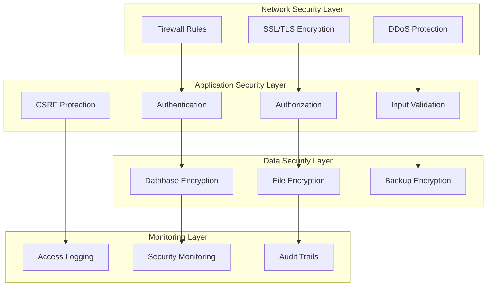

### 6.2 Authentication and Authorization

#### 6.2.1 Authentication System Design

**Multi-Factor Authentication Framework**
```php
<?php
// app/Services/AuthenticationService.php
class AuthenticationService
{
    public function __construct(
        private UserRepository $userRepository,
        private AuditService $auditService,
        private RateLimitService $rateLimitService
    ) {}
    
    public function authenticate(array $credentials): AuthenticationResult
    {
        // Rate limiting check
        if ($this->rateLimitService->tooManyAttempts($credentials['email'])) {
            $this->auditService->logFailedLogin($credentials['email'], 'rate_limited');
            throw new TooManyAttemptsException('Too many login attempts');
        }
        
        // Validate credentials
        $user = $this->validateCredentials($credentials);
        
        if (!$user) {
            $this->rateLimitService->incrementAttempts($credentials['email']);
            $this->auditService->logFailedLogin($credentials['email'], 'invalid_credentials');
            throw new InvalidCredentialsException('Invalid credentials');
        }
        
        // Check account status
        $this->validateAccountStatus($user);
        
        // Generate session
        $session = $this->createSecureSession($user);
        
        // Log successful login
        $this->auditService->logSuccessfulLogin($user);
        
        // Clear rate limiting
        $this->rateLimitService->clearAttempts($credentials['email']);
        
        return new AuthenticationResult($user, $session);
    }
    
    private function validateCredentials(array $credentials): ?User
    {
        $user = $this->userRepository->findByEmail($credentials['email']);
        
        if (!$user || !Hash::check($credentials['password'], $user->password)) {
            return null;
        }
        
        return $user;
    }
    
    private function validateAccountStatus(User $user): void
    {
        if (!$user->is_active) {
            throw new AccountDisabledException('Account is disabled');
        }
        
        if (!$user->hasVerifiedEmail()) {
            throw new EmailNotVerifiedException('Email not verified');
        }
        
        if ($user->isLocked()) {
            throw new AccountLockedException('Account is locked');
        }
    }
    
    private function createSecureSession(User $user): string
    {
        $sessionId = Str::random(40);
        
        Session::put([
            'user_id' => $user->id,
            'session_id' => $sessionId,
            'login_time' => now(),
            'last_activity' => now(),
            'ip_address' => request()->ip(),
            'user_agent' => request()->userAgent()
        ]);
        
        return $sessionId;
    }
}
```

**Password Security Implementation**
```php
<?php
// app/Services/PasswordSecurityService.php
class PasswordSecurityService
{
    private const MIN_LENGTH = 8;
    private const REQUIRE_UPPERCASE = true;
    private const REQUIRE_LOWERCASE = true;
    private const REQUIRE_NUMBERS = true;
    private const REQUIRE_SYMBOLS = false;
    private const PASSWORD_HISTORY_COUNT = 5;
    
    public function validatePasswordStrength(string $password): PasswordValidationResult
    {
        $errors = [];
        
        if (strlen($password) < self::MIN_LENGTH) {
            $errors[] = "Password must be at least " . self::MIN_LENGTH . " characters long";
        }
        
        if (self::REQUIRE_UPPERCASE && !preg_match('/[A-Z]/', $password)) {
            $errors[] = "Password must contain at least one uppercase letter";
        }
        
        if (self::REQUIRE_LOWERCASE && !preg_match('/[a-z]/', $password)) {
            $errors[] = "Password must contain at least one lowercase letter";
        }
        
        if (self::REQUIRE_NUMBERS && !preg_match('/\d/', $password)) {
            $errors[] = "Password must contain at least one number";
        }
        
        if (self::REQUIRE_SYMBOLS && !preg_match('/[^A-Za-z0-9]/', $password)) {
            $errors[] = "Password must contain at least one special character";
        }
        
        // Check against common passwords
        if ($this->isCommonPassword($password)) {
            $errors[] = "Password is too common, please choose a more unique password";
        }
        
        return new PasswordValidationResult(empty($errors), $errors);
    }
    
    public function hashPassword(string $password): string
    {
        return Hash::make($password, [
            'rounds' => 12, // Increased rounds for better security
        ]);
    }
    
    public function checkPasswordHistory(User $user, string $newPassword): bool
    {
        $passwordHistory = $user->passwordHistory()
            ->latest()
            ->take(self::PASSWORD_HISTORY_COUNT)
            ->get();
        
        foreach ($passwordHistory as $historicalPassword) {
            if (Hash::check($newPassword, $historicalPassword->password_hash)) {
                return false; // Password was used recently
            }
        }
        
        return true;
    }
    
    public function updatePassword(User $user, string $newPassword): void
    {
        DB::transaction(function () use ($user, $newPassword) {
            // Store old password in history
            $user->passwordHistory()->create([
                'password_hash' => $user->password,
                'created_at' => now()
            ]);
            
            // Update user password
            $user->update([
                'password' => $this->hashPassword($newPassword),
                'password_changed_at' => now()
            ]);
            
            // Clean up old password history
            $user->passwordHistory()
                ->oldest()
                ->skip(self::PASSWORD_HISTORY_COUNT)
                ->delete();
        });
    }
    
    private function isCommonPassword(string $password): bool
    {
        $commonPasswords = [
            'password', '123456', '123456789', 'qwerty', 'abc123',
            'password123', 'admin', 'letmein', 'welcome', 'monkey'
        ];
        
        return in_array(strtolower($password), $commonPasswords);
    }
}
```

#### 6.2.2 Role-Based Access Control (RBAC)

**Permission System Architecture**
```php
<?php
// app/Services/AuthorizationService.php
class AuthorizationService
{
    public function __construct(
        private PermissionRepository $permissionRepository,
        private RoleRepository $roleRepository
    ) {}
    
    public function userCan(User $user, string $permission, $resource = null): bool
    {
        // Check direct permissions
        if ($this->hasDirectPermission($user, $permission)) {
            return true;
        }
        
        // Check role-based permissions
        if ($this->hasRolePermission($user, $permission)) {
            return true;
        }
        
        // Check resource-specific permissions
        if ($resource && $this->hasResourcePermission($user, $permission, $resource)) {
            return true;
        }
        
        // Check organizational hierarchy permissions
        if ($resource && $this->hasHierarchicalPermission($user, $permission, $resource)) {
            return true;
        }
        
        return false;
    }
    
    private function hasRolePermission(User $user, string $permission): bool
    {
        $rolePermissions = $this->getRolePermissions($user->role);
        
        return in_array($permission, $rolePermissions);
    }
    
    private function getRolePermissions(string $role): array
    {
        return match($role) {
            'super_admin' => [
                'users.create', 'users.read', 'users.update', 'users.delete',
                'documents.create', 'documents.read', 'documents.update', 'documents.delete',
                'announcements.create', 'announcements.read', 'announcements.update', 'announcements.delete',
                'system.configure', 'system.backup', 'system.monitor'
            ],
            'hq_admin' => [
                'users.create', 'users.read', 'users.update',
                'documents.create', 'documents.read', 'documents.update',
                'announcements.create', 'announcements.read', 'announcements.update',
                'reports.generate', 'policies.manage'
            ],
            'centre_admin' => [
                'users.read', 'users.update.centre',
                'documents.create.centre', 'documents.read', 'documents.update.centre',
                'announcements.create.centre', 'announcements.read', 'announcements.update.centre',
                'events.create.centre', 'events.manage.centre'
            ],
            'station_admin' => [
                'users.read.station', 'users.update.station',
                'documents.create.station', 'documents.read', 'documents.update.station',
                'announcements.create.station', 'announcements.read', 'announcements.update.station',
                'events.create.station', 'events.manage.station'
            ],
            'staff' => [
                'documents.read', 'announcements.read', 'events.read', 'events.rsvp',
                'messages.send', 'messages.read', 'profile.update'
            ],
            default => []
        };
    }
    
    private function hasHierarchicalPermission(User $user, string $permission, $resource): bool
    {
        if (!method_exists($resource, 'isAccessibleBy')) {
            return false;
        }
        
        return $resource->isAccessibleBy($user);
    }
}
```

**Policy-Based Authorization**
```php
<?php
// app/Policies/DocumentPolicy.php
class DocumentPolicy
{
    public function viewAny(User $user): bool
    {
        return true; // All authenticated users can view documents list
    }
    
    public function view(User $user, Document $document): bool
    {
        return $document->canBeAccessedBy($user);
    }
    
    public function create(User $user): bool
    {
        return in_array($user->role, [
            'super_admin', 'hq_admin', 'centre_admin', 'station_admin'
        ]);
    }
    
    public function update(User $user, Document $document): bool
    {
        // Super admin can update any document
        if ($user->role === 'super_admin') {
            return true;
        }
        
        // HQ admin can update any document
        if ($user->role === 'hq_admin') {
            return true;
        }
        
        // Document owner can update
        if ($document->uploaded_by === $user->id) {
            return true;
        }
        
        // Centre admin can update documents in their centre
        if ($user->role === 'centre_admin' && $document->uploader->centre_id === $user->centre_id) {
            return true;
        }
        
        // Station admin can update documents in their station
        if ($user->role === 'station_admin' && $document->uploader->station_id === $user->station_id) {
            return true;
        }
        
        return false;
    }
    
    public function delete(User $user, Document $document): bool
    {
        // Only super admin and HQ admin can delete documents
        return in_array($user->role, ['super_admin', 'hq_admin']);
    }
    
    public function download(User $user, Document $document): bool
    {
        if (!$document->canBeAccessedBy($user)) {
            return false;
        }
        
        // Check if download permission is required
        if ($document->requires_download_permission) {
            return in_array($user->role, [
                'super_admin', 'hq_admin', 'centre_admin', 'station_admin'
            ]);
        }
        
        return true;
    }
}
```

### 6.3 Data Protection and Encryption

#### 6.3.1 Data Encryption Strategy

**Database Encryption Implementation**
```php
<?php
// app/Services/EncryptionService.php
class EncryptionService
{
    private const SENSITIVE_FIELDS = [
        'users' => ['phone', 'employee_id', 'birth_date'],
        'password_vaults' => ['password', 'notes'],
        'messages' => ['body'],
    ];
    
    public function encryptSensitiveData(string $table, array $data): array
    {
        if (!isset(self::SENSITIVE_FIELDS[$table])) {
            return $data;
        }
        
        $sensitiveFields = self::SENSITIVE_FIELDS[$table];
        
        foreach ($sensitiveFields as $field) {
            if (isset($data[$field]) && !empty($data[$field])) {
                $data[$field] = encrypt($data[$field]);
            }
        }
        
        return $data;
    }
    
    public function decryptSensitiveData(string $table, array $data): array
    {
        if (!isset(self::SENSITIVE_FIELDS[$table])) {
            return $data;
        }
        
        $sensitiveFields = self::SENSITIVE_FIELDS[$table];
        
        foreach ($sensitiveFields as $field) {
            if (isset($data[$field]) && !empty($data[$field])) {
                try {
                    $data[$field] = decrypt($data[$field]);
                } catch (DecryptException $e) {
                    Log::warning("Failed to decrypt field {$field} in table {$table}");
                    $data[$field] = null;
                }
            }
        }
        
        return $data;
    }
}
```

**File Encryption for Sensitive Documents**
```php
<?php
// app/Services/FileEncryptionService.php
class FileEncryptionService
{
    public function encryptFile(string $filePath, string $encryptionKey = null): string
    {
        $encryptionKey = $encryptionKey ?: config('app.key');
        
        $fileContent = file_get_contents($filePath);
        $encryptedContent = encrypt($fileContent);
        
        $encryptedFilePath = $filePath . '.encrypted';
        file_put_contents($encryptedFilePath, $encryptedContent);
        
        // Remove original file
        unlink($filePath);
        
        return $encryptedFilePath;
    }
    
    public function decryptFile(string $encryptedFilePath, string $outputPath = null): string
    {
        $outputPath = $outputPath ?: str_replace('.encrypted', '', $encryptedFilePath);
        
        $encryptedContent = file_get_contents($encryptedFilePath);
        $decryptedContent = decrypt($encryptedContent);
        
        file_put_contents($outputPath, $decryptedContent);
        
        return $outputPath;
    }
    
    public function streamEncryptedFile(string $encryptedFilePath): StreamedResponse
    {
        return response()->stream(function () use ($encryptedFilePath) {
            $encryptedContent = file_get_contents($encryptedFilePath);
            $decryptedContent = decrypt($encryptedContent);
            echo $decryptedContent;
        });
    }
}
```

### 6.4 Input Validation and Sanitization

#### 6.4.1 Request Validation Framework

**Custom Form Request Classes**
```php
<?php
// app/Http/Requests/StoreDocumentRequest.php
class StoreDocumentRequest extends FormRequest
{
    public function authorize(): bool
    {
        return $this->user()->can('create', Document::class);
    }
    
    public function rules(): array
    {
        return [
            'title' => [
                'required',
                'string',
                'max:500',
                'regex:/^[a-zA-Z0-9\s\-_\.]+$/' // Alphanumeric with basic punctuation
            ],
            'description' => [
                'nullable',
                'string',
                'max:2000'
            ],
            'category' => [
                'required',
                'in:hr,it,research,finance,administration,training'
            ],
            'visibility_scope' => [
                'required',
                'in:all,headquarters,centre,station,department'
            ],
            'target_centres' => [
                'nullable',
                'array',
                'exists:centres,id'
            ],
            'target_stations' => [
                'nullable',
                'array',
                'exists:stations,id'
            ],
            'access_level' => [
                'required',
                'in:public,internal,restricted,confidential'
            ],
            'document' => [
                'required',
                'file',
                'max:20480', // 20MB
                'mimes:pdf,doc,docx,xls,xlsx,ppt,pptx,jpg,jpeg,png,gif'
            ],
            'tags' => [
                'nullable',
                'array',
                'max:10'
            ],
            'tags.*' => [
                'string',
                'max:50',
                'regex:/^[a-zA-Z0-9\s\-_]+$/'
            ]
        ];
    }
    
    public function messages(): array
    {
        return [
            'title.regex' => 'Title contains invalid characters',
            'document.mimes' => 'Document must be a valid file type (PDF, DOC, XLS, PPT, or image)',
            'document.max' => 'Document size cannot exceed 20MB',
            'tags.*.regex' => 'Tags can only contain letters, numbers, spaces, hyphens, and underscores'
        ];
    }
    
    protected function prepareForValidation(): void
    {
        // Sanitize input data
        $this->merge([
            'title' => $this->sanitizeString($this->title),
            'description' => $this->sanitizeString($this->description),
            'tags' => $this->sanitizeArray($this->tags)
        ]);
    }
    
    private function sanitizeString(?string $value): ?string
    {
        if (!$value) return null;
        
        // Remove HTML tags and encode special characters
        return htmlspecialchars(strip_tags(trim($value)), ENT_QUOTES, 'UTF-8');
    }
    
    private function sanitizeArray(?array $values): ?array
    {
        if (!$values) return null;
        
        return array_map(function ($value) {
            return $this->sanitizeString($value);
        }, $values);
    }
}
```

#### 6.4.2 XSS and CSRF Protection

**XSS Prevention Middleware**
```php
<?php
// app/Http/Middleware/XssProtection.php
class XssProtection
{
    public function handle(Request $request, Closure $next): Response
    {
        $input = $request->all();
        
        array_walk_recursive($input, function (&$input) {
            $input = $this->cleanInput($input);
        });
        
        $request->merge($input);
        
        return $next($request);
    }
    
    private function cleanInput($input): string
    {
        if (!is_string($input)) {
            return $input;
        }
        
        // Remove potentially dangerous HTML tags and attributes
        $input = preg_replace('/<script\b[^<]*(?:(?!<\/script>)<[^<]*)*<\/script>/mi', '', $input);
        $input = preg_replace('/<iframe\b[^<]*(?:(?!<\/iframe>)<[^<]*)*<\/iframe>/mi', '', $input);
        $input = preg_replace('/javascript:/i', '', $input);
        $input = preg_replace('/on\w+\s*=/i', '', $input);
        
        return $input;
    }
}
```

### 6.5 Security Monitoring and Audit

#### 6.5.1 Comprehensive Audit Logging

**Audit Service Implementation**
```php
<?php
// app/Services/AuditService.php
class AuditService
{
    public function __construct(
        private AuditLogRepository $auditRepository
    ) {}
    
    public function logUserActivity(User $user, string $action, array $context = []): void
    {
        $this->auditRepository->create([
            'user_id' => $user->id,
            'action' => $action,
            'context' => $context,
            'ip_address' => request()->ip(),
            'user_agent' => request()->userAgent(),
            'session_id' => session()->getId(),
            'timestamp' => now()
        ]);
    }
    
    public function logSecurityEvent(string $event, array $context = []): void
    {
        $this->auditRepository->create([
            'user_id' => auth()->id(),
            'action' => 'security_event',
            'event_type' => $event,
            'context' => $context,
            'ip_address' => request()->ip(),
            'user_agent' => request()->userAgent(),
            'severity' => $this->getEventSeverity($event),
            'timestamp' => now()
        ]);
        
        // Alert on high-severity events
        if ($this->isHighSeverityEvent($event)) {
            $this->sendSecurityAlert($event, $context);
        }
    }
    
    public function logDataAccess(string $resource, int $resourceId, string $action): void
    {
        $this->auditRepository->create([
            'user_id' => auth()->id(),
            'action' => 'data_access',
            'resource_type' => $resource,
            'resource_id' => $resourceId,
            'access_type' => $action,
            'ip_address' => request()->ip(),
            'timestamp' => now()
        ]);
    }
    
    private function getEventSeverity(string $event): string
    {
        return match($event) {
            'failed_login', 'account_locked', 'suspicious_activity' => 'high',
            'password_changed', 'permission_denied', 'file_access' => 'medium',
            'login', 'logout', 'profile_updated' => 'low',
            default => 'medium'
        };
    }
    
    private function isHighSeverityEvent(string $event): bool
    {
        return in_array($event, [
            'multiple_failed_logins',
            'account_locked',
            'suspicious_activity',
            'unauthorized_access_attempt',
            'data_breach_detected'
        ]);
    }
    
    private function sendSecurityAlert(string $event, array $context): void
    {
        // Send immediate notification to security team
        Notification::route('mail', config('security.alert_email'))
            ->notify(new SecurityAlertNotification($event, $context));
    }
}
```

#### 6.5.2 Intrusion Detection System

**Security Monitor Service**
```php
<?php
// app/Services/SecurityMonitorService.php
class SecurityMonitorService
{
    private const FAILED_LOGIN_THRESHOLD = 5;
    private const SUSPICIOUS_ACTIVITY_THRESHOLD = 10;
    private const TIME_WINDOW_MINUTES = 15;
    
    public function __construct(
        private AuditService $auditService,
        private Cache $cache
    ) {}
    
    public function checkForSuspiciousActivity(User $user = null): void
    {
        $ipAddress = request()->ip();
        $userId = $user?->id;
        
        // Check for multiple failed logins
        $this->checkFailedLogins($ipAddress, $userId);
        
        // Check for rapid requests
        $this->checkRapidRequests($ipAddress, $userId);
        
        // Check for unusual access patterns
        $this->checkUnusualAccess($userId);
    }
    
    private function checkFailedLogins(string $ipAddress, ?int $userId): void
    {
        $cacheKey = "failed_logins:{$ipAddress}";
        $failedAttempts = $this->cache->get($cacheKey, 0);
        
        if ($failedAttempts >= self::FAILED_LOGIN_THRESHOLD) {
            $this->auditService->logSecurityEvent('multiple_failed_logins', [
                'ip_address' => $ipAddress,
                'user_id' => $userId,
                'attempts' => $failedAttempts
            ]);
            
            // Temporarily block IP
            $this->blockIpAddress($ipAddress);
        }
    }
    
    private function checkRapidRequests(string $ipAddress, ?int $userId): void
    {
        $cacheKey = "request_count:{$ipAddress}";
        $requestCount = $this->cache->get($cacheKey, 0);
        
        $this->cache->put($cacheKey, $requestCount + 1, now()->addMinutes(self::TIME_WINDOW_MINUTES));
        
        if ($requestCount > self::SUSPICIOUS_ACTIVITY_THRESHOLD) {
            $this->auditService->logSecurityEvent('rapid_requests', [
                'ip_address' => $ipAddress,
                'user_id' => $userId,
                'request_count' => $requestCount
            ]);
        }
    }
    
    private function checkUnusualAccess(?int $userId): void
    {
        if (!$userId) return;
        
        $user = User::find($userId);
        if (!$user) return;
        
        // Check for access from new location
        $currentIp = request()->ip();
        $knownIps = $user->knownIpAddresses()->pluck('ip_address')->toArray();
        
        if (!in_array($currentIp, $knownIps)) {
            $this->auditService->logSecurityEvent('new_location_access', [
                'user_id' => $userId,
                'ip_address' => $currentIp,
                'known_ips' => $knownIps
            ]);
            
            // Record new IP
            $user->knownIpAddresses()->create([
                'ip_address' => $currentIp,
                'first_seen' => now(),
                'last_seen' => now()
            ]);
        }
    }
    
    private function blockIpAddress(string $ipAddress): void
    {
        $this->cache->put("blocked_ip:{$ipAddress}", true, now()->addHours(1));
        
        Log::warning("IP address blocked due to suspicious activity", [
            'ip_address' => $ipAddress,
            'blocked_until' => now()->addHours(1)
        ]);
    }
}
```

---

## 7. User Interface Design

### 7.1 Design System and Standards

#### 7.1.1 Design Principles

The NIMR Intranet user interface follows modern design principles focused on usability, accessibility, and organizational efficiency.

**Core Design Principles:**
- **Clarity**: Clear visual hierarchy and intuitive navigation
- **Consistency**: Uniform design patterns across all interfaces
- **Efficiency**: Streamlined workflows for common tasks
- **Accessibility**: WCAG 2.1 AA compliance for inclusive design
- **Responsiveness**: Optimal experience across all device types

#### 7.1.2 Visual Design System

**Color Palette**
```css
/* Primary Colors */
:root {
  --color-primary-50: #eff6ff;
  --color-primary-100: #dbeafe;
  --color-primary-200: #bfdbfe;
  --color-primary-300: #93c5fd;
  --color-primary-400: #60a5fa;
  --color-primary-500: #3b82f6;  /* Primary brand color */
  --color-primary-600: #2563eb;
  --color-primary-700: #1d4ed8;
  --color-primary-800: #1e40af;
  --color-primary-900: #1e3a8a;
  
  /* Semantic Colors */
  --color-success: #10b981;
  --color-warning: #f59e0b;
  --color-error: #ef4444;
  --color-info: #06b6d4;
  
  /* Neutral Colors */
  --color-gray-50: #f9fafb;
  --color-gray-100: #f3f4f6;
  --color-gray-200: #e5e7eb;
  --color-gray-300: #d1d5db;
  --color-gray-400: #9ca3af;
  --color-gray-500: #6b7280;
  --color-gray-600: #4b5563;
  --color-gray-700: #374151;
  --color-gray-800: #1f2937;
  --color-gray-900: #111827;
}
```

**Typography System**
```css
/* Font Families */
:root {
  --font-sans: 'Inter', system-ui, -apple-system, sans-serif;
  --font-mono: 'JetBrains Mono', 'Fira Code', monospace;
}

/* Font Sizes */
.text-xs { font-size: 0.75rem; line-height: 1rem; }
.text-sm { font-size: 0.875rem; line-height: 1.25rem; }
.text-base { font-size: 1rem; line-height: 1.5rem; }
.text-lg { font-size: 1.125rem; line-height: 1.75rem; }
.text-xl { font-size: 1.25rem; line-height: 1.75rem; }
.text-2xl { font-size: 1.5rem; line-height: 2rem; }
.text-3xl { font-size: 1.875rem; line-height: 2.25rem; }
.text-4xl { font-size: 2.25rem; line-height: 2.5rem; }

/* Font Weights */
.font-light { font-weight: 300; }
.font-normal { font-weight: 400; }
.font-medium { font-weight: 500; }
.font-semibold { font-weight: 600; }
.font-bold { font-weight: 700; }
```

**Spacing System**
```css
/* Spacing Scale (based on 0.25rem = 4px) */
.space-1 { margin: 0.25rem; }
.space-2 { margin: 0.5rem; }
.space-3 { margin: 0.75rem; }
.space-4 { margin: 1rem; }
.space-5 { margin: 1.25rem; }
.space-6 { margin: 1.5rem; }
.space-8 { margin: 2rem; }
.space-10 { margin: 2.5rem; }
.space-12 { margin: 3rem; }
.space-16 { margin: 4rem; }
.space-20 { margin: 5rem; }
.space-24 { margin: 6rem; }
```

### 7.2 Component Library

#### 7.2.1 Base Components

**Button Component System**
```php
{{-- resources/views/components/button.blade.php --}}
@props([
    'variant' => 'primary',
    'size' => 'md',
    'type' => 'button',
    'disabled' => false,
    'loading' => false,
    'icon' => null,
    'iconPosition' => 'left'
])

@php
$baseClasses = 'inline-flex items-center justify-center font-medium rounded-lg transition-colors focus:outline-none focus:ring-2 focus:ring-offset-2 disabled:opacity-50 disabled:cursor-not-allowed';

$variantClasses = [
    'primary' => 'bg-blue-600 text-white hover:bg-blue-700 focus:ring-blue-500',
    'secondary' => 'bg-gray-200 text-gray-900 hover:bg-gray-300 focus:ring-gray-500',
    'success' => 'bg-green-600 text-white hover:bg-green-700 focus:ring-green-500',
    'danger' => 'bg-red-600 text-white hover:bg-red-700 focus:ring-red-500',
    'outline' => 'border border-gray-300 bg-white text-gray-700 hover:bg-gray-50 focus:ring-blue-500',
    'ghost' => 'text-gray-700 hover:bg-gray-100 focus:ring-gray-500'
];

$sizeClasses = [
    'xs' => 'px-2 py-1 text-xs',
    'sm' => 'px-3 py-1.5 text-sm',
    'md' => 'px-4 py-2 text-sm',
    'lg' => 'px-6 py-3 text-base',
    'xl' => 'px-8 py-4 text-lg'
];

$classes = $baseClasses . ' ' . $variantClasses[$variant] . ' ' . $sizeClasses[$size];
@endphp

<button 
    type="{{ $type }}"
    {{ $disabled ? 'disabled' : '' }}
    {{ $attributes->merge(['class' => $classes]) }}
>
    @if($loading)
        <x-icon name="spinner" class="w-4 h-4 mr-2 animate-spin" />
    @elseif($icon && $iconPosition === 'left')
        <x-icon :name="$icon" class="w-4 h-4 mr-2" />
    @endif
    
    {{ $slot }}
    
    @if($icon && $iconPosition === 'right')
        <x-icon :name="$icon" class="w-4 h-4 ml-2" />
    @endif
</button>
```

**Form Input Components**
```php
{{-- resources/views/components/forms/input.blade.php --}}
@props([
    'label' => null,
    'name' => null,
    'type' => 'text',
    'required' => false,
    'error' => null,
    'help' => null,
    'placeholder' => null
])

<div class="space-y-1">
    @if($label)
        <label for="{{ $name }}" class="block text-sm font-medium text-gray-700">
            {{ $label }}
            @if($required)
                <span class="text-red-500">*</span>
            @endif
        </label>
    @endif
    
    <input
        type="{{ $type }}"
        name="{{ $name }}"
        id="{{ $name }}"
        @if($placeholder) placeholder="{{ $placeholder }}" @endif
        {{ $required ? 'required' : '' }}
        {{ $attributes->merge([
            'class' => 'block w-full rounded-md border-gray-300 shadow-sm focus:border-blue-500 focus:ring-blue-500 sm:text-sm' . 
                      ($error ? ' border-red-300 text-red-900 placeholder-red-300 focus:border-red-500 focus:ring-red-500' : '')
        ]) }}
    />
    
    @if($error)
        <p class="text-sm text-red-600">{{ $error }}</p>
    @elseif($help)
        <p class="text-sm text-gray-500">{{ $help }}</p>
    @endif
</div>
```

**Card Component**
```php
{{-- resources/views/components/card.blade.php --}}
@props([
    'title' => null,
    'subtitle' => null,
    'actions' => null,
    'padding' => 'default'
])

@php
$paddingClasses = [
    'none' => '',
    'sm' => 'p-4',
    'default' => 'p-6',
    'lg' => 'p-8'
];
@endphp

<div {{ $attributes->merge(['class' => 'bg-white rounded-lg shadow-sm border border-gray-200']) }}>
    @if($title || $actions)
        <div class="px-6 py-4 border-b border-gray-200 flex items-center justify-between">
            <div>
                @if($title)
                    <h3 class="text-lg font-medium text-gray-900">{{ $title }}</h3>
                @endif
                @if($subtitle)
                    <p class="mt-1 text-sm text-gray-500">{{ $subtitle }}</p>
                @endif
            </div>
            
            @if($actions)
                <div class="flex items-center space-x-2">
                    {{ $actions }}
                </div>
            @endif
        </div>
    @endif
    
    <div class="{{ $paddingClasses[$padding] }}">
        {{ $slot }}
    </div>
</div>
```

#### 7.2.2 Complex Components

**Data Table Component**
```php
{{-- resources/views/components/data-table.blade.php --}}
@props([
    'headers' => [],
    'rows' => [],
    'sortable' => false,
    'searchable' => false,
    'pagination' => null
])

<div class="bg-white shadow-sm rounded-lg border border-gray-200">
    @if($searchable)
        <div class="p-4 border-b border-gray-200">
            <div class="relative">
                <input
                    type="text"
                    placeholder="Search..."
                    class="block w-full pl-10 pr-3 py-2 border border-gray-300 rounded-md leading-5 bg-white placeholder-gray-500 focus:outline-none focus:placeholder-gray-400 focus:ring-1 focus:ring-blue-500 focus:border-blue-500 sm:text-sm"
                    x-data="{ search: '' }"
                    x-model="search"
                    @input="$dispatch('table-search', { query: search })"
                />
                <div class="absolute inset-y-0 left-0 pl-3 flex items-center pointer-events-none">
                    <x-icon name="search" class="h-5 w-5 text-gray-400" />
                </div>
            </div>
        </div>
    @endif
    
    <div class="overflow-x-auto">
        <table class="min-w-full divide-y divide-gray-200">
            <thead class="bg-gray-50">
                <tr>
                    @foreach($headers as $header)
                        <th class="px-6 py-3 text-left text-xs font-medium text-gray-500 uppercase tracking-wider">
                            @if($sortable && isset($header['sortable']) && $header['sortable'])
                                <button
                                    class="group inline-flex items-center hover:text-gray-900"
                                    @click="$dispatch('table-sort', { column: '{{ $header['key'] }}' })"
                                >
                                    {{ $header['label'] }}
                                    <x-icon name="chevron-up-down" class="ml-2 h-4 w-4 text-gray-400 group-hover:text-gray-500" />
                                </button>
                            @else
                                {{ $header['label'] ?? $header }}
                            @endif
                        </th>
                    @endforeach
                </tr>
            </thead>
            <tbody class="bg-white divide-y divide-gray-200">
                {{ $slot }}
            </tbody>
        </table>
    </div>
    
    @if($pagination)
        <div class="px-6 py-3 border-t border-gray-200">
            {{ $pagination->links() }}
        </div>
    @endif
</div>
```

**Modal Component**
```php
{{-- resources/views/components/modal.blade.php --}}
@props([
    'name',
    'show' => false,
    'maxWidth' => '2xl',
    'closeable' => true
])

@php
$maxWidthClasses = [
    'sm' => 'sm:max-w-sm',
    'md' => 'sm:max-w-md',
    'lg' => 'sm:max-w-lg',
    'xl' => 'sm:max-w-xl',
    '2xl' => 'sm:max-w-2xl',
    '3xl' => 'sm:max-w-3xl',
    '4xl' => 'sm:max-w-4xl',
    '5xl' => 'sm:max-w-5xl',
    '6xl' => 'sm:max-w-6xl',
    '7xl' => 'sm:max-w-7xl',
];
@endphp

<div
    x-data="{
        show: @js($show),
        focusables() {
            let selector = 'a, button, input:not([type=\'hidden\']), textarea, select, details, [tabindex]:not([tabindex=\'-1\'])'
            return [...$el.querySelectorAll(selector)]
                .filter(el => ! el.hasAttribute('disabled'))
        },
        firstFocusable() { return this.focusables()[0] },
        lastFocusable() { return this.focusables().slice(-1)[0] },
        nextFocusable() { return this.focusables()[this.nextFocusableIndex()] || this.firstFocusable() },
        prevFocusable() { return this.focusables()[this.prevFocusableIndex()] || this.lastFocusable() },
        nextFocusableIndex() { return (this.focusables().indexOf(document.activeElement) + 1) % (this.focusables().length + 1) },
        prevFocusableIndex() { return Math.max(0, this.focusables().indexOf(document.activeElement)) -1 },
    }"
    x-init="$watch('show', value => {
        if (value) {
            document.body.classList.add('overflow-hidden');
            setTimeout(() => firstFocusable().focus(), 100)
        } else {
            document.body.classList.remove('overflow-hidden');
        }
    })"
    x-on:open-modal.window="$event.detail == '{{ $name }}' ? show = true : null"
    x-on:close-modal.window="$event.detail == '{{ $name }}' ? show = false : null"
    x-on:close.stop="show = false"
    x-on:keydown.escape.window="show = false"
    x-on:keydown.tab.prevent="$event.shiftKey || nextFocusable().focus()"
    x-on:keydown.shift.tab.prevent="prevFocusable().focus()"
    x-show="show"
    class="fixed inset-0 overflow-y-auto px-4 py-6 sm:px-0 z-50"
    style="display: none;"
>
    <div
        x-show="show"
        class="fixed inset-0 transform transition-all"
        x-on:click="show = false"
        x-transition:enter="ease-out duration-300"
        x-transition:enter-start="opacity-0"
        x-transition:enter-end="opacity-100"
        x-transition:leave="ease-in duration-200"
        x-transition:leave-start="opacity-100"
        x-transition:leave-end="opacity-0"
    >
        <div class="absolute inset-0 bg-gray-500 opacity-75"></div>
    </div>

    <div
        x-show="show"
        class="mb-6 bg-white rounded-lg overflow-hidden shadow-xl transform transition-all sm:w-full {{ $maxWidthClasses[$maxWidth] }} sm:mx-auto"
        x-transition:enter="ease-out duration-300"
        x-transition:enter-start="opacity-0 translate-y-4 sm:translate-y-0 sm:scale-95"
        x-transition:enter-end="opacity-100 translate-y-0 sm:scale-100"
        x-transition:leave="ease-in duration-200"
        x-transition:leave-start="opacity-100 translate-y-0 sm:scale-100"
        x-transition:leave-end="opacity-0 translate-y-4 sm:translate-y-0 sm:scale-95"
    >
        {{ $slot }}
    </div>
</div>
```

### 7.3 Responsive Design Strategy

#### 7.3.1 Breakpoint System

```css
/* Tailwind CSS Breakpoints */
/* sm: 640px and up */
/* md: 768px and up */
/* lg: 1024px and up */
/* xl: 1280px and up */
/* 2xl: 1536px and up */

/* Mobile-first approach */
.container {
  width: 100%;
  padding-left: 1rem;
  padding-right: 1rem;
}

@media (min-width: 640px) {
  .container {
    max-width: 640px;
    margin-left: auto;
    margin-right: auto;
  }
}

@media (min-width: 768px) {
  .container {
    max-width: 768px;
  }
}

@media (min-width: 1024px) {
  .container {
    max-width: 1024px;
  }
}

@media (min-width: 1280px) {
  .container {
    max-width: 1280px;
  }
}

@media (min-width: 1536px) {
  .container {
    max-width: 1536px;
  }
}
```

#### 7.3.2 Layout Patterns

**Dashboard Layout**
```php
{{-- resources/views/layouts/dashboard.blade.php --}}
<div class="min-h-screen bg-gray-50">
    <!-- Mobile sidebar -->
    <div class="lg:hidden">
        <div x-show="sidebarOpen" class="fixed inset-0 flex z-40">
            <div class="fixed inset-0 bg-gray-600 bg-opacity-75" @click="sidebarOpen = false"></div>
            <div class="relative flex-1 flex flex-col max-w-xs w-full bg-white">
                <!-- Mobile sidebar content -->
                @include('layouts.partials.mobile-sidebar')
            </div>
        </div>
    </div>

    <!-- Desktop sidebar -->
    <div class="hidden lg:flex lg:w-64 lg:flex-col lg:fixed lg:inset-y-0">
        <div class="flex-1 flex flex-col min-h-0 bg-white border-r border-gray-200">
            @include('layouts.partials.desktop-sidebar')
        </div>
    </div>

    <!-- Main content -->
    <div class="lg:pl-64 flex flex-col flex-1">
        <!-- Top navigation -->
        <div class="sticky top-0 z-10 lg:hidden pl-1 pt-1 sm:pl-3 sm:pt-3 bg-gray-50">
            <button @click="sidebarOpen = true" class="-ml-0.5 -mt-0.5 h-12 w-12 inline-flex items-center justify-center rounded-md text-gray-500 hover:text-gray-900 focus:outline-none focus:ring-2 focus:ring-inset focus:ring-blue-500">
                <x-icon name="menu" class="h-6 w-6" />
            </button>
        </div>

        <!-- Page header -->
        @hasSection('header')
            <div class="bg-white shadow-sm border-b border-gray-200">
                <div class="px-4 sm:px-6 lg:px-8">
                    @yield('header')
                </div>
            </div>
        @endif

        <!-- Main content area -->
        <main class="flex-1">
            <div class="py-6">
                <div class="max-w-7xl mx-auto px-4 sm:px-6 lg:px-8">
                    @yield('content')
                </div>
            </div>
        </main>
    </div>
</div>
```

### 7.4 Accessibility Implementation

#### 7.4.1 WCAG 2.1 AA Compliance

**Semantic HTML Structure**
```html
<!-- Proper heading hierarchy -->
<h1>NIMR Intranet Dashboard</h1>
<section aria-labelledby="announcements-heading">
    <h2 id="announcements-heading">Recent Announcements</h2>
    <article>
        <h3>Announcement Title</h3>
        <p>Announcement content...</p>
    </article>
</section>

<!-- Form accessibility -->
<form>
    <fieldset>
        <legend>Document Upload</legend>
        <label for="document-title">Document Title</label>
        <input 
            type="text" 
            id="document-title" 
            name="title" 
            required 
            aria-describedby="title-help"
        />
        <div id="title-help" class="help-text">
            Enter a descriptive title for your document
        </div>
    </fieldset>
</form>

<!-- Navigation accessibility -->
<nav aria-label="Main navigation">
    <ul role="menubar">
        <li role="none">
            <a href="/dashboard" role="menuitem" aria-current="page">Dashboard</a>
        </li>
        <li role="none">
            <a href="/documents" role="menuitem">Documents</a>
        </li>
    </ul>
</nav>
```

**Keyboard Navigation Support**
```javascript
// Focus management for modals and dropdowns
class FocusManager {
    constructor(element) {
        this.element = element;
        this.focusableElements = this.getFocusableElements();
        this.firstFocusable = this.focusableElements[0];
        this.lastFocusable = this.focusableElements[this.focusableElements.length - 1];
    }
    
    getFocusableElements() {
        const selector = 'a[href], button:not([disabled]), textarea:not([disabled]), input:not([disabled]), select:not([disabled]), [tabindex]:not([tabindex="-1"])';
        return Array.from(this.element.querySelectorAll(selector));
    }
    
    trapFocus(event) {
        if (event.key === 'Tab') {
            if (event.shiftKey) {
                if (document.activeElement === this.firstFocusable) {
                    event.preventDefault();
                    this.lastFocusable.focus();
                }
            } else {
                if (document.activeElement === this.lastFocusable) {
                    event.preventDefault();
                    this.firstFocusable.focus();
                }
            }
        }
        
        if (event.key === 'Escape') {
            this.close();
        }
    }
}
```

**Screen Reader Support**
```php
{{-- ARIA labels and descriptions --}}
<div class="document-card" role="article" aria-labelledby="doc-{{ $document->id }}-title">
    <h3 id="doc-{{ $document->id }}-title">{{ $document->title }}</h3>
    <p aria-describedby="doc-{{ $document->id }}-meta">{{ $document->description }}</p>
    <div id="doc-{{ $document->id }}-meta" class="sr-only">
        Uploaded by {{ $document->uploader->name }} on {{ $document->created_at->format('F j, Y') }}
    </div>
    
    <div class="actions" role="group" aria-label="Document actions">
        <button aria-describedby="doc-{{ $document->id }}-view-desc">
            View Document
        </button>
        <div id="doc-{{ $document->id }}-view-desc" class="sr-only">
            View {{ $document->title }} document
        </div>
        
        <button aria-describedby="doc-{{ $document->id }}-download-desc">
            Download
        </button>
        <div id="doc-{{ $document->id }}-download-desc" class="sr-only">
            Download {{ $document->title }} ({{ $document->file_size_human }})
        </div>
    </div>
</div>

{{-- Live regions for dynamic content --}}
<div aria-live="polite" aria-atomic="true" class="sr-only" id="status-messages">
    <!-- Dynamic status messages appear here -->
</div>

<div aria-live="assertive" aria-atomic="true" class="sr-only" id="error-messages">
    <!-- Critical error messages appear here -->
</div>
```

This comprehensive UI design system ensures a consistent, accessible, and user-friendly interface across the entire NIMR Intranet system.---


## 8. API Design and Integration

### 8.1 RESTful API Architecture

#### 8.1.1 API Design Principles

The NIMR Intranet system provides a comprehensive RESTful API following industry best practices for consistency, security, and usability.

**API Design Standards:**
- **RESTful Conventions**: Standard HTTP methods and status codes
- **Resource-Based URLs**: Clear, hierarchical resource naming
- **Consistent Response Format**: Standardized JSON response structure
- **Versioning Strategy**: URL-based versioning for backward compatibility
- **Authentication**: Token-based authentication with proper scoping
- **Rate Limiting**: Request throttling to prevent abuse
- **Documentation**: Comprehensive API documentation with examples

#### 8.1.2 API Structure and Endpoints

**Base API Structure**
```
https://intranet.nimr.or.tz/api/v1/
├── auth/
│   ├── login
│   ├── logout
│   ├── refresh
│   └── me
├── users/
├── documents/
├── announcements/
├── messages/
├── events/
└── admin/
```

**Core API Controller Implementation**
```php
<?php
// app/Http/Controllers/Api/BaseApiController.php
abstract class BaseApiController extends Controller
{
    protected function successResponse($data = null, string $message = 'Success', int $code = 200): JsonResponse
    {
        return response()->json([
            'success' => true,
            'message' => $message,
            'data' => $data,
            'timestamp' => now()->toISOString()
        ], $code);
    }
    
    protected function errorResponse(string $message, int $code = 400, array $errors = []): JsonResponse
    {
        return response()->json([
            'success' => false,
            'message' => $message,
            'errors' => $errors,
            'timestamp' => now()->toISOString()
        ], $code);
    }
    
    protected function paginatedResponse($data, string $message = 'Success'): JsonResponse
    {
        return response()->json([
            'success' => true,
            'message' => $message,
            'data' => $data->items(),
            'pagination' => [
                'current_page' => $data->currentPage(),
                'last_page' => $data->lastPage(),
                'per_page' => $data->perPage(),
                'total' => $data->total(),
                'from' => $data->firstItem(),
                'to' => $data->lastItem(),
                'has_more_pages' => $data->hasMorePages()
            ],
            'timestamp' => now()->toISOString()
        ]);
    }
}
```

**Document API Implementation**
```php
<?php
// app/Http/Controllers/Api/DocumentController.php
class DocumentController extends BaseApiController
{
    public function __construct(
        private DocumentService $documentService,
        private DocumentTransformer $transformer
    ) {
        $this->middleware('auth:sanctum');
        $this->middleware('throttle:60,1');
    }
    
    /**
     * @OA\Get(
     *     path="/api/v1/documents",
     *     summary="Get paginated list of documents",
     *     tags={"Documents"},
     *     security={{"sanctum": {}}},
     *     @OA\Parameter(
     *         name="category",
     *         in="query",
     *         description="Filter by document category",
     *         @OA\Schema(type="string", enum={"hr", "it", "research", "finance", "administration", "training"})
     *     ),
     *     @OA\Parameter(
     *         name="search",
     *         in="query",
     *         description="Search in document title and description",
     *         @OA\Schema(type="string")
     *     ),
     *     @OA\Parameter(
     *         name="per_page",
     *         in="query",
     *         description="Number of items per page (max 100)",
     *         @OA\Schema(type="integer", minimum=1, maximum=100, default=20)
     *     ),
     *     @OA\Response(
     *         response=200,
     *         description="Documents retrieved successfully",
     *         @OA\JsonContent(
     *             @OA\Property(property="success", type="boolean", example=true),
     *             @OA\Property(property="message", type="string", example="Documents retrieved successfully"),
     *             @OA\Property(property="data", type="array", @OA\Items(ref="#/components/schemas/Document")),
     *             @OA\Property(property="pagination", ref="#/components/schemas/Pagination")
     *         )
     *     )
     * )
     */
    public function index(Request $request): JsonResponse
    {
        $this->validate($request, [
            'category' => 'sometimes|in:hr,it,research,finance,administration,training',
            'search' => 'sometimes|string|max:255',
            'sort' => 'sometimes|in:name_asc,name_desc,date_asc,date_desc,downloads_desc',
            'per_page' => 'sometimes|integer|min:1|max:100'
        ]);
        
        $filters = $request->only(['category', 'search', 'sort']);
        $perPage = $request->get('per_page', 20);
        
        $documents = $this->documentService->getAccessibleDocuments(
            auth()->user(),
            $filters,
            $perPage
        );
        
        $transformedDocuments = $documents->through(function ($document) {
            return $this->transformer->transform($document);
        });
        
        return $this->paginatedResponse($transformedDocuments, 'Documents retrieved successfully');
    }
    
    /**
     * @OA\Get(
     *     path="/api/v1/documents/{id}",
     *     summary="Get specific document details",
     *     tags={"Documents"},
     *     security={{"sanctum": {}}},
     *     @OA\Parameter(
     *         name="id",
     *         in="path",
     *         required=true,
     *         description="Document ID",
     *         @OA\Schema(type="integer")
     *     ),
     *     @OA\Response(
     *         response=200,
     *         description="Document retrieved successfully",
     *         @OA\JsonContent(
     *             @OA\Property(property="success", type="boolean", example=true),
     *             @OA\Property(property="data", ref="#/components/schemas/Document")
     *         )
     *     ),
     *     @OA\Response(response=404, description="Document not found"),
     *     @OA\Response(response=403, description="Access denied")
     * )
     */
    public function show(Document $document): JsonResponse
    {
        $this->authorize('view', $document);
        
        $this->documentService->logAccess($document, auth()->user());
        
        return $this->successResponse(
            $this->transformer->transform($document),
            'Document retrieved successfully'
        );
    }
    
    /**
     * @OA\Post(
     *     path="/api/v1/documents",
     *     summary="Upload new document",
     *     tags={"Documents"},
     *     security={{"sanctum": {}}},
     *     @OA\RequestBody(
     *         required=true,
     *         @OA\MediaType(
     *             mediaType="multipart/form-data",
     *             @OA\Schema(
     *                 @OA\Property(property="title", type="string", maxLength=500),
     *                 @OA\Property(property="description", type="string", maxLength=2000),
     *                 @OA\Property(property="category", type="string", enum={"hr", "it", "research", "finance", "administration", "training"}),
     *                 @OA\Property(property="visibility_scope", type="string", enum={"all", "centre", "station", "department"}),
     *                 @OA\Property(property="document", type="string", format="binary"),
     *                 @OA\Property(property="tags", type="array", @OA\Items(type="string"))
     *             )
     *         )
     *     ),
     *     @OA\Response(
     *         response=201,
     *         description="Document uploaded successfully",
     *         @OA\JsonContent(
     *             @OA\Property(property="success", type="boolean", example=true),
     *             @OA\Property(property="data", ref="#/components/schemas/Document")
     *         )
     *     )
     * )
     */
    public function store(StoreDocumentRequest $request): JsonResponse
    {
        try {
            $document = $this->documentService->createDocument(
                $request->validated(),
                $request->file('document'),
                auth()->user()
            );
            
            return $this->successResponse(
                $this->transformer->transform($document),
                'Document uploaded successfully',
                201
            );
            
        } catch (DocumentUploadException $e) {
            return $this->errorResponse($e->getMessage(), 422);
        }
    }
    
    /**
     * @OA\Get(
     *     path="/api/v1/documents/{id}/download",
     *     summary="Download document file",
     *     tags={"Documents"},
     *     security={{"sanctum": {}}},
     *     @OA\Parameter(
     *         name="id",
     *         in="path",
     *         required=true,
     *         description="Document ID",
     *         @OA\Schema(type="integer")
     *     ),
     *     @OA\Response(
     *         response=200,
     *         description="File download",
     *         @OA\MediaType(mediaType="application/octet-stream")
     *     )
     * )
     */
    public function download(Document $document): StreamedResponse
    {
        $this->authorize('download', $document);
        
        $this->documentService->incrementDownloadCount($document, auth()->user());
        
        return Storage::download($document->file_path, $document->original_name);
    }
}
```

#### 8.1.3 API Authentication and Security

**Sanctum Token Authentication**
```php
<?php
// app/Http/Controllers/Api/AuthController.php
class AuthController extends BaseApiController
{
    public function __construct(
        private AuthenticationService $authService
    ) {
        $this->middleware('auth:sanctum')->except(['login', 'register']);
        $this->middleware('throttle:5,1')->only(['login']);
    }
    
    /**
     * @OA\Post(
     *     path="/api/v1/auth/login",
     *     summary="Authenticate user and return access token",
     *     tags={"Authentication"},
     *     @OA\RequestBody(
     *         required=true,
     *         @OA\JsonContent(
     *             @OA\Property(property="email", type="string", format="email"),
     *             @OA\Property(property="password", type="string"),
     *             @OA\Property(property="device_name", type="string", example="Mobile App")
     *         )
     *     ),
     *     @OA\Response(
     *         response=200,
     *         description="Login successful",
     *         @OA\JsonContent(
     *             @OA\Property(property="success", type="boolean", example=true),
     *             @OA\Property(property="data", type="object",
     *                 @OA\Property(property="user", ref="#/components/schemas/User"),
     *                 @OA\Property(property="token", type="string"),
     *                 @OA\Property(property="expires_at", type="string", format="datetime")
     *             )
     *         )
     *     )
     * )
     */
    public function login(Request $request): JsonResponse
    {
        $request->validate([
            'email' => 'required|email',
            'password' => 'required|string',
            'device_name' => 'required|string|max:255'
        ]);
        
        try {
            $result = $this->authService->authenticate([
                'email' => $request->email,
                'password' => $request->password
            ]);
            
            $token = $result->user->createToken(
                $request->device_name,
                ['*'],
                now()->addDays(30)
            );
            
            return $this->successResponse([
                'user' => new UserResource($result->user),
                'token' => $token->plainTextToken,
                'expires_at' => $token->accessToken->expires_at
            ], 'Login successful');
            
        } catch (AuthenticationException $e) {
            return $this->errorResponse($e->getMessage(), 401);
        }
    }
    
    /**
     * @OA\Post(
     *     path="/api/v1/auth/logout",
     *     summary="Revoke current access token",
     *     tags={"Authentication"},
     *     security={{"sanctum": {}}},
     *     @OA\Response(
     *         response=200,
     *         description="Logout successful"
     *     )
     * )
     */
    public function logout(Request $request): JsonResponse
    {
        $request->user()->currentAccessToken()->delete();
        
        return $this->successResponse(null, 'Logout successful');
    }
    
    /**
     * @OA\Get(
     *     path="/api/v1/auth/me",
     *     summary="Get current authenticated user",
     *     tags={"Authentication"},
     *     security={{"sanctum": {}}},
     *     @OA\Response(
     *         response=200,
     *         description="User data retrieved",
     *         @OA\JsonContent(
     *             @OA\Property(property="success", type="boolean", example=true),
     *             @OA\Property(property="data", ref="#/components/schemas/User")
     *         )
     *     )
     * )
     */
    public function me(Request $request): JsonResponse
    {
        return $this->successResponse(
            new UserResource($request->user()),
            'User data retrieved'
        );
    }
}
```

**API Rate Limiting and Throttling**
```php
<?php
// app/Http/Middleware/ApiRateLimit.php
class ApiRateLimit
{
    public function handle(Request $request, Closure $next, string $maxAttempts = '60', string $decayMinutes = '1'): Response
    {
        $key = $this->resolveRequestSignature($request);
        
        if (RateLimiter::tooManyAttempts($key, $maxAttempts)) {
            return $this->buildResponse($key, $maxAttempts);
        }
        
        RateLimiter::hit($key, $decayMinutes * 60);
        
        $response = $next($request);
        
        return $this->addHeaders(
            $response,
            $maxAttempts,
            RateLimiter::retriesLeft($key, $maxAttempts)
        );
    }
    
    protected function resolveRequestSignature(Request $request): string
    {
        if ($user = $request->user()) {
            return sha1('api_rate_limit:' . $user->id);
        }
        
        return sha1('api_rate_limit:' . $request->ip());
    }
    
    protected function buildResponse(string $key, int $maxAttempts): JsonResponse
    {
        $retryAfter = RateLimiter::availableIn($key);
        
        return response()->json([
            'success' => false,
            'message' => 'Too many requests. Please try again later.',
            'retry_after' => $retryAfter
        ], 429)->header('Retry-After', $retryAfter);
    }
    
    protected function addHeaders(Response $response, int $maxAttempts, int $remainingAttempts): Response
    {
        return $response->withHeaders([
            'X-RateLimit-Limit' => $maxAttempts,
            'X-RateLimit-Remaining' => $remainingAttempts,
        ]);
    }
}
```

### 8.2 API Documentation and Testing

#### 8.2.1 OpenAPI Specification

**API Documentation Configuration**
```php
<?php
// config/l5-swagger.php
return [
    'default' => 'default',
    'documentations' => [
        'default' => [
            'api' => [
                'title' => 'NIMR Intranet API',
                'version' => '1.0.0',
                'description' => 'RESTful API for NIMR Intranet Management System',
            ],
            'routes' => [
                'api' => 'api/documentation',
            ],
            'paths' => [
                'use_absolute_path' => env('L5_SWAGGER_USE_ABSOLUTE_PATH', true),
                'docs_json' => 'api-docs.json',
                'docs_yaml' => 'api-docs.yaml',
                'format_to_use_for_docs' => env('L5_FORMAT_TO_USE_FOR_DOCS', 'json'),
                'annotations' => [
                    base_path('app/Http/Controllers/Api'),
                    base_path('app/Http/Resources'),
                    base_path('app/Models'),
                ],
            ],
        ],
    ],
    'defaults' => [
        'routes' => [
            'docs' => 'docs',
            'oauth2_callback' => 'api/oauth2-callback',
            'middleware' => [
                'api' => [],
                'asset' => [],
                'docs' => ['auth:sanctum'],
                'oauth2_callback' => [],
            ],
        ],
        'paths' => [
            'docs' => storage_path('api-docs'),
            'views' => base_path('resources/views/vendor/l5-swagger'),
            'base' => env('L5_SWAGGER_BASE_PATH', null),
            'swagger_ui_assets_path' => env('L5_SWAGGER_UI_ASSETS_PATH', 'vendor/swagger-api/swagger-ui/dist/'),
            'excludes' => [],
        ],
    ],
];
```

**API Resource Transformers**
```php
<?php
// app/Http/Resources/DocumentResource.php
/**
 * @OA\Schema(
 *     schema="Document",
 *     type="object",
 *     @OA\Property(property="id", type="integer", example=1),
 *     @OA\Property(property="title", type="string", example="Employee Handbook"),
 *     @OA\Property(property="description", type="string", example="Complete employee handbook with policies"),
 *     @OA\Property(property="category", type="string", example="hr"),
 *     @OA\Property(property="file_size", type="integer", example=2048576),
 *     @OA\Property(property="file_size_human", type="string", example="2.0 MB"),
 *     @OA\Property(property="mime_type", type="string", example="application/pdf"),
 *     @OA\Property(property="download_count", type="integer", example=42),
 *     @OA\Property(property="uploader", ref="#/components/schemas/User"),
 *     @OA\Property(property="created_at", type="string", format="datetime"),
 *     @OA\Property(property="updated_at", type="string", format="datetime")
 * )
 */
class DocumentResource extends JsonResource
{
    public function toArray($request): array
    {
        return [
            'id' => $this->id,
            'title' => $this->title,
            'description' => $this->description,
            'category' => $this->category,
            'tags' => $this->tags,
            'file_size' => $this->file_size,
            'file_size_human' => $this->getHumanReadableSize(),
            'mime_type' => $this->mime_type,
            'download_count' => $this->download_count,
            'access_level' => $this->access_level,
            'uploader' => new UserResource($this->whenLoaded('uploader')),
            'can_download' => $this->when(
                auth()->check(),
                fn() => auth()->user()->can('download', $this->resource)
            ),
            'can_edit' => $this->when(
                auth()->check(),
                fn() => auth()->user()->can('update', $this->resource)
            ),
            'created_at' => $this->created_at?->toISOString(),
            'updated_at' => $this->updated_at?->toISOString(),
        ];
    }
    
    private function getHumanReadableSize(): string
    {
        $bytes = $this->file_size;
        $units = ['B', 'KB', 'MB', 'GB'];
        
        for ($i = 0; $bytes > 1024 && $i < count($units) - 1; $i++) {
            $bytes /= 1024;
        }
        
        return round($bytes, 2) . ' ' . $units[$i];
    }
}
```

#### 8.2.2 API Testing Framework

**Feature Test Implementation**
```php
<?php
// tests/Feature/Api/DocumentApiTest.php
class DocumentApiTest extends TestCase
{
    use RefreshDatabase, WithFaker;
    
    protected User $user;
    protected string $token;
    
    protected function setUp(): void
    {
        parent::setUp();
        
        $this->user = User::factory()->create(['role' => 'staff']);
        $this->token = $this->user->createToken('test-token')->plainTextToken;
    }
    
    public function test_can_list_documents(): void
    {
        Document::factory()->count(5)->create();
        
        $response = $this->withHeaders([
            'Authorization' => 'Bearer ' . $this->token,
            'Accept' => 'application/json',
        ])->getJson('/api/v1/documents');
        
        $response->assertStatus(200)
                ->assertJsonStructure([
                    'success',
                    'message',
                    'data' => [
                        '*' => [
                            'id',
                            'title',
                            'description',
                            'category',
                            'file_size',
                            'uploader',
                            'created_at'
                        ]
                    ],
                    'pagination' => [
                        'current_page',
                        'last_page',
                        'per_page',
                        'total'
                    ]
                ]);
    }
    
    public function test_can_upload_document(): void
    {
        Storage::fake('local');
        
        $file = UploadedFile::fake()->create('test-document.pdf', 1024, 'application/pdf');
        
        $response = $this->withHeaders([
            'Authorization' => 'Bearer ' . $this->token,
            'Accept' => 'application/json',
        ])->postJson('/api/v1/documents', [
            'title' => 'Test Document',
            'description' => 'This is a test document',
            'category' => 'hr',
            'visibility_scope' => 'all',
            'document' => $file
        ]);
        
        $response->assertStatus(201)
                ->assertJsonStructure([
                    'success',
                    'message',
                    'data' => [
                        'id',
                        'title',
                        'description',
                        'category'
                    ]
                ]);
        
        $this->assertDatabaseHas('documents', [
            'title' => 'Test Document',
            'uploaded_by' => $this->user->id
        ]);
    }
    
    public function test_cannot_access_restricted_document(): void
    {
        $restrictedDocument = Document::factory()->create([
            'visibility_scope' => 'centre',
            'target_centres' => [999] // Different centre
        ]);
        
        $response = $this->withHeaders([
            'Authorization' => 'Bearer ' . $this->token,
            'Accept' => 'application/json',
        ])->getJson("/api/v1/documents/{$restrictedDocument->id}");
        
        $response->assertStatus(403);
    }
    
    public function test_rate_limiting_works(): void
    {
        // Make requests up to the limit
        for ($i = 0; $i < 60; $i++) {
            $this->withHeaders([
                'Authorization' => 'Bearer ' . $this->token,
                'Accept' => 'application/json',
            ])->getJson('/api/v1/documents');
        }
        
        // Next request should be rate limited
        $response = $this->withHeaders([
            'Authorization' => 'Bearer ' . $this->token,
            'Accept' => 'application/json',
        ])->getJson('/api/v1/documents');
        
        $response->assertStatus(429)
                ->assertJsonStructure([
                    'success',
                    'message',
                    'retry_after'
                ]);
    }
}
```

### 8.3 External System Integration

#### 8.3.1 Email Service Integration

**SMTP Integration Service**
```php
<?php
// app/Services/EmailIntegrationService.php
class EmailIntegrationService
{
    public function __construct(
        private Mailer $mailer,
        private QueueManager $queue
    ) {}
    
    public function sendNotificationEmail(User $user, string $subject, string $content, array $attachments = []): void
    {
        $this->queue->push(new SendNotificationEmail($user, $subject, $content, $attachments));
    }
    
    public function sendBulkEmail(Collection $users, string $subject, string $content): void
    {
        $chunks = $users->chunk(50); // Process in batches
        
        foreach ($chunks as $chunk) {
            $this->queue->push(new SendBulkEmail($chunk, $subject, $content));
        }
    }
    
    public function sendSystemAlert(string $alertType, array $context): void
    {
        $adminEmails = config('mail.admin_emails');
        
        foreach ($adminEmails as $email) {
            $this->queue->push(new SendSystemAlert($email, $alertType, $context));
        }
    }
}

// app/Jobs/SendNotificationEmail.php
class SendNotificationEmail implements ShouldQueue
{
    use Dispatchable, InteractsWithQueue, Queueable, SerializesModels;
    
    public function __construct(
        private User $user,
        private string $subject,
        private string $content,
        private array $attachments = []
    ) {}
    
    public function handle(Mailer $mailer): void
    {
        try {
            $mailer->send(new NotificationMail(
                $this->user,
                $this->subject,
                $this->content,
                $this->attachments
            ));
            
            Log::info('Notification email sent', [
                'user_id' => $this->user->id,
                'subject' => $this->subject
            ]);
            
        } catch (\Throwable $e) {
            Log::error('Failed to send notification email', [
                'user_id' => $this->user->id,
                'subject' => $this->subject,
                'error' => $e->getMessage()
            ]);
            
            throw $e;
        }
    }
}
```

#### 8.3.2 File Storage Integration

**Cloud Storage Service**
```php
<?php
// app/Services/CloudStorageService.php
class CloudStorageService
{
    public function __construct(
        private FilesystemManager $storage
    ) {}
    
    public function uploadFile(UploadedFile $file, string $path, array $options = []): string
    {
        $disk = $options['disk'] ?? config('filesystems.default');
        $visibility = $options['visibility'] ?? 'private';
        
        $filename = $this->generateUniqueFilename($file);
        $fullPath = $path . '/' . $filename;
        
        $this->storage->disk($disk)->putFileAs(
            $path,
            $file,
            $filename,
            $visibility
        );
        
        return $fullPath;
    }
    
    public function downloadFile(string $path, string $filename = null): StreamedResponse
    {
        $disk = config('filesystems.default');
        
        if (!$this->storage->disk($disk)->exists($path)) {
            throw new FileNotFoundException("File not found: {$path}");
        }
        
        return $this->storage->disk($disk)->download($path, $filename);
    }
    
    public function deleteFile(string $path): bool
    {
        $disk = config('filesystems.default');
        
        return $this->storage->disk($disk)->delete($path);
    }
    
    public function getFileUrl(string $path, int $expirationMinutes = 60): string
    {
        $disk = config('filesystems.default');
        
        return $this->storage->disk($disk)->temporaryUrl(
            $path,
            now()->addMinutes($expirationMinutes)
        );
    }
    
    private function generateUniqueFilename(UploadedFile $file): string
    {
        $extension = $file->getClientOriginalExtension();
        $hash = hash('sha256', $file->getClientOriginalName() . time());
        
        return substr($hash, 0, 32) . '.' . $extension;
    }
}
```

---

## 9. Data Flow and Process Design

### 9.1 System Data Flow Architecture

#### 9.1.1 Overall Data Flow Diagram

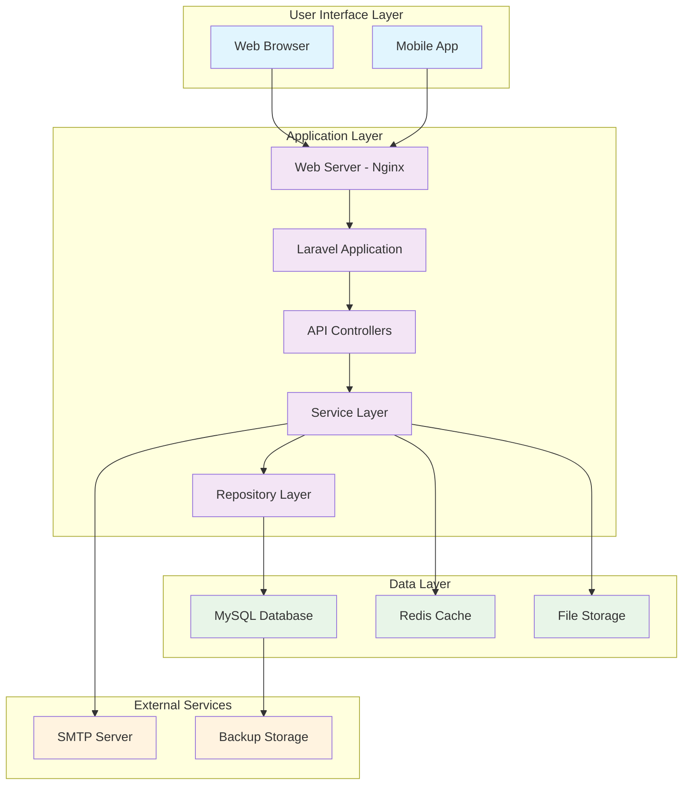

#### 9.1.2 Request Processing Flow

**HTTP Request Lifecycle**
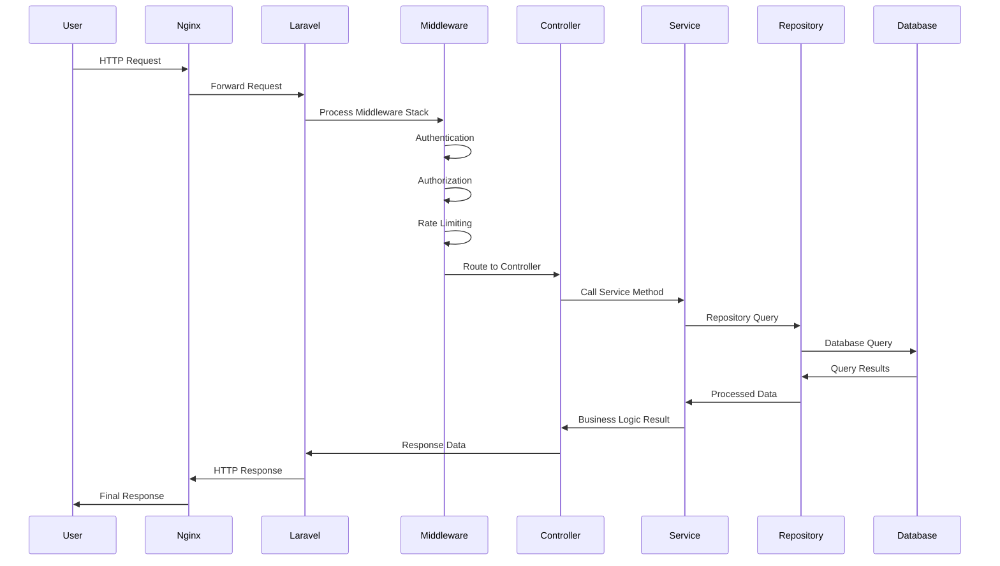

### 9.2 Core Business Process Flows

#### 9.2.1 Document Upload Process

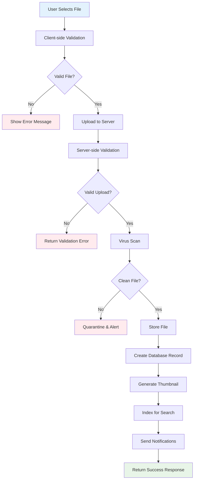

**Document Upload Service Implementation**
```php
<?php
// app/Services/DocumentUploadService.php
class DocumentUploadService
{
    public function __construct(
        private FileValidationService $fileValidator,
        private VirusScanService $virusScanner,
        private FileStorageService $fileStorage,
        private ThumbnailService $thumbnailService,
        private SearchIndexService $searchIndex,
        private NotificationService $notificationService
    ) {}
    
    public function processUpload(UploadedFile $file, array $metadata, User $uploader): Document
    {
        DB::beginTransaction();
        
        try {
            // Step 1: Validate file
            $this->fileValidator->validate($file);
            
            // Step 2: Scan for viruses
            $scanResult = $this->virusScanner->scan($file);
            if (!$scanResult->isClean()) {
                throw new VirusDetectedException('File contains malware');
            }
            
            // Step 3: Store file securely
            $filePath = $this->fileStorage->store($file, 'documents', [
                'visibility' => 'private',
                'encryption' => $metadata['access_level'] === 'confidential'
            ]);
            
            // Step 4: Create database record
            $document = Document::create([
                'title' => $metadata['title'],
                'description' => $metadata['description'],
                'file_name' => basename($filePath),
                'original_name' => $file->getClientOriginalName(),
                'file_path' => $filePath,
                'mime_type' => $file->getMimeType(),
                'file_size' => $file->getSize(),
                'category' => $metadata['category'],
                'visibility_scope' => $metadata['visibility_scope'],
                'access_level' => $metadata['access_level'],
                'uploaded_by' => $uploader->id,
            ]);
            
            // Step 5: Generate thumbnail (async)
            dispatch(new GenerateThumbnailJob($document));
            
            // Step 6: Index for search (async)
            dispatch(new IndexDocumentJob($document));
            
            // Step 7: Send notifications (async)
            if ($metadata['notify_users'] ?? false) {
                dispatch(new NotifyDocumentUploadJob($document));
            }
            
            DB::commit();
            
            event(new DocumentUploaded($document, $uploader));
            
            return $document;
            
        } catch (\Throwable $e) {
            DB::rollBack();
            
            // Clean up uploaded file
            if (isset($filePath)) {
                $this->fileStorage->delete($filePath);
            }
            
            throw $e;
        }
    }
}
```

#### 9.2.2 User Authentication Flow

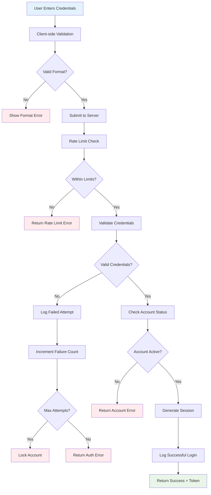

#### 9.2.3 Message Delivery Process

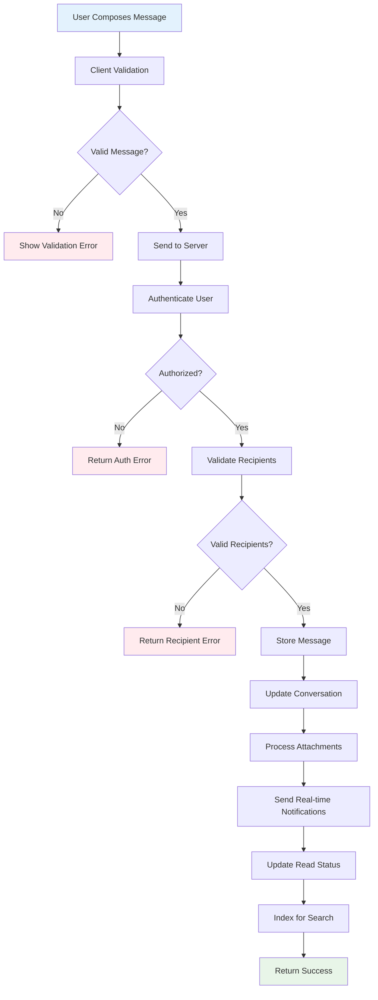

### 9.3 Data Processing Workflows

#### 9.3.1 Background Job Processing

**Queue System Architecture**
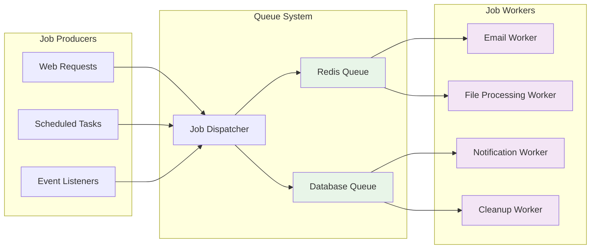

**Job Processing Implementation**
```php
<?php
// app/Jobs/ProcessDocumentJob.php
class ProcessDocumentJob implements ShouldQueue
{
    use Dispatchable, InteractsWithQueue, Queueable, SerializesModels;
    
    public $tries = 3;
    public $timeout = 300; // 5 minutes
    
    public function __construct(
        private Document $document
    ) {}
    
    public function handle(
        ThumbnailService $thumbnailService,
        SearchIndexService $searchIndex,
        MetadataExtractor $metadataExtractor
    ): void {
        try {
            // Extract metadata
            $metadata = $metadataExtractor->extract($this->document->file_path);
            $this->document->update(['metadata' => $metadata]);
            
            // Generate thumbnail
            if ($this->document->isImage() || $this->document->isPdf()) {
                $thumbnailPath = $thumbnailService->generate($this->document);
                $this->document->update(['thumbnail_path' => $thumbnailPath]);
            }
            
            // Index for search
            $searchIndex->index($this->document);
            
            // Mark as processed
            $this->document->update(['processing_status' => 'completed']);
            
            event(new DocumentProcessed($this->document));
            
        } catch (\Throwable $e) {
            $this->document->update(['processing_status' => 'failed']);
            
            Log::error('Document processing failed', [
                'document_id' => $this->document->id,
                'error' => $e->getMessage()
            ]);
            
            throw $e;
        }
    }
    
    public function failed(\Throwable $exception): void
    {
        $this->document->update(['processing_status' => 'failed']);
        
        event(new DocumentProcessingFailed($this->document, $exception));
    }
}
```

#### 9.3.2 Real-time Data Synchronization

**WebSocket Integration for Real-time Features**
```php
<?php
// app/Services/RealTimeService.php
class RealTimeService
{
    public function __construct(
        private BroadcastManager $broadcaster
    ) {}
    
    public function broadcastMessage(Message $message): void
    {
        $conversationChannel = "conversation.{$message->conversation_id}";
        
        $this->broadcaster->channel($conversationChannel)->send([
            'type' => 'message.new',
            'data' => [
                'id' => $message->id,
                'conversation_id' => $message->conversation_id,
                'sender' => [
                    'id' => $message->sender->id,
                    'name' => $message->sender->name
                ],
                'body' => $message->body,
                'created_at' => $message->created_at->toISOString()
            ]
        ]);
    }
    
    public function broadcastTypingIndicator(int $conversationId, User $user, bool $isTyping): void
    {
        $conversationChannel = "conversation.{$conversationId}";
        
        $this->broadcaster->channel($conversationChannel)->send([
            'type' => 'typing.indicator',
            'data' => [
                'user_id' => $user->id,
                'user_name' => $user->name,
                'is_typing' => $isTyping
            ]
        ]);
    }
    
    public function broadcastUserPresence(User $user, string $status): void
    {
        $userChannel = "user.{$user->id}";
        
        $this->broadcaster->channel($userChannel)->send([
            'type' => 'presence.update',
            'data' => [
                'user_id' => $user->id,
                'status' => $status, // online, away, offline
                'last_seen' => now()->toISOString()
            ]
        ]);
    }
}
```

This comprehensive data flow and process design ensures efficient, secure, and scalable handling of all system operations while maintaining data integrity and providing real-time user experiences.---

#
# 10. Deployment Architecture

### 10.1 Infrastructure Design

#### 10.1.1 Production Environment Architecture

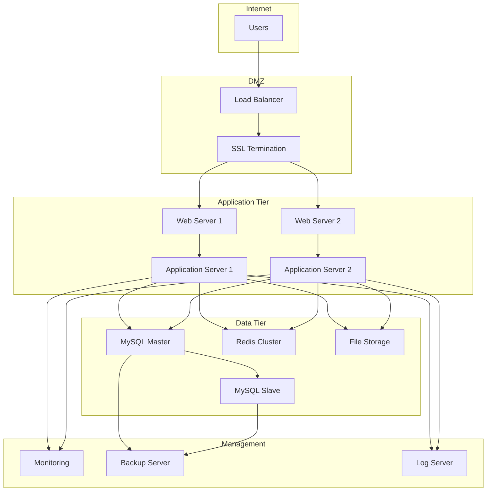

#### 10.1.2 Server Specifications

**Production Server Requirements**

| **Component** | **Minimum Specs** | **Recommended Specs** | **Scaling Options** |
|---------------|-------------------|----------------------|-------------------|
| **Web Server** | 2 CPU, 4GB RAM, 50GB SSD | 4 CPU, 8GB RAM, 100GB SSD | Horizontal scaling with load balancer |
| **Application Server** | 4 CPU, 8GB RAM, 100GB SSD | 8 CPU, 16GB RAM, 200GB SSD | Auto-scaling based on CPU/memory |
| **Database Server** | 4 CPU, 16GB RAM, 500GB SSD | 8 CPU, 32GB RAM, 1TB SSD | Read replicas, clustering |
| **Cache Server** | 2 CPU, 8GB RAM, 50GB SSD | 4 CPU, 16GB RAM, 100GB SSD | Redis cluster, sharding |
| **File Storage** | 1TB initial capacity | 5TB with expansion capability | Network-attached storage, cloud storage |

### 10.2 Deployment Strategy

#### 10.2.1 Blue-Green Deployment

**Deployment Process Flow**
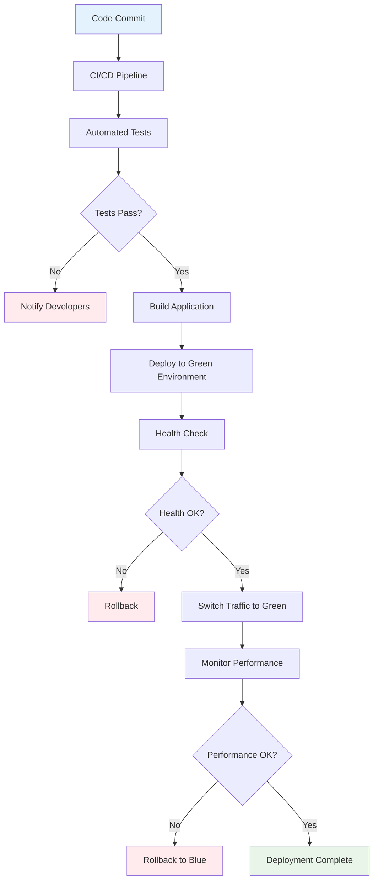

**Deployment Configuration**
```yaml
# docker-compose.production.yml
version: '3.8'

services:
  nginx:
    image: nginx:alpine
    ports:
      - "80:80"
      - "443:443"
    volumes:
      - ./nginx.conf:/etc/nginx/nginx.conf
      - ./ssl:/etc/ssl/certs
    depends_on:
      - app
    networks:
      - nimr-network

  app:
    build:
      context: .
      dockerfile: Dockerfile.production
    environment:
      - APP_ENV=production
      - APP_DEBUG=false
      - DB_HOST=mysql
      - REDIS_HOST=redis
    volumes:
      - ./storage:/var/www/storage
      - ./bootstrap/cache:/var/www/bootstrap/cache
    depends_on:
      - mysql
      - redis
    networks:
      - nimr-network

  mysql:
    image: mysql:8.0
    environment:
      - MYSQL_ROOT_PASSWORD=${DB_ROOT_PASSWORD}
      - MYSQL_DATABASE=${DB_DATABASE}
      - MYSQL_USER=${DB_USERNAME}
      - MYSQL_PASSWORD=${DB_PASSWORD}
    volumes:
      - mysql_data:/var/lib/mysql
      - ./mysql.cnf:/etc/mysql/conf.d/custom.cnf
    networks:
      - nimr-network

  redis:
    image: redis:alpine
    command: redis-server --appendonly yes
    volumes:
      - redis_data:/data
    networks:
      - nimr-network

  queue-worker:
    build:
      context: .
      dockerfile: Dockerfile.production
    command: php artisan queue:work --sleep=3 --tries=3
    environment:
      - APP_ENV=production
      - DB_HOST=mysql
      - REDIS_HOST=redis
    depends_on:
      - mysql
      - redis
    networks:
      - nimr-network

volumes:
  mysql_data:
  redis_data:

networks:
  nimr-network:
    driver: bridge
```

#### 10.2.2 CI/CD Pipeline

**GitHub Actions Workflow**
```yaml
# .github/workflows/deploy.yml
name: Deploy to Production

on:
  push:
    branches: [main]
  pull_request:
    branches: [main]

jobs:
  test:
    runs-on: ubuntu-latest
    
    services:
      mysql:
        image: mysql:8.0
        env:
          MYSQL_ROOT_PASSWORD: password
          MYSQL_DATABASE: nimr_test
        options: >-
          --health-cmd="mysqladmin ping"
          --health-interval=10s
          --health-timeout=5s
          --health-retries=3
        ports:
          - 3306:3306
      
      redis:
        image: redis:alpine
        options: >-
          --health-cmd="redis-cli ping"
          --health-interval=10s
          --health-timeout=5s
          --health-retries=3
        ports:
          - 6379:6379
    
    steps:
      - uses: actions/checkout@v3
      
      - name: Setup PHP
        uses: shivammathur/setup-php@v2
        with:
          php-version: '8.2'
          extensions: mbstring, xml, ctype, iconv, intl, pdo_mysql, dom, filter, gd, iconv, json, mbstring, redis
          
      - name: Cache Composer packages
        id: composer-cache
        uses: actions/cache@v3
        with:
          path: vendor
          key: ${{ runner.os }}-php-${{ hashFiles('**/composer.lock') }}
          restore-keys: |
            ${{ runner.os }}-php-
            
      - name: Install dependencies
        run: composer install --prefer-dist --no-progress
        
      - name: Setup Node.js
        uses: actions/setup-node@v3
        with:
          node-version: '18'
          cache: 'npm'
          
      - name: Install NPM dependencies
        run: npm ci
        
      - name: Build assets
        run: npm run build
        
      - name: Copy environment file
        run: cp .env.example .env
        
      - name: Generate application key
        run: php artisan key:generate
        
      - name: Run database migrations
        run: php artisan migrate --force
        env:
          DB_CONNECTION: mysql
          DB_HOST: 127.0.0.1
          DB_PORT: 3306
          DB_DATABASE: nimr_test
          DB_USERNAME: root
          DB_PASSWORD: password
          
      - name: Run PHPUnit tests
        run: php artisan test
        env:
          DB_CONNECTION: mysql
          DB_HOST: 127.0.0.1
          DB_PORT: 3306
          DB_DATABASE: nimr_test
          DB_USERNAME: root
          DB_PASSWORD: password
          REDIS_HOST: 127.0.0.1
          REDIS_PORT: 6379

  deploy:
    needs: test
    runs-on: ubuntu-latest
    if: github.ref == 'refs/heads/main'
    
    steps:
      - uses: actions/checkout@v3
      
      - name: Deploy to production
        uses: appleboy/ssh-action@v0.1.5
        with:
          host: ${{ secrets.PRODUCTION_HOST }}
          username: ${{ secrets.PRODUCTION_USER }}
          key: ${{ secrets.PRODUCTION_SSH_KEY }}
          script: |
            cd /var/www/nimr-intranet
            git pull origin main
            composer install --no-dev --optimize-autoloader
            npm ci --production
            npm run build
            php artisan migrate --force
            php artisan config:cache
            php artisan route:cache
            php artisan view:cache
            php artisan queue:restart
            sudo systemctl reload nginx
```

### 10.3 Environment Configuration

#### 10.3.1 Environment-Specific Settings

**Production Environment (.env.production)**
```env
# Application
APP_NAME="NIMR Intranet"
APP_ENV=production
APP_KEY=base64:generated_key_here
APP_DEBUG=false
APP_URL=https://intranet.nimr.or.tz

# Database
DB_CONNECTION=mysql
DB_HOST=mysql-master.internal
DB_PORT=3306
DB_DATABASE=nimr_intranet
DB_USERNAME=nimr_user
DB_PASSWORD=secure_production_password

# Cache & Sessions
CACHE_DRIVER=redis
SESSION_DRIVER=redis
QUEUE_CONNECTION=redis

# Redis
REDIS_HOST=redis-cluster.internal
REDIS_PASSWORD=redis_production_password
REDIS_PORT=6379

# Mail
MAIL_MAILER=smtp
MAIL_HOST=smtp.nimr.or.tz
MAIL_PORT=587
MAIL_USERNAME=noreply@nimr.or.tz
MAIL_PASSWORD=mail_production_password
MAIL_ENCRYPTION=tls
MAIL_FROM_ADDRESS=noreply@nimr.or.tz
MAIL_FROM_NAME="NIMR Intranet"

# File Storage
FILESYSTEM_DISK=local
# For cloud storage:
# FILESYSTEM_DISK=s3
# AWS_ACCESS_KEY_ID=your_access_key
# AWS_SECRET_ACCESS_KEY=your_secret_key
# AWS_DEFAULT_REGION=us-east-1
# AWS_BUCKET=nimr-intranet-files

# Logging
LOG_CHANNEL=daily
LOG_LEVEL=error
LOG_DAYS=30

# Security
SESSION_LIFETIME=120
SESSION_ENCRYPT=true
SESSION_HTTP_ONLY=true
SESSION_SAME_SITE=strict

# Performance
OCTANE_SERVER=swoole
OCTANE_HTTPS=true
```

**Staging Environment (.env.staging)**
```env
# Application
APP_NAME="NIMR Intranet (Staging)"
APP_ENV=staging
APP_KEY=base64:staging_key_here
APP_DEBUG=true
APP_URL=https://staging.intranet.nimr.or.tz

# Database
DB_CONNECTION=mysql
DB_HOST=mysql-staging.internal
DB_PORT=3306
DB_DATABASE=nimr_intranet_staging
DB_USERNAME=nimr_staging_user
DB_PASSWORD=staging_password

# Cache & Sessions
CACHE_DRIVER=redis
SESSION_DRIVER=redis
QUEUE_CONNECTION=redis

# Redis
REDIS_HOST=redis-staging.internal
REDIS_PASSWORD=redis_staging_password
REDIS_PORT=6379

# Mail (using staging SMTP)
MAIL_MAILER=smtp
MAIL_HOST=smtp-staging.nimr.or.tz
MAIL_PORT=587
MAIL_USERNAME=staging@nimr.or.tz
MAIL_PASSWORD=mail_staging_password
MAIL_ENCRYPTION=tls
MAIL_FROM_ADDRESS=staging@nimr.or.tz
MAIL_FROM_NAME="NIMR Intranet Staging"

# Logging
LOG_CHANNEL=daily
LOG_LEVEL=debug
LOG_DAYS=7
```

#### 10.3.2 Server Configuration

**Nginx Production Configuration**
```nginx
# /etc/nginx/sites-available/nimr-intranet
server {
    listen 80;
    server_name intranet.nimr.or.tz;
    return 301 https://$server_name$request_uri;
}

server {
    listen 443 ssl http2;
    server_name intranet.nimr.or.tz;
    root /var/www/nimr-intranet/public;
    index index.php;

    # SSL Configuration
    ssl_certificate /etc/ssl/certs/nimr-intranet.crt;
    ssl_certificate_key /etc/ssl/private/nimr-intranet.key;
    ssl_protocols TLSv1.2 TLSv1.3;
    ssl_ciphers ECDHE-RSA-AES256-GCM-SHA512:DHE-RSA-AES256-GCM-SHA512:ECDHE-RSA-AES256-GCM-SHA384;
    ssl_prefer_server_ciphers off;
    ssl_session_cache shared:SSL:10m;
    ssl_session_timeout 10m;

    # Security Headers
    add_header Strict-Transport-Security "max-age=31536000; includeSubDomains" always;
    add_header X-Frame-Options "SAMEORIGIN" always;
    add_header X-Content-Type-Options "nosniff" always;
    add_header X-XSS-Protection "1; mode=block" always;
    add_header Referrer-Policy "strict-origin-when-cross-origin" always;
    add_header Content-Security-Policy "default-src 'self'; script-src 'self' 'unsafe-inline' 'unsafe-eval'; style-src 'self' 'unsafe-inline'; img-src 'self' data: https:; font-src 'self' data:; connect-src 'self'; media-src 'self'; object-src 'none'; child-src 'none'; frame-ancestors 'none'; form-action 'self'; base-uri 'self';" always;

    # File Upload Limits
    client_max_body_size 20M;
    client_body_timeout 60s;
    client_header_timeout 60s;

    # Gzip Compression
    gzip on;
    gzip_vary on;
    gzip_min_length 1024;
    gzip_proxied any;
    gzip_comp_level 6;
    gzip_types
        text/plain
        text/css
        text/xml
        text/javascript
        application/json
        application/javascript
        application/xml+rss
        application/atom+xml
        image/svg+xml;

    # Static File Caching
    location ~* \.(js|css|png|jpg|jpeg|gif|ico|svg|woff|woff2|ttf|eot)$ {
        expires 1y;
        add_header Cache-Control "public, immutable";
        access_log off;
    }

    # PHP Processing
    location / {
        try_files $uri $uri/ /index.php?$query_string;
    }

    location ~ \.php$ {
        fastcgi_pass unix:/var/run/php/php8.2-fpm.sock;
        fastcgi_param SCRIPT_FILENAME $realpath_root$fastcgi_script_name;
        include fastcgi_params;
        fastcgi_hide_header X-Powered-By;
        
        # Security
        fastcgi_param HTTP_PROXY "";
        fastcgi_param SERVER_NAME $host;
        fastcgi_param HTTPS on;
    }

    # Deny access to sensitive files
    location ~ /\.(?!well-known).* {
        deny all;
    }

    location ~ ^/(\.env|composer\.(json|lock)|package\.json|webpack\.mix\.js|artisan) {
        deny all;
    }

    # Rate Limiting
    limit_req_zone $binary_remote_addr zone=login:10m rate=5r/m;
    limit_req_zone $binary_remote_addr zone=api:10m rate=60r/m;

    location /login {
        limit_req zone=login burst=3 nodelay;
        try_files $uri $uri/ /index.php?$query_string;
    }

    location /api/ {
        limit_req zone=api burst=10 nodelay;
        try_files $uri $uri/ /index.php?$query_string;
    }

    # Logging
    access_log /var/log/nginx/nimr-intranet.access.log;
    error_log /var/log/nginx/nimr-intranet.error.log;
}
```

### 10.4 Monitoring and Maintenance

#### 10.4.1 System Monitoring

**Health Check Implementation**
```php
<?php
// app/Http/Controllers/HealthController.php
class HealthController extends Controller
{
    public function check(): JsonResponse
    {
        $checks = [
            'database' => $this->checkDatabase(),
            'redis' => $this->checkRedis(),
            'storage' => $this->checkStorage(),
            'queue' => $this->checkQueue(),
            'mail' => $this->checkMail(),
        ];
        
        $overall = collect($checks)->every(fn($check) => $check['status'] === 'ok');
        
        return response()->json([
            'status' => $overall ? 'ok' : 'error',
            'timestamp' => now()->toISOString(),
            'checks' => $checks,
            'version' => config('app.version'),
            'environment' => config('app.env')
        ], $overall ? 200 : 503);
    }
    
    private function checkDatabase(): array
    {
        try {
            DB::connection()->getPdo();
            $count = DB::table('users')->count();
            
            return [
                'status' => 'ok',
                'message' => "Database connection successful. {$count} users in system.",
                'response_time' => $this->measureResponseTime(fn() => DB::select('SELECT 1'))
            ];
        } catch (\Throwable $e) {
            return [
                'status' => 'error',
                'message' => 'Database connection failed: ' . $e->getMessage()
            ];
        }
    }
    
    private function checkRedis(): array
    {
        try {
            Redis::ping();
            
            return [
                'status' => 'ok',
                'message' => 'Redis connection successful',
                'response_time' => $this->measureResponseTime(fn() => Redis::ping())
            ];
        } catch (\Throwable $e) {
            return [
                'status' => 'error',
                'message' => 'Redis connection failed: ' . $e->getMessage()
            ];
        }
    }
    
    private function checkStorage(): array
    {
        try {
            $testFile = 'health-check-' . time() . '.txt';
            Storage::put($testFile, 'health check');
            $exists = Storage::exists($testFile);
            Storage::delete($testFile);
            
            if ($exists) {
                return [
                    'status' => 'ok',
                    'message' => 'File storage is working',
                    'free_space' => $this->getStorageFreeSpace()
                ];
            } else {
                return [
                    'status' => 'error',
                    'message' => 'File storage test failed'
                ];
            }
        } catch (\Throwable $e) {
            return [
                'status' => 'error',
                'message' => 'Storage check failed: ' . $e->getMessage()
            ];
        }
    }
    
    private function measureResponseTime(callable $callback): float
    {
        $start = microtime(true);
        $callback();
        return round((microtime(true) - $start) * 1000, 2); // milliseconds
    }
    
    private function getStorageFreeSpace(): string
    {
        $bytes = disk_free_space(storage_path());
        $units = ['B', 'KB', 'MB', 'GB', 'TB'];
        
        for ($i = 0; $bytes > 1024 && $i < count($units) - 1; $i++) {
            $bytes /= 1024;
        }
        
        return round($bytes, 2) . ' ' . $units[$i];
    }
}
```

---

## 11. Performance and Scalability Design

### 11.1 Performance Optimization Strategy

#### 11.1.1 Database Performance

**Query Optimization Techniques**
```php
<?php
// app/Services/QueryOptimizationService.php
class QueryOptimizationService
{
    public function optimizeDocumentQueries(): void
    {
        // Add composite indexes for common query patterns
        Schema::table('documents', function (Blueprint $table) {
            $table->index(['category', 'is_active', 'created_at']);
            $table->index(['uploaded_by', 'created_at']);
            $table->index(['visibility_scope', 'created_at']);
        });
        
        // Add covering indexes for frequently accessed columns
        Schema::table('users', function (Blueprint $table) {
            $table->index(['centre_id', 'station_id', 'role', 'is_active']);
        });
    }
    
    public function implementQueryCaching(): void
    {
        // Cache expensive queries
        $popularDocuments = Cache::remember('popular_documents', 3600, function () {
            return Document::select(['id', 'title', 'download_count', 'created_at'])
                ->where('is_active', true)
                ->orderByDesc('download_count')
                ->limit(10)
                ->get();
        });
        
        // Cache user permissions
        $userPermissions = Cache::remember("user_permissions_{$userId}", 1800, function () use ($userId) {
            return User::with(['roles.permissions'])->find($userId);
        });
    }
}
```

**Database Connection Optimization**
```php
<?php
// config/database.php - Optimized MySQL configuration
'mysql' => [
    'driver' => 'mysql',
    'host' => env('DB_HOST', '127.0.0.1'),
    'port' => env('DB_PORT', '3306'),
    'database' => env('DB_DATABASE', 'forge'),
    'username' => env('DB_USERNAME', 'forge'),
    'password' => env('DB_PASSWORD', ''),
    'unix_socket' => env('DB_SOCKET', ''),
    'charset' => 'utf8mb4',
    'collation' => 'utf8mb4_unicode_ci',
    'prefix' => '',
    'prefix_indexes' => true,
    'strict' => true,
    'engine' => 'InnoDB',
    'options' => extension_loaded('pdo_mysql') ? array_filter([
        PDO::MYSQL_ATTR_SSL_CA => env('MYSQL_ATTR_SSL_CA'),
        PDO::ATTR_PERSISTENT => true,
        PDO::ATTR_TIMEOUT => 30,
        PDO::MYSQL_ATTR_USE_BUFFERED_QUERY => true,
    ]) : [],
    'pool' => [
        'min_connections' => 5,
        'max_connections' => 20,
        'connect_timeout' => 10.0,
        'wait_timeout' => 3.0,
        'heartbeat' => -1,
        'max_idle_time' => 60.0,
    ],
],
```

#### 11.1.2 Application-Level Caching

**Multi-Layer Caching Strategy**
```php
<?php
// app/Services/CacheService.php
class CacheService
{
    private const CACHE_TAGS = [
        'users' => 'users',
        'documents' => 'documents',
        'announcements' => 'announcements',
        'organizational' => 'organizational'
    ];
    
    public function __construct(
        private CacheManager $cache
    ) {}
    
    public function cacheUserData(User $user): void
    {
        $cacheKey = "user_data_{$user->id}";
        
        $this->cache->tags([self::CACHE_TAGS['users']])->put($cacheKey, [
            'id' => $user->id,
            'name' => $user->name,
            'role' => $user->role,
            'permissions' => $user->getAllPermissions(),
            'organizational_context' => [
                'centre_id' => $user->centre_id,
                'station_id' => $user->station_id,
                'department_id' => $user->department_id
            ]
        ], 1800); // 30 minutes
    }
    
    public function cacheDocumentList(string $cacheKey, Collection $documents): void
    {
        $this->cache->tags([self::CACHE_TAGS['documents']])->put($cacheKey, [
            'data' => $documents->map(function ($doc) {
                return [
                    'id' => $doc->id,
                    'title' => $doc->title,
                    'category' => $doc->category,
                    'file_size' => $doc->file_size,
                    'created_at' => $doc->created_at->toISOString()
                ];
            }),
            'cached_at' => now()->toISOString()
        ], 900); // 15 minutes
    }
    
    public function invalidateUserCache(int $userId): void
    {
        $this->cache->forget("user_data_{$userId}");
        $this->cache->tags([self::CACHE_TAGS['users']])->flush();
    }
    
    public function invalidateDocumentCache(): void
    {
        $this->cache->tags([self::CACHE_TAGS['documents']])->flush();
    }
}
```

**Redis Configuration for Performance**
```redis
# redis.conf - Production optimizations
maxmemory 2gb
maxmemory-policy allkeys-lru
save 900 1
save 300 10
save 60 10000
stop-writes-on-bgsave-error yes
rdbcompression yes
rdbchecksum yes
timeout 300
tcp-keepalive 300
tcp-backlog 511
databases 16
```

### 11.2 Scalability Architecture

#### 11.2.1 Horizontal Scaling Design

**Load Balancer Configuration**
```nginx
# nginx-load-balancer.conf
upstream nimr_app_servers {
    least_conn;
    server app1.internal:9000 weight=3 max_fails=3 fail_timeout=30s;
    server app2.internal:9000 weight=3 max_fails=3 fail_timeout=30s;
    server app3.internal:9000 weight=2 max_fails=3 fail_timeout=30s backup;
}

server {
    listen 80;
    server_name intranet.nimr.or.tz;
    
    location / {
        proxy_pass http://nimr_app_servers;
        proxy_set_header Host $host;
        proxy_set_header X-Real-IP $remote_addr;
        proxy_set_header X-Forwarded-For $proxy_add_x_forwarded_for;
        proxy_set_header X-Forwarded-Proto $scheme;
        
        # Connection pooling
        proxy_http_version 1.1;
        proxy_set_header Connection "";
        
        # Timeouts
        proxy_connect_timeout 5s;
        proxy_send_timeout 60s;
        proxy_read_timeout 60s;
        
        # Health checks
        proxy_next_upstream error timeout invalid_header http_500 http_502 http_503;
        proxy_next_upstream_tries 3;
        proxy_next_upstream_timeout 10s;
    }
    
    # Health check endpoint
    location /health {
        access_log off;
        proxy_pass http://nimr_app_servers/health;
    }
}
```

#### 11.2.2 Database Scaling Strategy

**Master-Slave Replication Setup**
```php
<?php
// config/database.php - Read/Write splitting
'mysql' => [
    'read' => [
        'host' => [
            'mysql-slave1.internal',
            'mysql-slave2.internal',
        ],
        'username' => env('DB_READ_USERNAME', 'read_user'),
        'password' => env('DB_READ_PASSWORD', ''),
    ],
    'write' => [
        'host' => 'mysql-master.internal',
        'username' => env('DB_WRITE_USERNAME', 'write_user'),
        'password' => env('DB_WRITE_PASSWORD', ''),
    ],
    'sticky' => true, // Ensure read-after-write consistency
    'driver' => 'mysql',
    'database' => env('DB_DATABASE', 'nimr_intranet'),
    'charset' => 'utf8mb4',
    'collation' => 'utf8mb4_unicode_ci',
    'prefix' => '',
    'strict' => true,
    'engine' => 'InnoDB',
],
```

**Database Partitioning Strategy**
```sql
-- Partition messages table by date for better performance
CREATE TABLE messages (
    id BIGINT UNSIGNED AUTO_INCREMENT,
    conversation_id BIGINT UNSIGNED NOT NULL,
    sender_id BIGINT UNSIGNED NOT NULL,
    body LONGTEXT NOT NULL,
    created_at TIMESTAMP DEFAULT CURRENT_TIMESTAMP,
    -- other columns...
    PRIMARY KEY (id, created_at)
) PARTITION BY RANGE (YEAR(created_at)) (
    PARTITION p2024 VALUES LESS THAN (2025),
    PARTITION p2025 VALUES LESS THAN (2026),
    PARTITION p2026 VALUES LESS THAN (2027),
    PARTITION p_future VALUES LESS THAN MAXVALUE
);

-- Partition audit logs by month
CREATE TABLE audit_logs (
    id BIGINT UNSIGNED AUTO_INCREMENT,
    user_id BIGINT UNSIGNED,
    action VARCHAR(255) NOT NULL,
    created_at TIMESTAMP DEFAULT CURRENT_TIMESTAMP,
    -- other columns...
    PRIMARY KEY (id, created_at)
) PARTITION BY RANGE (TO_DAYS(created_at)) (
    PARTITION p202501 VALUES LESS THAN (TO_DAYS('2025-02-01')),
    PARTITION p202502 VALUES LESS THAN (TO_DAYS('2025-03-01')),
    PARTITION p202503 VALUES LESS THAN (TO_DAYS('2025-04-01')),
    -- Add more partitions as needed
    PARTITION p_future VALUES LESS THAN MAXVALUE
);
```

### 11.3 Performance Monitoring

#### 11.3.1 Application Performance Monitoring

**Performance Metrics Collection**
```php
<?php
// app/Services/PerformanceMonitoringService.php
class PerformanceMonitoringService
{
    public function __construct(
        private MetricsCollector $metrics
    ) {}
    
    public function recordRequestMetrics(Request $request, Response $response, float $duration): void
    {
        $this->metrics->increment('http_requests_total', [
            'method' => $request->method(),
            'route' => $request->route()?->getName() ?? 'unknown',
            'status_code' => $response->getStatusCode()
        ]);
        
        $this->metrics->histogram('http_request_duration_seconds', $duration, [
            'method' => $request->method(),
            'route' => $request->route()?->getName() ?? 'unknown'
        ]);
        
        if ($duration > 3.0) { // Log slow requests
            Log::warning('Slow request detected', [
                'url' => $request->fullUrl(),
                'method' => $request->method(),
                'duration' => $duration,
                'user_id' => auth()->id(),
                'memory_usage' => memory_get_peak_usage(true)
            ]);
        }
    }
    
    public function recordDatabaseMetrics(string $query, float $duration): void
    {
        $this->metrics->histogram('database_query_duration_seconds', $duration, [
            'query_type' => $this->getQueryType($query)
        ]);
        
        if ($duration > 1.0) { // Log slow queries
            Log::warning('Slow database query', [
                'query' => $query,
                'duration' => $duration
            ]);
        }
    }
    
    public function recordCacheMetrics(string $operation, bool $hit): void
    {
        $this->metrics->increment('cache_operations_total', [
            'operation' => $operation,
            'result' => $hit ? 'hit' : 'miss'
        ]);
    }
    
    private function getQueryType(string $query): string
    {
        $query = strtoupper(trim($query));
        
        if (str_starts_with($query, 'SELECT')) return 'select';
        if (str_starts_with($query, 'INSERT')) return 'insert';
        if (str_starts_with($query, 'UPDATE')) return 'update';
        if (str_starts_with($query, 'DELETE')) return 'delete';
        
        return 'other';
    }
}
```

---

## 12. Design Patterns and Best Practices

### 12.1 Architectural Patterns

#### 12.1.1 Repository Pattern Implementation

**Repository Interface Design**
```php
<?php
// app/Repositories/Contracts/RepositoryInterface.php
interface RepositoryInterface
{
    public function find(int $id): ?Model;
    public function findOrFail(int $id): Model;
    public function all(array $columns = ['*']): Collection;
    public function paginate(int $perPage = 15, array $columns = ['*']): LengthAwarePaginator;
    public function create(array $data): Model;
    public function update(Model $model, array $data): Model;
    public function delete(Model $model): bool;
    public function findWhere(array $criteria): Collection;
    public function findWhereFirst(array $criteria): ?Model;
}

// app/Repositories/BaseRepository.php
abstract class BaseRepository implements RepositoryInterface
{
    protected Model $model;
    
    public function __construct(Model $model)
    {
        $this->model = $model;
    }
    
    public function find(int $id): ?Model
    {
        return $this->model->find($id);
    }
    
    public function findOrFail(int $id): Model
    {
        return $this->model->findOrFail($id);
    }
    
    public function all(array $columns = ['*']): Collection
    {
        return $this->model->all($columns);
    }
    
    public function paginate(int $perPage = 15, array $columns = ['*']): LengthAwarePaginator
    {
        return $this->model->paginate($perPage, $columns);
    }
    
    public function create(array $data): Model
    {
        return $this->model->create($data);
    }
    
    public function update(Model $model, array $data): Model
    {
        $model->update($data);
        return $model->fresh();
    }
    
    public function delete(Model $model): bool
    {
        return $model->delete();
    }
    
    public function findWhere(array $criteria): Collection
    {
        $query = $this->model->newQuery();
        
        foreach ($criteria as $field => $value) {
            if (is_array($value)) {
                $query->whereIn($field, $value);
            } else {
                $query->where($field, $value);
            }
        }
        
        return $query->get();
    }
    
    public function findWhereFirst(array $criteria): ?Model
    {
        return $this->findWhere($criteria)->first();
    }
}
```

#### 12.1.2 Service Layer Pattern

**Service Layer Architecture**
```php
<?php
// app/Services/Contracts/ServiceInterface.php
interface ServiceInterface
{
    public function handleException(\Throwable $exception, string $context): void;
    public function validateData(array $data, array $rules): array;
    public function logActivity(string $action, array $context = []): void;
}

// app/Services/BaseService.php
abstract class BaseService implements ServiceInterface
{
    protected function validateData(array $data, array $rules): array
    {
        return Validator::make($data, $rules)->validate();
    }
    
    protected function handleException(\Throwable $exception, string $context): void
    {
        Log::error("Service error in {$context}", [
            'exception' => $exception->getMessage(),
            'trace' => $exception->getTraceAsString(),
            'user_id' => auth()->id(),
            'timestamp' => now()
        ]);
        
        throw new ServiceException("An error occurred in {$context}: " . $exception->getMessage());
    }
    
    protected function logActivity(string $action, array $context = []): void
    {
        Log::info($action, array_merge($context, [
            'user_id' => auth()->id(),
            'ip_address' => request()->ip(),
            'timestamp' => now()
        ]));
    }
    
    protected function executeInTransaction(callable $callback)
    {
        return DB::transaction($callback);
    }
}
```

#### 12.1.3 Observer Pattern for Events

**Model Observers Implementation**
```php
<?php
// app/Observers/DocumentObserver.php
class DocumentObserver
{
    public function creating(Document $document): void
    {
        // Set default values
        $document->file_name = $document->file_name ?: Str::uuid();
        $document->processing_status = 'pending';
    }
    
    public function created(Document $document): void
    {
        // Dispatch background jobs
        dispatch(new ProcessDocumentJob($document));
        dispatch(new IndexDocumentJob($document));
        
        // Log activity
        Log::info('Document created', [
            'document_id' => $document->id,
            'uploader_id' => $document->uploaded_by,
            'category' => $document->category
        ]);
        
        // Fire event
        event(new DocumentUploaded($document));
    }
    
    public function updated(Document $document): void
    {
        // Check for significant changes
        if ($document->wasChanged(['title', 'description', 'category'])) {
            dispatch(new ReindexDocumentJob($document));
        }
        
        // Log changes
        Log::info('Document updated', [
            'document_id' => $document->id,
            'changes' => $document->getChanges(),
            'updated_by' => auth()->id()
        ]);
    }
    
    public function deleting(Document $document): void
    {
        // Clean up related data
        $document->accessLogs()->delete();
        
        // Remove from search index
        dispatch(new RemoveFromIndexJob($document));
    }
    
    public function deleted(Document $document): void
    {
        // Schedule file deletion (with delay for recovery)
        dispatch(new DeleteFileJob($document->file_path))->delay(now()->addDays(30));
        
        // Log deletion
        Log::warning('Document deleted', [
            'document_id' => $document->id,
            'title' => $document->title,
            'deleted_by' => auth()->id()
        ]);
    }
}
```

### 12.2 Code Quality Standards

#### 12.2.1 SOLID Principles Implementation

**Single Responsibility Principle**
```php
<?php
// Good: Each class has a single responsibility

// File validation
class FileValidator
{
    public function validate(UploadedFile $file): ValidationResult
    {
        // Only handles file validation logic
    }
}

// File storage
class FileStorageService
{
    public function store(UploadedFile $file, string $path): string
    {
        // Only handles file storage logic
    }
}

// Document creation
class DocumentCreationService
{
    public function __construct(
        private FileValidator $validator,
        private FileStorageService $storage,
        private DocumentRepository $repository
    ) {}
    
    public function create(UploadedFile $file, array $metadata): Document
    {
        // Orchestrates document creation using other services
    }
}
```

**Dependency Inversion Principle**
```php
<?php
// Good: Depend on abstractions, not concretions

interface NotificationServiceInterface
{
    public function send(User $user, string $message): void;
}

class EmailNotificationService implements NotificationServiceInterface
{
    public function send(User $user, string $message): void
    {
        // Email implementation
    }
}

class SmsNotificationService implements NotificationServiceInterface
{
    public function send(User $user, string $message): void
    {
        // SMS implementation
    }
}

class DocumentService
{
    public function __construct(
        private NotificationServiceInterface $notificationService
    ) {}
    
    public function notifyUpload(Document $document): void
    {
        // Depends on interface, not concrete implementation
        $this->notificationService->send(
            $document->uploader,
            "Document '{$document->title}' uploaded successfully"
        );
    }
}
```

#### 12.2.2 Error Handling Best Practices

**Custom Exception Hierarchy**
```php
<?php
// app/Exceptions/BaseException.php
abstract class BaseException extends Exception
{
    protected string $errorCode;
    protected array $context;
    
    public function __construct(string $message, array $context = [], int $code = 0, \Throwable $previous = null)
    {
        $this->context = $context;
        parent::__construct($message, $code, $previous);
    }
    
    public function getContext(): array
    {
        return $this->context;
    }
    
    public function getErrorCode(): string
    {
        return $this->errorCode;
    }
    
    abstract public function getHttpStatusCode(): int;
}

// app/Exceptions/DocumentException.php
class DocumentException extends BaseException
{
    protected string $errorCode = 'DOCUMENT_ERROR';
    
    public function getHttpStatusCode(): int
    {
        return 422;
    }
}

class DocumentNotFoundException extends DocumentException
{
    protected string $errorCode = 'DOCUMENT_NOT_FOUND';
    
    public function getHttpStatusCode(): int
    {
        return 404;
    }
}

class DocumentAccessDeniedException extends DocumentException
{
    protected string $errorCode = 'DOCUMENT_ACCESS_DENIED';
    
    public function getHttpStatusCode(): int
    {
        return 403;
    }
}
```

**Global Exception Handler**
```php
<?php
// app/Exceptions/Handler.php
class Handler extends ExceptionHandler
{
    public function render($request, Throwable $e): Response
    {
        // Handle API requests
        if ($request->expectsJson()) {
            return $this->handleApiException($request, $e);
        }
        
        // Handle web requests
        return $this->handleWebException($request, $e);
    }
    
    private function handleApiException(Request $request, Throwable $e): JsonResponse
    {
        if ($e instanceof BaseException) {
            return response()->json([
                'success' => false,
                'error_code' => $e->getErrorCode(),
                'message' => $e->getMessage(),
                'context' => $e->getContext(),
                'timestamp' => now()->toISOString()
            ], $e->getHttpStatusCode());
        }
        
        if ($e instanceof ValidationException) {
            return response()->json([
                'success' => false,
                'error_code' => 'VALIDATION_ERROR',
                'message' => 'Validation failed',
                'errors' => $e->errors(),
                'timestamp' => now()->toISOString()
            ], 422);
        }
        
        // Log unexpected exceptions
        Log::error('Unexpected API exception', [
            'exception' => $e->getMessage(),
            'trace' => $e->getTraceAsString(),
            'request' => $request->all(),
            'user_id' => auth()->id()
        ]);
        
        return response()->json([
            'success' => false,
            'error_code' => 'INTERNAL_ERROR',
            'message' => 'An unexpected error occurred',
            'timestamp' => now()->toISOString()
        ], 500);
    }
}
```

### 12.3 Testing Strategy

#### 12.3.1 Test-Driven Development Approach

**Unit Test Example**
```php
<?php
// tests/Unit/Services/DocumentServiceTest.php
class DocumentServiceTest extends TestCase
{
    use RefreshDatabase;
    
    private DocumentService $documentService;
    private User $user;
    
    protected function setUp(): void
    {
        parent::setUp();
        
        $this->user = User::factory()->create();
        $this->documentService = app(DocumentService::class);
    }
    
    public function test_can_create_document_with_valid_data(): void
    {
        // Arrange
        Storage::fake('local');
        $file = UploadedFile::fake()->create('test.pdf', 1024, 'application/pdf');
        $metadata = [
            'title' => 'Test Document',
            'description' => 'Test description',
            'category' => 'hr',
            'visibility_scope' => 'all'
        ];
        
        // Act
        $document = $this->documentService->createDocument($metadata, $file, $this->user);
        
        // Assert
        $this->assertInstanceOf(Document::class, $document);
        $this->assertEquals('Test Document', $document->title);
        $this->assertEquals($this->user->id, $document->uploaded_by);
        $this->assertDatabaseHas('documents', [
            'title' => 'Test Document',
            'uploaded_by' => $this->user->id
        ]);
        Storage::assertExists($document->file_path);
    }
    
    public function test_throws_exception_for_invalid_file_type(): void
    {
        // Arrange
        Storage::fake('local');
        $file = UploadedFile::fake()->create('test.exe', 1024, 'application/x-executable');
        $metadata = ['title' => 'Test', 'category' => 'hr', 'visibility_scope' => 'all'];
        
        // Act & Assert
        $this->expectException(InvalidFileTypeException::class);
        $this->documentService->createDocument($metadata, $file, $this->user);
    }
}
```

**Integration Test Example**
```php
<?php
// tests/Feature/DocumentManagementTest.php
class DocumentManagementTest extends TestCase
{
    use RefreshDatabase;
    
    public function test_complete_document_workflow(): void
    {
        // Arrange
        Storage::fake('local');
        $admin = User::factory()->create(['role' => 'hq_admin']);
        $staff = User::factory()->create(['role' => 'staff']);
        $file = UploadedFile::fake()->create('policy.pdf', 2048, 'application/pdf');
        
        // Act 1: Admin uploads document
        $response = $this->actingAs($admin)
            ->post('/documents', [
                'title' => 'New Policy Document',
                'description' => 'Important policy update',
                'category' => 'hr',
                'visibility_scope' => 'all',
                'document' => $file
            ]);
        
        // Assert 1: Document created successfully
        $response->assertRedirect();
        $document = Document::where('title', 'New Policy Document')->first();
        $this->assertNotNull($document);
        
        // Act 2: Staff member views document
        $response = $this->actingAs($staff)
            ->get("/documents/{$document->id}");
        
        // Assert 2: Staff can view document
        $response->assertOk();
        $response->assertSee('New Policy Document');
        
        // Act 3: Staff downloads document
        $response = $this->actingAs($staff)
            ->get("/documents/{$document->id}/download");
        
        // Assert 3: Download successful and logged
        $response->assertOk();
        $this->assertEquals(1, $document->fresh()->download_count);
        
        // Act 4: Admin deletes document
        $response = $this->actingAs($admin)
            ->delete("/documents/{$document->id}");
        
        // Assert 4: Document soft deleted
        $response->assertRedirect();
        $this->assertSoftDeleted('documents', ['id' => $document->id]);
    }
}
```

This comprehensive System Design Document provides a complete technical blueprint for the NIMR Intranet Management System, covering all aspects from architecture and security to performance and best practices. The design ensures scalability, maintainability, and security while following industry standards and Laravel best practices.

---

**Document Information**  
**Version**: 1.0.0  
**Last Updated**: January 2025  
**Maintained by**: NIMR IT Development Team  
**Next Review**: April 2025  
**Classification**: Internal Use Only

---

*This document contains detailed technical specifications for system implementation. Distribute only to authorized technical personnel and maintain appropriate security controls.*