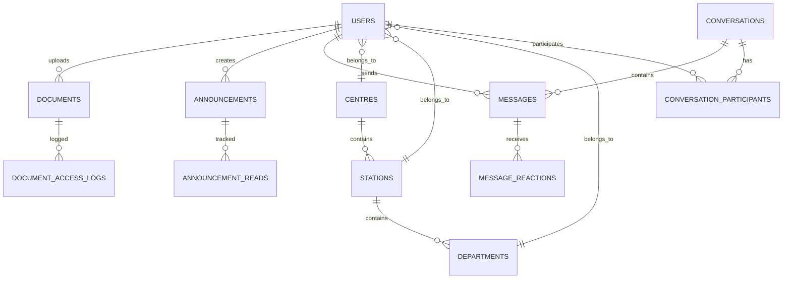

# Source Code Documentation
## NIMR Intranet Management System

**Document Version**: 1.0.0  
**Date**: January 2025  
**Project**: NIMR Intranet Management System  
**Organization**: National Institute for Medical Research (NIMR)  
**Classification**: Internal Use Only

---

## Document Control

| **Field** | **Details** |
|-----------|-------------|
| **Document Title** | Source Code Documentation - NIMR Intranet Management System |
| **Document ID** | SCD-NIMR-2025-001 |
| **Version** | 1.0.0 |
| **Date Created** | January 2025 |
| **Last Modified** | January 2025 |
| **Author(s)** | NIMR IT Development Team |
| **Reviewer(s)** | Senior Developer, Technical Lead |
| **Approver** | IT Director |
| **Distribution** | Development Team, Technical Staff, System Administrators |

---

## Table of Contents

1. [Introduction](#1-introduction)
2. [Project Structure](#2-project-structure)
3. [Development Environment Setup](#3-development-environment-setup)
4. [Core Models Documentation](#4-core-models-documentation)
5. [Controller Documentation](#5-controller-documentation)
6. [Service Layer Documentation](#6-service-layer-documentation)
7. [API Endpoints Reference](#7-api-endpoints-reference)
8. [Frontend Components](#8-frontend-components)
9. [Database Schema](#9-database-schema)
10. [Testing Documentation](#10-testing-documentation)
11. [Deployment Procedures](#11-deployment-procedures)
12. [Extension Guidelines](#12-extension-guidelines)

---

## 1. Introduction

### 1.1 Purpose

This Source Code Documentation provides comprehensive technical information about the NIMR Intranet Management System codebase. It serves as a reference for developers, maintainers, and technical staff involved in system development, maintenance, and enhancement.

### 1.2 Scope

This document covers:
- **Project Structure**: Organization of files and directories
- **Code Architecture**: Design patterns and architectural decisions
- **API Documentation**: Detailed endpoint specifications
- **Database Design**: Schema and relationship documentation
- **Development Practices**: Coding standards and best practices
- **Testing Strategy**: Test structure and guidelines
- **Deployment Process**: Build and deployment procedures

### 1.3 Technology Stack

**Backend Technologies:**
- **Framework**: Laravel 11.x (PHP 8.2+)
- **Database**: MySQL 8.0+ / MariaDB 10.6+
- **Cache**: Redis for session and application caching
- **Queue**: Redis-based job queue system
- **Authentication**: Laravel Sanctum for API authentication

**Frontend Technologies:**
- **CSS Framework**: Tailwind CSS 3.x
- **JavaScript**: Alpine.js for interactive components
- **Build Tool**: Vite for asset compilation
- **Template Engine**: Laravel Blade templates
---

##
 2. Project Structure

### 2.1 Directory Organization

```
nimr-intranet/
├── app/                          # Application source code
│   ├── Console/                  # Artisan commands
│   ├── Events/                   # Event classes
│   ├── Exceptions/               # Custom exception classes
│   ├── Helpers/                  # Helper functions and utilities
│   ├── Http/                     # HTTP layer (controllers, middleware, requests)
│   │   ├── Controllers/          # Application controllers
│   │   │   ├── Admin/           # Administrative controllers
│   │   │   ├── Api/             # API controllers
│   │   │   └── Auth/            # Authentication controllers
│   │   ├── Middleware/          # Custom middleware
│   │   ├── Requests/            # Form request validation classes
│   │   └── Resources/           # API resource transformers
│   ├── Models/                   # Eloquent models
│   ├── Policies/                 # Authorization policies
│   ├── Providers/                # Service providers
│   ├── Services/                 # Business logic services
│   └── View/                     # View composers and creators
├── bootstrap/                    # Application bootstrap files
├── config/                       # Configuration files
├── database/                     # Database files
│   ├── factories/               # Model factories for testing
│   ├── migrations/              # Database migrations
│   └── seeders/                 # Database seeders
├── public/                       # Public web directory
├── resources/                    # Raw assets and views
│   ├── css/                     # CSS source files
│   ├── js/                      # JavaScript source files
│   └── views/                   # Blade templates
│       ├── components/          # Reusable Blade components
│       ├── layouts/             # Layout templates
│       └── [feature-folders]/   # Feature-specific views
├── routes/                       # Route definitions
│   ├── api.php                  # API routes
│   ├── web.php                  # Web routes
│   └── auth.php                 # Authentication routes
├── storage/                      # Storage directory
│   ├── app/                     # Application storage
│   ├── framework/               # Framework storage
│   └── logs/                    # Application logs
├── tests/                        # Test files
│   ├── Feature/                 # Feature tests
│   └── Unit/                    # Unit tests
├── vendor/                       # Composer dependencies
├── .env.example                  # Environment configuration template
├── composer.json                 # PHP dependencies
├── package.json                  # Node.js dependencies
├── vite.config.js               # Vite build configuration
└── README.md                     # Project documentation
```

### 2.2 Key Directories Explained

#### 2.2.1 Application Layer (`app/`)

**Controllers (`app/Http/Controllers/`)**
- **Main Controllers**: Handle web requests and coordinate business logic
- **API Controllers**: Provide RESTful API endpoints
- **Admin Controllers**: Administrative interface controllers
- **Auth Controllers**: Authentication and authorization handling

**Models (`app/Models/`)**
- **Core Models**: User, Document, Announcement, Message, Event
- **Organizational Models**: Headquarters, Centre, Station, Department
- **Supporting Models**: Various supporting entities and relationships

**Services (`app/Services/`)**
- **Business Logic**: Encapsulated business operations
- **External Integrations**: Third-party service integrations
- **Utility Services**: Common functionality and helpers

#### 2.2.2 Database Layer (`database/`)

**Migrations (`database/migrations/`)**
- **Schema Definitions**: Database table structures
- **Relationship Setup**: Foreign key constraints and indexes
- **Data Modifications**: Schema updates and data transformations

**Seeders (`database/seeders/`)**
- **Initial Data**: Default system data and configurations
- **Test Data**: Sample data for development and testing
- **Reference Data**: Lookup tables and static data

#### 2.2.3 Frontend Layer (`resources/`)

**Views (`resources/views/`)**
- **Layouts**: Base templates and common structures
- **Components**: Reusable UI components
- **Feature Views**: Page-specific templates

**Assets (`resources/css/` & `resources/js/`)**
- **Stylesheets**: Tailwind CSS configurations and custom styles
- **JavaScript**: Alpine.js components and custom scripts
- **Build Configuration**: Vite setup for asset compilation

---

## 3. Development Environment Setup

### 3.1 Prerequisites

**System Requirements:**
- **PHP**: 8.2 or higher
- **Composer**: Latest version
- **Node.js**: 18.x or higher
- **NPM**: 9.x or higher
- **MySQL**: 8.0 or higher
- **Redis**: 6.x or higher (optional but recommended)

**Development Tools:**
- **Git**: Version control
- **IDE**: PhpStorm, VS Code, or similar
- **Database Client**: MySQL Workbench, phpMyAdmin, or similar

### 3.2 Installation Steps

#### 3.2.1 Clone and Setup

```bash
# Clone the repository
git clone [repository-url] nimr-intranet
cd nimr-intranet

# Install PHP dependencies
composer install

# Install Node.js dependencies
npm install

# Copy environment configuration
cp .env.example .env

# Generate application key
php artisan key:generate
```

#### 3.2.2 Database Configuration

```bash
# Create database
mysql -u root -p
CREATE DATABASE nimr_intranet CHARACTER SET utf8mb4 COLLATE utf8mb4_unicode_ci;
CREATE USER 'nimr_dev'@'localhost' IDENTIFIED BY 'dev_password';
GRANT ALL PRIVILEGES ON nimr_intranet.* TO 'nimr_dev'@'localhost';
FLUSH PRIVILEGES;
EXIT;

# Update .env file with database credentials
DB_CONNECTION=mysql
DB_HOST=127.0.0.1
DB_PORT=3306
DB_DATABASE=nimr_intranet
DB_USERNAME=nimr_dev
DB_PASSWORD=dev_password

# Run migrations and seeders
php artisan migrate
php artisan db:seed
```

#### 3.2.3 Development Server

```bash
# Start Laravel development server
php artisan serve

# In another terminal, start Vite development server
npm run dev

# Start queue worker (if using queues)
php artisan queue:work

# Start Redis server (if using Redis)
redis-server
```

### 3.3 Development Configuration

#### 3.3.1 Environment Variables (.env)

```env
# Application
APP_NAME="NIMR Intranet (Development)"
APP_ENV=local
APP_KEY=base64:generated_key_here
APP_DEBUG=true
APP_URL=http://localhost:8000

# Database
DB_CONNECTION=mysql
DB_HOST=127.0.0.1
DB_PORT=3306
DB_DATABASE=nimr_intranet
DB_USERNAME=nimr_dev
DB_PASSWORD=dev_password

# Cache & Sessions
CACHE_DRIVER=file
SESSION_DRIVER=file
QUEUE_CONNECTION=sync

# Redis (optional)
REDIS_HOST=127.0.0.1
REDIS_PASSWORD=null
REDIS_PORT=6379

# Mail (development)
MAIL_MAILER=log
MAIL_HOST=localhost
MAIL_PORT=1025
MAIL_USERNAME=null
MAIL_PASSWORD=null
MAIL_ENCRYPTION=null
MAIL_FROM_ADDRESS=dev@nimr.or.tz
MAIL_FROM_NAME="NIMR Intranet Dev"

# File Storage
FILESYSTEM_DISK=local

# Logging
LOG_CHANNEL=single
LOG_LEVEL=debug
```

#### 3.3.2 IDE Configuration

**PhpStorm Configuration:**
```xml
<!-- .idea/php.xml -->
<project version="4">
  <component name="PhpProjectSharedConfiguration" php_language_level="8.2">
    <option name="suggestChangeDefaultLanguageLevel" value="false" />
  </component>
  <component name="PhpUnit">
    <phpunit_settings>
      <PhpUnitSettings configuration_file_path="$PROJECT_DIR$/phpunit.xml" 
                      custom_loader_path="$PROJECT_DIR$/vendor/autoload.php" 
                      use_configuration_file="true" />
    </phpunit_settings>
  </component>
</project>
```

**VS Code Configuration:**
```json
// .vscode/settings.json
{
    "php.validate.executablePath": "/usr/bin/php",
    "php.suggest.basic": false,
    "emmet.includeLanguages": {
        "blade": "html"
    },
    "files.associations": {
        "*.blade.php": "blade"
    },
    "blade.format.enable": true,
    "tailwindCSS.includeLanguages": {
        "blade": "html"
    }
}
```

---

## 4. Core Models Documentation

### 4.1 User Model

**File**: `app/Models/User.php`

**Purpose**: Represents system users with role-based access control and organizational hierarchy.

**Key Relationships:**
- `belongsTo`: Headquarters, Centre, Station, Department
- `hasMany`: Announcements, Documents, Messages, Events
- `belongsToMany`: Conversations (through participants)

**Important Methods:**

```php
/**
 * Check if user can manage another user
 * @param User $targetUser
 * @return bool
 */
public function canManageUser(User $targetUser): bool
{
    return match($this->role) {
        'super_admin' => true,
        'hq_admin' => !$targetUser->isSuperAdmin(),
        'centre_admin' => $targetUser->centre_id === $this->centre_id && 
                        !in_array($targetUser->role, ['super_admin', 'hq_admin']),
        'station_admin' => $targetUser->station_id === $this->station_id && 
                         $targetUser->role === 'staff',
        default => false
    };
}

/**
 * Get documents accessible to this user
 * @return Builder
 */
public function getAccessibleContent(): Builder
{
    return match($this->role) {
        'super_admin', 'hq_admin' => Document::query(),
        'centre_admin' => Document::whereIn('visibility_scope', ['all', 'centre'])
                                ->where(function($q) {
                                    $q->whereJsonContains('target_centres', $this->centre_id)
                                      ->orWhere('visibility_scope', 'all');
                                }),
        // ... additional role logic
        default => Document::where('visibility_scope', 'all')
    };
}

/**
 * Query scope for organizational filtering
 * @param Builder $query
 * @param User $user
 * @return Builder
 */
public function scopeInOrganization(Builder $query, User $user): Builder
{
    return match($user->role) {
        'super_admin', 'hq_admin' => $query,
        'centre_admin' => $query->where('centre_id', $user->centre_id),
        'station_admin' => $query->where('station_id', $user->station_id),
        default => $query->where('id', $user->id)
    };
}
```

**Database Schema:**
```sql
CREATE TABLE users (
    id BIGINT UNSIGNED AUTO_INCREMENT PRIMARY KEY,
    name VARCHAR(255) NOT NULL,
    email VARCHAR(255) UNIQUE NOT NULL,
    email_verified_at TIMESTAMP NULL,
    password VARCHAR(255) NOT NULL,
    role ENUM('staff', 'station_admin', 'centre_admin', 'hq_admin', 'super_admin') NOT NULL DEFAULT 'staff',
    
    -- Organizational Assignment
    headquarters_id BIGINT UNSIGNED NULL,
    centre_id BIGINT UNSIGNED NULL,
    station_id BIGINT UNSIGNED NULL,
    department_id BIGINT UNSIGNED NULL,
    
    -- Profile Information
    phone VARCHAR(20) NULL,
    employee_id VARCHAR(50) NULL,
    birth_date DATE NULL,
    birthday_visibility ENUM('everyone', 'department', 'station', 'private') DEFAULT 'department',
    hire_date DATE NULL,
    show_work_anniversary BOOLEAN DEFAULT TRUE,
    
    -- System Fields
    last_activity TIMESTAMP NULL,
    remember_token VARCHAR(100) NULL,
    created_at TIMESTAMP DEFAULT CURRENT_TIMESTAMP,
    updated_at TIMESTAMP DEFAULT CURRENT_TIMESTAMP ON UPDATE CURRENT_TIMESTAMP
);
```

### 4.2 Document Model

**File**: `app/Models/Document.php`

**Purpose**: Manages document storage, access control, and metadata.

**Key Features:**
- Hierarchical access control based on organizational structure
- Version management and file tracking
- Search indexing and categorization
- Download tracking and analytics

**Important Methods:**

```php
/**
 * Check if document can be accessed by user
 * @param User $user
 * @return bool
 */
public function canBeAccessedBy(User $user): bool
{
    if ($this->visibility_scope === 'all') {
        return true;
    }
    
    return match($this->visibility_scope) {
        'centre' => in_array($user->centre_id, $this->target_centres ?? []),
        'station' => in_array($user->station_id, $this->target_stations ?? []),
        'department' => $user->department_id === $this->target_department_id,
        default => false
    };
}

/**
 * Increment download count and update access time
 */
public function incrementDownloadCount(): void
{
    $this->increment('download_count');
    $this->update(['last_accessed_at' => now()]);
}

/**
 * Query scope for user-accessible documents
 * @param Builder $query
 * @param User $user
 * @return Builder
 */
public function scopeAccessibleTo(Builder $query, User $user): Builder
{
    return $query->where(function ($q) use ($user) {
        $q->where('visibility_scope', 'all')
          ->orWhere(function ($subQ) use ($user) {
              if ($user->centre_id) {
                  $subQ->where('visibility_scope', 'centre')
                       ->whereJsonContains('target_centres', $user->centre_id);
              }
          })
          ->orWhere(function ($subQ) use ($user) {
              if ($user->station_id) {
                  $subQ->where('visibility_scope', 'station')
                       ->whereJsonContains('target_stations', $user->station_id);
              }
          });
    });
}
```

### 4.3 Announcement Model

**File**: `app/Models/Announcement.php`

**Purpose**: Manages organizational announcements with targeting and scheduling.

**Key Features:**
- Priority-based display and notifications
- Targeted distribution by organizational level
- Read tracking and analytics
- Scheduled publishing and expiration

**Important Methods:**

```php
/**
 * Query scope for published announcements
 * @param Builder $query
 * @return Builder
 */
public function scopePublished(Builder $query): Builder
{
    return $query->where('is_published', true)
        ->where(function ($q) {
            $q->whereNull('published_at')->orWhere('published_at', '<=', now());
        })
        ->where(function ($q) {
            $q->whereNull('expires_at')->orWhere('expires_at', '>', now());
        });
}

/**
 * Query scope for announcements visible to user
 * @param Builder $query
 * @param User $user
 * @return Builder
 */
public function scopeVisibleTo(Builder $query, User $user): Builder
{
    return $query->published()->where(function ($q) use ($user) {
        $q->where('target_scope', 'all')
          ->orWhere(function ($subQ) use ($user) {
              if ($user->centre_id) {
                  $subQ->where('target_scope', 'centre')
                       ->whereJsonContains('target_centres', $user->centre_id);
              }
          })
          ->orWhere(function ($subQ) use ($user) {
              if ($user->station_id) {
                  $subQ->where('target_scope', 'station')
                       ->whereJsonContains('target_stations', $user->station_id);
              }
          });
    });
}

/**
 * Check if user has read this announcement
 * @param User $user
 * @return bool
 */
public function isReadBy(User $user): bool
{
    return $this->readBy()->where('user_id', $user->id)->exists();
}
```

### 4.4 Message and Conversation Models

**Files**: `app/Models/Message.php`, `app/Models/Conversation.php`

**Purpose**: Handle internal messaging system with real-time capabilities.

**Key Features:**
- Direct and group messaging
- File attachments and reactions
- Real-time delivery and read receipts
- Message search and history

**Conversation Model Methods:**

```php
/**
 * Add participant to conversation
 * @param User $user
 * @return ConversationParticipant
 */
public function addParticipant(User $user): ConversationParticipant
{
    return $this->participants()->firstOrCreate([
        'user_id' => $user->id
    ], [
        'joined_at' => now(),
        'is_active' => true
    ]);
}

/**
 * Get unread message count for user
 * @param User $user
 * @return int
 */
public function getUnreadCountFor(User $user): int
{
    $participant = $this->participants()->where('user_id', $user->id)->first();
    
    if (!$participant) {
        return 0;
    }
    
    return $this->messages()
        ->where('created_at', '>', $participant->last_read_at ?? $participant->joined_at)
        ->where('sender_id', '!=', $user->id)
        ->count();
}
```

**Message Model Methods:**

```php
/**
 * Add reaction to message
 * @param User $user
 * @param string $emoji
 * @return MessageReaction
 */
public function addReaction(User $user, string $emoji): MessageReaction
{
    return $this->reactions()->updateOrCreate([
        'user_id' => $user->id,
        'emoji' => $emoji
    ]);
}

/**
 * Remove reaction from message
 * @param User $user
 * @param string $emoji
 * @return bool
 */
public function removeReaction(User $user, string $emoji): bool
{
    return $this->reactions()
        ->where('user_id', $user->id)
        ->where('emoji', $emoji)
        ->delete() > 0;
}
```

---

## 5. Controller Documentation

### 5.1 Base Controller Structure

**File**: `app/Http/Controllers/Controller.php`

**Purpose**: Provides common functionality for all controllers.

```php
abstract class Controller extends BaseController
{
    use AuthorizesRequests, ValidatesRequests;
    
    /**
     * Get current authenticated user
     * @return User
     */
    protected function getCurrentUser(): User
    {
        return auth()->user();
    }
    
    /**
     * Authorize action with proper error handling
     * @param string $ability
     * @param mixed $resource
     * @throws AuthorizationException
     */
    protected function authorizeAction(string $ability, $resource = null): void
    {
        $this->authorize($ability, $resource);
    }
    
    /**
     * Validate request with custom error handling
     * @param Request $request
     * @param array $rules
     * @return array
     */
    protected function validateRequest(Request $request, array $rules): array
    {
        return $request->validate($rules);
    }
}
```

### 5.2 Document Controller

**File**: `app/Http/Controllers/DocumentController.php`

**Purpose**: Handles document management operations including upload, download, and access control.

**Key Methods:**

```php
/**
 * Display paginated list of documents
 * @param Request $request
 * @return View
 */
public function index(Request $request): View
{
    $this->authorizeAction('viewAny', Document::class);
    
    $filters = $request->only(['category', 'search', 'sort']);
    $documents = $this->documentService->getAccessibleDocuments(
        $this->getCurrentUser(),
        $filters
    );
    
    return view('documents.index', compact('documents', 'filters'));
}

/**
 * Store new document with validation and processing
 * @param StoreDocumentRequest $request
 * @return RedirectResponse
 */
public function store(StoreDocumentRequest $request): RedirectResponse
{
    $this->authorizeAction('create', Document::class);
    
    try {
        $document = $this->documentService->createDocument(
            $request->validated(),
            $request->file('document'),
            $this->getCurrentUser()
        );
        
        return redirect()
            ->route('documents.show', $document)
            ->with('success', 'Document uploaded successfully.');
            
    } catch (DocumentUploadException $e) {
        return back()
            ->withInput()
            ->withErrors(['document' => $e->getMessage()]);
    }
}

/**
 * Download document with access logging
 * @param Document $document
 * @return StreamedResponse
 */
public function download(Document $document): StreamedResponse
{
    $this->authorizeAction('download', $document);
    
    $this->documentService->incrementDownloadCount($document, $this->getCurrentUser());
    
    return $this->fileStorage->downloadFile($document->file_path, $document->original_name);
}
```

### 5.3 API Controllers

**Base API Controller**: `app/Http/Controllers/Api/BaseApiController.php`

```php
abstract class BaseApiController extends Controller
{
    /**
     * Return successful JSON response
     * @param mixed $data
     * @param string $message
     * @param int $code
     * @return JsonResponse
     */
    protected function successResponse($data = null, string $message = 'Success', int $code = 200): JsonResponse
    {
        return response()->json([
            'success' => true,
            'message' => $message,
            'data' => $data,
            'timestamp' => now()->toISOString()
        ], $code);
    }
    
    /**
     * Return error JSON response
     * @param string $message
     * @param int $code
     * @param array $errors
     * @return JsonResponse
     */
    protected function errorResponse(string $message, int $code = 400, array $errors = []): JsonResponse
    {
        return response()->json([
            'success' => false,
            'message' => $message,
            'errors' => $errors,
            'timestamp' => now()->toISOString()
        ], $code);
    }
    
    /**
     * Return paginated JSON response
     * @param LengthAwarePaginator $data
     * @param string $message
     * @return JsonResponse
     */
    protected function paginatedResponse($data, string $message = 'Success'): JsonResponse
    {
        return response()->json([
            'success' => true,
            'message' => $message,
            'data' => $data->items(),
            'pagination' => [
                'current_page' => $data->currentPage(),
                'last_page' => $data->lastPage(),
                'per_page' => $data->perPage(),
                'total' => $data->total(),
                'from' => $data->firstItem(),
                'to' => $data->lastItem(),
                'has_more_pages' => $data->hasMorePages()
            ],
            'timestamp' => now()->toISOString()
        ]);
    }
}
```

### 5.4 Admin Controllers

**User Admin Controller**: `app/Http/Controllers/Admin/UserAdminController.php`

**Purpose**: Handles user management for different administrative levels.

```php
/**
 * Display users based on admin scope
 * @param Request $request
 * @return View
 */
public function index(Request $request): View
{
    $this->authorizeAction('manage', User::class);
    
    $users = User::inOrganization($this->getCurrentUser())
        ->with(['centre', 'station', 'department'])
        ->when($request->search, function ($query, $search) {
            $query->where('name', 'like', "%{$search}%")
                  ->orWhere('email', 'like', "%{$search}%");
        })
        ->when($request->role, function ($query, $role) {
            $query->where('role', $role);
        })
        ->paginate(20);
    
    return view('admin.users.index', compact('users'));
}

/**
 * Bulk update users with validation
 * @param BulkUpdateUsersRequest $request
 * @return RedirectResponse
 */
public function bulkUpdate(BulkUpdateUsersRequest $request): RedirectResponse
{
    $this->authorizeAction('bulkUpdate', User::class);
    
    $userIds = $request->validated()['user_ids'];
    $updates = $request->validated()['updates'];
    
    $updatedCount = $this->userService->bulkUpdateUsers(
        $userIds,
        $updates,
        $this->getCurrentUser()
    );
    
    return back()->with('success', "Updated {$updatedCount} users successfully.");
}
```---

#
# 6. Service Layer Documentation

### 6.1 Base Service Architecture

**File**: `app/Services/BaseService.php`

**Purpose**: Provides common functionality and patterns for all service classes.

```php
abstract class BaseService
{
    /**
     * Validate data against rules
     * @param array $data
     * @param array $rules
     * @return array
     * @throws ValidationException
     */
    protected function validateData(array $data, array $rules): array
    {
        return Validator::make($data, $rules)->validate();
    }
    
    /**
     * Handle exceptions with logging and context
     * @param Throwable $e
     * @param string $context
     * @throws ServiceException
     */
    protected function handleException(\Throwable $e, string $context): void
    {
        Log::error("Service error in {$context}", [
            'exception' => $e->getMessage(),
            'trace' => $e->getTraceAsString(),
            'user_id' => auth()->id(),
            'timestamp' => now()
        ]);
        
        throw new ServiceException("An error occurred in {$context}: " . $e->getMessage());
    }
    
    /**
     * Log service activity
     * @param string $action
     * @param array $context
     */
    protected function logActivity(string $action, array $context = []): void
    {
        Log::info($action, array_merge($context, [
            'user_id' => auth()->id(),
            'ip_address' => request()->ip(),
            'timestamp' => now()
        ]));
    }
    
    /**
     * Execute operation within database transaction
     * @param callable $callback
     * @return mixed
     */
    protected function executeInTransaction(callable $callback)
    {
        return DB::transaction($callback);
    }
}
```

### 6.2 Document Service

**File**: `app/Services/DocumentService.php`

**Purpose**: Handles all document-related business logic including upload, processing, and access control.

**Key Methods:**

```php
/**
 * Get documents accessible to user with filtering
 * @param User $user
 * @param array $filters
 * @return LengthAwarePaginator
 */
public function getAccessibleDocuments(User $user, array $filters = []): LengthAwarePaginator
{
    $query = Document::accessibleTo($user)
        ->with(['uploader:id,name'])
        ->latest();
    
    // Apply category filter
    if (!empty($filters['category'])) {
        $query->byCategory($filters['category']);
    }
    
    // Apply search filter
    if (!empty($filters['search'])) {
        $query->whereFullText(['title', 'description'], $filters['search']);
    }
    
    // Apply sorting
    if (!empty($filters['sort'])) {
        $this->applySorting($query, $filters['sort']);
    }
    
    return $query->paginate(20);
}

/**
 * Create new document with full processing pipeline
 * @param array $data
 * @param UploadedFile $file
 * @param User $user
 * @return Document
 * @throws DocumentUploadException
 */
public function createDocument(array $data, UploadedFile $file, User $user): Document
{
    return $this->executeInTransaction(function () use ($data, $file, $user) {
        try {
            // Validate file
            $this->validateFile($file);
            
            // Store file securely
            $filePath = $this->fileStorage->storeDocument($file, $user);
            
            // Create document record
            $document = Document::create([
                'title' => $data['title'],
                'description' => $data['description'] ?? null,
                'file_name' => $filePath,
                'original_name' => $file->getClientOriginalName(),
                'file_path' => $filePath,
                'mime_type' => $file->getMimeType(),
                'file_size' => $file->getSize(),
                'category' => $data['category'],
                'tags' => $data['tags'] ?? [],
                'visibility_scope' => $data['visibility_scope'],
                'target_centres' => $data['target_centres'] ?? null,
                'target_stations' => $data['target_stations'] ?? null,
                'access_level' => $data['access_level'] ?? 'internal',
                'uploaded_by' => $user->id,
            ]);
            
            // Queue background processing
            dispatch(new ProcessDocumentJob($document));
            
            // Send notifications if required
            if ($data['notify_users'] ?? false) {
                dispatch(new NotifyDocumentUploadJob($document));
            }
            
            // Log activity
            $this->auditService->logDocumentUpload($document, $user);
            
            // Fire event
            event(new DocumentUploaded($document, $user));
            
            $this->logActivity('Document created', ['document_id' => $document->id]);
            
            return $document;
            
        } catch (\Throwable $e) {
            // Clean up uploaded file if document creation failed
            if (isset($filePath)) {
                $this->fileStorage->deleteFile($filePath);
            }
            
            $this->handleException($e, 'document creation');
        }
    });
}

/**
 * Update document with change tracking
 * @param Document $document
 * @param array $data
 * @param User $user
 * @return Document
 */
public function updateDocument(Document $document, array $data, User $user): Document
{
    return $this->executeInTransaction(function () use ($document, $data, $user) {
        $originalData = $document->toArray();
        
        $document->update([
            'title' => $data['title'],
            'description' => $data['description'] ?? $document->description,
            'category' => $data['category'],
            'tags' => $data['tags'] ?? $document->tags,
            'visibility_scope' => $data['visibility_scope'],
            'target_centres' => $data['target_centres'] ?? $document->target_centres,
            'target_stations' => $data['target_stations'] ?? $document->target_stations,
            'access_level' => $data['access_level'] ?? $document->access_level,
        ]);
        
        // Log changes
        $this->auditService->logDocumentUpdate($document, $originalData, $user);
        
        // Reindex if content changed
        if ($document->wasChanged(['title', 'description', 'tags'])) {
            dispatch(new ReindexDocumentJob($document));
        }
        
        $this->logActivity('Document updated', ['document_id' => $document->id]);
        
        return $document->fresh();
    });
}

/**
 * Validate uploaded file against security and business rules
 * @param UploadedFile $file
 * @throws InvalidFileTypeException|FileTooLargeException
 */
private function validateFile(UploadedFile $file): void
{
    $allowedMimeTypes = [
        'application/pdf',
        'application/msword',
        'application/vnd.openxmlformats-officedocument.wordprocessingml.document',
        'application/vnd.ms-excel',
        'application/vnd.openxmlformats-officedocument.spreadsheetml.sheet',
        'image/jpeg',
        'image/png',
        'image/gif'
    ];
    
    if (!in_array($file->getMimeType(), $allowedMimeTypes)) {
        throw new InvalidFileTypeException('File type not allowed');
    }
    
    if ($file->getSize() > 20 * 1024 * 1024) { // 20MB
        throw new FileTooLargeException('File size exceeds maximum allowed size');
    }
    
    // Additional security checks
    $this->virusScanService->scanFile($file);
}
```

### 6.3 User Service

**File**: `app/Services/UserService.php`

**Purpose**: Manages user operations including creation, updates, and organizational assignments.

```php
/**
 * Create new user with organizational assignment
 * @param array $data
 * @param User $creator
 * @return User
 */
public function createUser(array $data, User $creator): User
{
    return $this->executeInTransaction(function () use ($data, $creator) {
        // Validate creator can create users at target organizational level
        $this->validateUserCreationPermissions($creator, $data);
        
        $user = User::create([
            'name' => $data['name'],
            'email' => $data['email'],
            'password' => Hash::make($data['password'] ?? Str::random(12)),
            'role' => $data['role'],
            'headquarters_id' => $data['headquarters_id'] ?? null,
            'centre_id' => $data['centre_id'] ?? null,
            'station_id' => $data['station_id'] ?? null,
            'department_id' => $data['department_id'] ?? null,
            'employee_id' => $data['employee_id'] ?? null,
            'phone' => $data['phone'] ?? null,
        ]);
        
        // Send welcome email
        if ($data['send_welcome_email'] ?? true) {
            dispatch(new SendWelcomeEmailJob($user, $data['password'] ?? null));
        }
        
        // Log activity
        $this->auditService->logUserCreation($user, $creator);
        
        $this->logActivity('User created', [
            'user_id' => $user->id,
            'creator_id' => $creator->id,
            'role' => $user->role
        ]);
        
        return $user;
    });
}

/**
 * Bulk update users with permission validation
 * @param array $userIds
 * @param array $updates
 * @param User $updater
 * @return int
 */
public function bulkUpdateUsers(array $userIds, array $updates, User $updater): int
{
    return $this->executeInTransaction(function () use ($userIds, $updates, $updater) {
        $users = User::whereIn('id', $userIds)->get();
        $updatedCount = 0;
        
        foreach ($users as $user) {
            if ($updater->canManageUser($user)) {
                $originalData = $user->toArray();
                
                $user->update($updates);
                
                // Log individual update
                $this->auditService->logUserUpdate($user, $originalData, $updater);
                
                $updatedCount++;
            }
        }
        
        $this->logActivity('Bulk user update', [
            'updated_count' => $updatedCount,
            'total_requested' => count($userIds),
            'updater_id' => $updater->id
        ]);
        
        return $updatedCount;
    });
}

/**
 * Validate user creation permissions based on organizational hierarchy
 * @param User $creator
 * @param array $userData
 * @throws UnauthorizedException
 */
private function validateUserCreationPermissions(User $creator, array $userData): void
{
    $targetRole = $userData['role'];
    $targetCentreId = $userData['centre_id'] ?? null;
    $targetStationId = $userData['station_id'] ?? null;
    
    switch ($creator->role) {
        case 'super_admin':
            // Can create any user
            break;
            
        case 'hq_admin':
            if ($targetRole === 'super_admin') {
                throw new UnauthorizedException('Cannot create super admin users');
            }
            break;
            
        case 'centre_admin':
            if (!in_array($targetRole, ['station_admin', 'staff'])) {
                throw new UnauthorizedException('Can only create station admin and staff users');
            }
            if ($targetCentreId !== $creator->centre_id) {
                throw new UnauthorizedException('Can only create users in your centre');
            }
            break;
            
        case 'station_admin':
            if ($targetRole !== 'staff') {
                throw new UnauthorizedException('Can only create staff users');
            }
            if ($targetStationId !== $creator->station_id) {
                throw new UnauthorizedException('Can only create users in your station');
            }
            break;
            
        default:
            throw new UnauthorizedException('Insufficient permissions to create users');
    }
}
```

### 6.4 Messaging Service

**File**: `app/Services/MessagingService.php`

**Purpose**: Handles messaging operations including conversation management and real-time delivery.

```php
/**
 * Create or get direct conversation between users
 * @param User $user1
 * @param User $user2
 * @return Conversation
 */
public function getOrCreateDirectConversation(User $user1, User $user2): Conversation
{
    // Check if conversation already exists
    $existingConversation = Conversation::where('type', 'direct')
        ->whereHas('participants', function ($query) use ($user1) {
            $query->where('user_id', $user1->id);
        })
        ->whereHas('participants', function ($query) use ($user2) {
            $query->where('user_id', $user2->id);
        })
        ->first();
    
    if ($existingConversation) {
        return $existingConversation;
    }
    
    // Create new conversation
    return $this->executeInTransaction(function () use ($user1, $user2) {
        $conversation = Conversation::create([
            'type' => 'direct',
            'created_by' => $user1->id
        ]);
        
        // Add participants
        $conversation->addParticipant($user1);
        $conversation->addParticipant($user2);
        
        $this->logActivity('Direct conversation created', [
            'conversation_id' => $conversation->id,
            'participants' => [$user1->id, $user2->id]
        ]);
        
        return $conversation;
    });
}

/**
 * Send message with real-time delivery
 * @param Conversation $conversation
 * @param User $sender
 * @param string $body
 * @param array $attachments
 * @return Message
 */
public function sendMessage(Conversation $conversation, User $sender, string $body, array $attachments = []): Message
{
    return $this->executeInTransaction(function () use ($conversation, $sender, $body, $attachments) {
        // Create message
        $message = Message::create([
            'conversation_id' => $conversation->id,
            'sender_id' => $sender->id,
            'body' => $body,
            'message_type' => empty($attachments) ? 'text' : 'file'
        ]);
        
        // Handle attachments
        foreach ($attachments as $attachment) {
            $this->attachmentService->storeMessageAttachment($message, $attachment);
        }
        
        // Update conversation timestamp
        $conversation->touch();
        
        // Broadcast to real-time channels
        $this->realTimeService->broadcastMessage($message);
        
        // Send push notifications to offline users
        $this->notificationService->notifyMessageRecipients($message);
        
        $this->logActivity('Message sent', [
            'message_id' => $message->id,
            'conversation_id' => $conversation->id,
            'sender_id' => $sender->id
        ]);
        
        return $message;
    });
}

/**
 * Mark conversation as read for user
 * @param Conversation $conversation
 * @param User $user
 */
public function markConversationAsRead(Conversation $conversation, User $user): void
{
    $participant = $conversation->participants()
        ->where('user_id', $user->id)
        ->first();
    
    if ($participant) {
        $participant->update(['last_read_at' => now()]);
        
        // Broadcast read status update
        $this->realTimeService->broadcastReadStatus($conversation, $user);
    }
}
```

---

## 7. API Endpoints Reference

### 7.1 Authentication Endpoints

**Base URL**: `/api/v1/auth`

#### POST /login
**Purpose**: Authenticate user and return access token

**Request Body**:
```json
{
    "email": "user@nimr.or.tz",
    "password": "password123",
    "device_name": "Mobile App"
}
```

**Response (200)**:
```json
{
    "success": true,
    "message": "Login successful",
    "data": {
        "user": {
            "id": 1,
            "name": "John Doe",
            "email": "john.doe@nimr.or.tz",
            "role": "staff"
        },
        "token": "1|abc123def456...",
        "expires_at": "2025-02-15T10:30:00Z"
    },
    "timestamp": "2025-01-15T10:30:00Z"
}
```

#### POST /logout
**Purpose**: Revoke current access token

**Headers**: `Authorization: Bearer {token}`

**Response (200)**:
```json
{
    "success": true,
    "message": "Logout successful",
    "timestamp": "2025-01-15T10:30:00Z"
}
```

#### GET /me
**Purpose**: Get current authenticated user information

**Headers**: `Authorization: Bearer {token}`

**Response (200)**:
```json
{
    "success": true,
    "message": "User data retrieved",
    "data": {
        "id": 1,
        "name": "John Doe",
        "email": "john.doe@nimr.or.tz",
        "role": "staff",
        "centre": {
            "id": 1,
            "name": "Mwanza Centre"
        },
        "station": {
            "id": 1,
            "name": "Mwanza Research Station"
        }
    },
    "timestamp": "2025-01-15T10:30:00Z"
}
```

### 7.2 Document Endpoints

**Base URL**: `/api/v1/documents`

#### GET /documents
**Purpose**: Get paginated list of accessible documents

**Headers**: `Authorization: Bearer {token}`

**Query Parameters**:
- `category` (optional): Filter by category (hr, it, research, finance, administration, training)
- `search` (optional): Search in title and description
- `sort` (optional): Sort order (name_asc, name_desc, date_asc, date_desc, downloads_desc)
- `per_page` (optional): Items per page (1-100, default: 20)

**Response (200)**:
```json
{
    "success": true,
    "message": "Documents retrieved successfully",
    "data": [
        {
            "id": 1,
            "title": "Employee Handbook",
            "description": "Complete employee handbook with policies",
            "category": "hr",
            "file_size": 2048576,
            "file_size_human": "2.0 MB",
            "mime_type": "application/pdf",
            "download_count": 42,
            "uploader": {
                "id": 5,
                "name": "HR Manager"
            },
            "can_download": true,
            "can_edit": false,
            "created_at": "2025-01-10T09:00:00Z",
            "updated_at": "2025-01-10T09:00:00Z"
        }
    ],
    "pagination": {
        "current_page": 1,
        "last_page": 5,
        "per_page": 20,
        "total": 95,
        "from": 1,
        "to": 20,
        "has_more_pages": true
    },
    "timestamp": "2025-01-15T10:30:00Z"
}
```

#### POST /documents
**Purpose**: Upload new document

**Headers**: 
- `Authorization: Bearer {token}`
- `Content-Type: multipart/form-data`

**Request Body** (multipart/form-data):
```
title: "New Policy Document"
description: "Updated organizational policy"
category: "hr"
visibility_scope: "all"
access_level: "internal"
tags[]: "policy"
tags[]: "hr"
document: [file]
```

**Response (201)**:
```json
{
    "success": true,
    "message": "Document uploaded successfully",
    "data": {
        "id": 123,
        "title": "New Policy Document",
        "description": "Updated organizational policy",
        "category": "hr",
        "file_size": 1024000,
        "file_size_human": "1.0 MB",
        "mime_type": "application/pdf",
        "download_count": 0,
        "uploader": {
            "id": 1,
            "name": "John Doe"
        },
        "created_at": "2025-01-15T10:30:00Z",
        "updated_at": "2025-01-15T10:30:00Z"
    },
    "timestamp": "2025-01-15T10:30:00Z"
}
```

#### GET /documents/{id}
**Purpose**: Get specific document details

**Headers**: `Authorization: Bearer {token}`

**Response (200)**:
```json
{
    "success": true,
    "message": "Document retrieved successfully",
    "data": {
        "id": 1,
        "title": "Employee Handbook",
        "description": "Complete employee handbook with policies",
        "category": "hr",
        "tags": ["policy", "handbook", "hr"],
        "file_size": 2048576,
        "file_size_human": "2.0 MB",
        "mime_type": "application/pdf",
        "download_count": 42,
        "access_level": "internal",
        "uploader": {
            "id": 5,
            "name": "HR Manager",
            "email": "hr@nimr.or.tz"
        },
        "can_download": true,
        "can_edit": false,
        "created_at": "2025-01-10T09:00:00Z",
        "updated_at": "2025-01-10T09:00:00Z"
    },
    "timestamp": "2025-01-15T10:30:00Z"
}
```

#### GET /documents/{id}/download
**Purpose**: Download document file

**Headers**: `Authorization: Bearer {token}`

**Response (200)**: Binary file content with appropriate headers

### 7.3 Announcement Endpoints

**Base URL**: `/api/v1/announcements`

#### GET /announcements
**Purpose**: Get paginated list of announcements visible to user

**Headers**: `Authorization: Bearer {token}`

**Query Parameters**:
- `category` (optional): Filter by category
- `priority` (optional): Filter by priority (low, medium, high)
- `unread_only` (optional): Show only unread announcements (true/false)

**Response (200)**:
```json
{
    "success": true,
    "message": "Announcements retrieved successfully",
    "data": [
        {
            "id": 1,
            "title": "System Maintenance Notice",
            "content": "The system will be under maintenance...",
            "category": "it",
            "priority": "high",
            "creator": {
                "id": 2,
                "name": "IT Administrator"
            },
            "is_read": false,
            "published_at": "2025-01-15T08:00:00Z",
            "expires_at": "2025-01-20T23:59:59Z",
            "created_at": "2025-01-15T07:30:00Z"
        }
    ],
    "pagination": {
        "current_page": 1,
        "last_page": 3,
        "per_page": 20,
        "total": 45
    },
    "timestamp": "2025-01-15T10:30:00Z"
}
```

#### POST /announcements/{id}/mark-read
**Purpose**: Mark announcement as read

**Headers**: `Authorization: Bearer {token}`

**Response (200)**:
```json
{
    "success": true,
    "message": "Announcement marked as read",
    "timestamp": "2025-01-15T10:30:00Z"
}
```

### 7.4 Message Endpoints

**Base URL**: `/api/v1/messages`

#### GET /messages
**Purpose**: Get user's conversations

**Headers**: `Authorization: Bearer {token}`

**Response (200)**:
```json
{
    "success": true,
    "message": "Conversations retrieved successfully",
    "data": [
        {
            "id": 1,
            "title": "Project Discussion",
            "type": "group",
            "participants_count": 5,
            "unread_count": 3,
            "last_message": {
                "id": 123,
                "body": "Let's schedule a meeting for tomorrow",
                "sender": {
                    "id": 2,
                    "name": "Jane Smith"
                },
                "created_at": "2025-01-15T09:45:00Z"
            },
            "updated_at": "2025-01-15T09:45:00Z"
        }
    ],
    "timestamp": "2025-01-15T10:30:00Z"
}
```

#### GET /messages/conversations/{id}/items
**Purpose**: Get messages in a conversation

**Headers**: `Authorization: Bearer {token}`

**Query Parameters**:
- `before` (optional): Get messages before specific message ID
- `limit` (optional): Number of messages to retrieve (default: 50)

**Response (200)**:
```json
{
    "success": true,
    "message": "Messages retrieved successfully",
    "data": [
        {
            "id": 123,
            "body": "Let's schedule a meeting for tomorrow",
            "message_type": "text",
            "sender": {
                "id": 2,
                "name": "Jane Smith"
            },
            "attachments": [],
            "reactions": [
                {
                    "emoji": "👍",
                    "count": 2,
                    "users": [
                        {"id": 1, "name": "John Doe"},
                        {"id": 3, "name": "Bob Wilson"}
                    ]
                }
            ],
            "created_at": "2025-01-15T09:45:00Z"
        }
    ],
    "timestamp": "2025-01-15T10:30:00Z"
}
```

#### POST /messages/conversations/{id}/items
**Purpose**: Send message to conversation

**Headers**: 
- `Authorization: Bearer {token}`
- `Content-Type: multipart/form-data` (if attachments)

**Request Body**:
```json
{
    "body": "Hello everyone, how are you doing?",
    "attachments": ["file1", "file2"]
}
```

**Response (201)**:
```json
{
    "success": true,
    "message": "Message sent successfully",
    "data": {
        "id": 124,
        "body": "Hello everyone, how are you doing?",
        "message_type": "text",
        "sender": {
            "id": 1,
            "name": "John Doe"
        },
        "attachments": [],
        "reactions": [],
        "created_at": "2025-01-15T10:30:00Z"
    },
    "timestamp": "2025-01-15T10:30:00Z"
}
```

### 7.5 Error Responses

**Validation Error (422)**:
```json
{
    "success": false,
    "message": "Validation failed",
    "errors": {
        "email": ["The email field is required."],
        "password": ["The password must be at least 8 characters."]
    },
    "timestamp": "2025-01-15T10:30:00Z"
}
```

**Authentication Error (401)**:
```json
{
    "success": false,
    "message": "Unauthenticated",
    "timestamp": "2025-01-15T10:30:00Z"
}
```

**Authorization Error (403)**:
```json
{
    "success": false,
    "message": "Access denied",
    "timestamp": "2025-01-15T10:30:00Z"
}
```

**Rate Limit Error (429)**:
```json
{
    "success": false,
    "message": "Too many requests. Please try again later.",
    "retry_after": 60,
    "timestamp": "2025-01-15T10:30:00Z"
}
```

**Server Error (500)**:
```json
{
    "success": false,
    "message": "An unexpected error occurred",
    "timestamp": "2025-01-15T10:30:00Z"
}
```--
-

## 8. Frontend Components

### 8.1 Blade Component System

**Base Component Structure**

The frontend uses Laravel Blade components with Tailwind CSS for styling and Alpine.js for interactivity.

#### 8.1.1 Button Component

**File**: `resources/views/components/button.blade.php`

```php
@props([
    'variant' => 'primary',
    'size' => 'md',
    'type' => 'button',
    'disabled' => false,
    'loading' => false,
    'icon' => null,
    'iconPosition' => 'left'
])

@php
$baseClasses = 'inline-flex items-center justify-center font-medium rounded-lg transition-colors focus:outline-none focus:ring-2 focus:ring-offset-2 disabled:opacity-50 disabled:cursor-not-allowed';

$variantClasses = [
    'primary' => 'bg-blue-600 text-white hover:bg-blue-700 focus:ring-blue-500',
    'secondary' => 'bg-gray-200 text-gray-900 hover:bg-gray-300 focus:ring-gray-500',
    'success' => 'bg-green-600 text-white hover:bg-green-700 focus:ring-green-500',
    'danger' => 'bg-red-600 text-white hover:bg-red-700 focus:ring-red-500',
    'outline' => 'border border-gray-300 bg-white text-gray-700 hover:bg-gray-50 focus:ring-blue-500',
    'ghost' => 'text-gray-700 hover:bg-gray-100 focus:ring-gray-500'
];

$sizeClasses = [
    'xs' => 'px-2 py-1 text-xs',
    'sm' => 'px-3 py-1.5 text-sm',
    'md' => 'px-4 py-2 text-sm',
    'lg' => 'px-6 py-3 text-base',
    'xl' => 'px-8 py-4 text-lg'
];

$classes = $baseClasses . ' ' . $variantClasses[$variant] . ' ' . $sizeClasses[$size];
@endphp

<button 
    type="{{ $type }}"
    {{ $disabled ? 'disabled' : '' }}
    {{ $attributes->merge(['class' => $classes]) }}
>
    @if($loading)
        <x-icon name="spinner" class="w-4 h-4 mr-2 animate-spin" />
    @elseif($icon && $iconPosition === 'left')
        <x-icon :name="$icon" class="w-4 h-4 mr-2" />
    @endif
    
    {{ $slot }}
    
    @if($icon && $iconPosition === 'right')
        <x-icon :name="$icon" class="w-4 h-4 ml-2" />
    @endif
</button>
```

**Usage Examples**:
```php
{{-- Basic button --}}
<x-button>Click Me</x-button>

{{-- Primary button with icon --}}
<x-button variant="primary" icon="plus">Add Document</x-button>

{{-- Loading state --}}
<x-button :loading="true">Processing...</x-button>

{{-- Danger button --}}
<x-button variant="danger" onclick="confirmDelete()">Delete</x-button>
```

#### 8.1.2 Form Input Component

**File**: `resources/views/components/forms/input.blade.php`

```php
@props([
    'label' => null,
    'name' => null,
    'type' => 'text',
    'required' => false,
    'error' => null,
    'help' => null,
    'placeholder' => null
])

<div class="space-y-1">
    @if($label)
        <label for="{{ $name }}" class="block text-sm font-medium text-gray-700">
            {{ $label }}
            @if($required)
                <span class="text-red-500">*</span>
            @endif
        </label>
    @endif
    
    <input
        type="{{ $type }}"
        name="{{ $name }}"
        id="{{ $name }}"
        @if($placeholder) placeholder="{{ $placeholder }}" @endif
        {{ $required ? 'required' : '' }}
        {{ $attributes->merge([
            'class' => 'block w-full rounded-md border-gray-300 shadow-sm focus:border-blue-500 focus:ring-blue-500 sm:text-sm' . 
                      ($error ? ' border-red-300 text-red-900 placeholder-red-300 focus:border-red-500 focus:ring-red-500' : '')
        ]) }}
    />
    
    @if($error)
        <p class="text-sm text-red-600">{{ $error }}</p>
    @elseif($help)
        <p class="text-sm text-gray-500">{{ $help }}</p>
    @endif
</div>
```

### 8.2 Alpine.js Components

#### 8.2.1 Document Upload Component

**File**: `resources/views/components/document-upload.blade.php`

```php
<div x-data="documentUpload()" class="space-y-4">
    <div class="border-2 border-dashed border-gray-300 rounded-lg p-6 text-center hover:border-gray-400 transition-colors"
         @dragover.prevent
         @drop.prevent="handleDrop($event)">
        
        <input type="file" 
               x-ref="fileInput"
               @change="handleFileSelect($event)"
               accept=".pdf,.doc,.docx,.xls,.xlsx,.ppt,.pptx,.jpg,.jpeg,.png,.gif"
               class="hidden">
        
        <div x-show="!file">
            <x-icon name="document-add" class="mx-auto h-12 w-12 text-gray-400" />
            <div class="mt-4">
                <button type="button" 
                        @click="$refs.fileInput.click()"
                        class="text-blue-600 hover:text-blue-500 font-medium">
                    Choose file
                </button>
                <span class="text-gray-500"> or drag and drop</span>
            </div>
            <p class="text-xs text-gray-500 mt-2">
                PDF, DOC, XLS, PPT, or images up to 20MB
            </p>
        </div>
        
        <div x-show="file" class="space-y-2">
            <div class="flex items-center justify-center space-x-2">
                <x-icon name="document" class="h-8 w-8 text-blue-500" />
                <div class="text-left">
                    <p class="text-sm font-medium text-gray-900" x-text="file?.name"></p>
                    <p class="text-xs text-gray-500" x-text="formatFileSize(file?.size)"></p>
                </div>
            </div>
            <button type="button" 
                    @click="removeFile()"
                    class="text-red-600 hover:text-red-500 text-sm">
                Remove file
            </button>
        </div>
    </div>
    
    <div x-show="uploadProgress > 0 && uploadProgress < 100" class="space-y-2">
        <div class="flex justify-between text-sm">
            <span class="text-gray-600">Uploading...</span>
            <span class="text-gray-900" x-text="uploadProgress + '%'"></span>
        </div>
        <div class="w-full bg-gray-200 rounded-full h-2">
            <div class="bg-blue-600 h-2 rounded-full transition-all duration-300" 
                 :style="'width: ' + uploadProgress + '%'"></div>
        </div>
    </div>
</div>

<script>
function documentUpload() {
    return {
        file: null,
        uploadProgress: 0,
        
        handleFileSelect(event) {
            const file = event.target.files[0];
            this.validateAndSetFile(file);
        },
        
        handleDrop(event) {
            const file = event.dataTransfer.files[0];
            this.validateAndSetFile(file);
        },
        
        validateAndSetFile(file) {
            if (!file) return;
            
            // Validate file type
            const allowedTypes = [
                'application/pdf',
                'application/msword',
                'application/vnd.openxmlformats-officedocument.wordprocessingml.document',
                'application/vnd.ms-excel',
                'application/vnd.openxmlformats-officedocument.spreadsheetml.sheet',
                'image/jpeg',
                'image/png',
                'image/gif'
            ];
            
            if (!allowedTypes.includes(file.type)) {
                alert('Invalid file type. Please select a PDF, DOC, XLS, PPT, or image file.');
                return;
            }
            
            // Validate file size (20MB)
            if (file.size > 20 * 1024 * 1024) {
                alert('File size must be less than 20MB.');
                return;
            }
            
            this.file = file;
        },
        
        removeFile() {
            this.file = null;
            this.uploadProgress = 0;
            this.$refs.fileInput.value = '';
        },
        
        formatFileSize(bytes) {
            if (!bytes) return '';
            
            const units = ['B', 'KB', 'MB', 'GB'];
            let size = bytes;
            let unitIndex = 0;
            
            while (size >= 1024 && unitIndex < units.length - 1) {
                size /= 1024;
                unitIndex++;
            }
            
            return `${size.toFixed(1)} ${units[unitIndex]}`;
        }
    }
}
</script>
```

#### 8.2.2 Real-time Messaging Component

**File**: `resources/views/components/messaging/conversation.blade.php`

```php
<div x-data="conversationComponent({{ $conversation->id }})" 
     x-init="initializeConnection()"
     class="flex flex-col h-full">
     
    <!-- Messages Container -->
    <div class="flex-1 overflow-y-auto p-4 space-y-4" 
         x-ref="messagesContainer"
         @scroll="handleScroll">
         
        <template x-for="message in messages" :key="message.id">
            <div class="flex" :class="message.sender.id === currentUserId ? 'justify-end' : 'justify-start'">
                <div class="max-w-xs lg:max-w-md px-4 py-2 rounded-lg"
                     :class="message.sender.id === currentUserId ? 
                             'bg-blue-600 text-white' : 
                             'bg-gray-200 text-gray-900'">
                    
                    <div x-show="message.sender.id !== currentUserId" 
                         class="text-xs font-medium mb-1" 
                         x-text="message.sender.name"></div>
                    
                    <div x-text="message.body"></div>
                    
                    <div class="text-xs mt-1 opacity-75" 
                         x-text="formatTime(message.created_at)"></div>
                </div>
            </div>
        </template>
        
        <!-- Typing Indicator -->
        <div x-show="typingUsers.length > 0" class="flex justify-start">
            <div class="bg-gray-200 text-gray-900 px-4 py-2 rounded-lg">
                <div class="flex items-center space-x-1">
                    <div class="flex space-x-1">
                        <div class="w-2 h-2 bg-gray-500 rounded-full animate-bounce"></div>
                        <div class="w-2 h-2 bg-gray-500 rounded-full animate-bounce" style="animation-delay: 0.1s"></div>
                        <div class="w-2 h-2 bg-gray-500 rounded-full animate-bounce" style="animation-delay: 0.2s"></div>
                    </div>
                    <span class="text-xs ml-2" x-text="getTypingText()"></span>
                </div>
            </div>
        </div>
    </div>
    
    <!-- Message Input -->
    <div class="border-t border-gray-200 p-4">
        <div class="flex space-x-2">
            <input type="text" 
                   x-model="newMessage"
                   @keydown.enter="sendMessage()"
                   @input="handleTyping()"
                   placeholder="Type a message..."
                   class="flex-1 border border-gray-300 rounded-lg px-3 py-2 focus:outline-none focus:ring-2 focus:ring-blue-500">
            
            <button @click="sendMessage()" 
                    :disabled="!newMessage.trim()"
                    class="bg-blue-600 text-white px-4 py-2 rounded-lg hover:bg-blue-700 disabled:opacity-50 disabled:cursor-not-allowed">
                <x-icon name="paper-airplane" class="w-5 h-5" />
            </button>
        </div>
    </div>
</div>

<script>
function conversationComponent(conversationId) {
    return {
        conversationId: conversationId,
        messages: [],
        newMessage: '',
        typingUsers: [],
        currentUserId: {{ auth()->id() }},
        typingTimeout: null,
        
        initializeConnection() {
            // Initialize WebSocket connection for real-time updates
            this.connectWebSocket();
            
            // Load initial messages
            this.loadMessages();
        },
        
        connectWebSocket() {
            // WebSocket connection logic would go here
            // This is a simplified example
            console.log('Connecting to WebSocket for conversation:', this.conversationId);
        },
        
        async loadMessages() {
            try {
                const response = await fetch(`/api/v1/messages/conversations/${this.conversationId}/items`, {
                    headers: {
                        'Authorization': `Bearer ${this.getAuthToken()}`,
                        'Accept': 'application/json'
                    }
                });
                
                const data = await response.json();
                this.messages = data.data;
                
                this.$nextTick(() => {
                    this.scrollToBottom();
                });
            } catch (error) {
                console.error('Failed to load messages:', error);
            }
        },
        
        async sendMessage() {
            if (!this.newMessage.trim()) return;
            
            const messageText = this.newMessage;
            this.newMessage = '';
            
            try {
                const response = await fetch(`/api/v1/messages/conversations/${this.conversationId}/items`, {
                    method: 'POST',
                    headers: {
                        'Authorization': `Bearer ${this.getAuthToken()}`,
                        'Content-Type': 'application/json',
                        'Accept': 'application/json'
                    },
                    body: JSON.stringify({
                        body: messageText
                    })
                });
                
                const data = await response.json();
                
                if (data.success) {
                    this.messages.push(data.data);
                    this.$nextTick(() => {
                        this.scrollToBottom();
                    });
                }
            } catch (error) {
                console.error('Failed to send message:', error);
                this.newMessage = messageText; // Restore message on error
            }
        },
        
        handleTyping() {
            // Send typing indicator
            clearTimeout(this.typingTimeout);
            
            // Send typing start event
            this.sendTypingIndicator(true);
            
            // Stop typing after 3 seconds of inactivity
            this.typingTimeout = setTimeout(() => {
                this.sendTypingIndicator(false);
            }, 3000);
        },
        
        sendTypingIndicator(isTyping) {
            // WebSocket typing indicator logic
            console.log('Typing indicator:', isTyping);
        },
        
        scrollToBottom() {
            const container = this.$refs.messagesContainer;
            container.scrollTop = container.scrollHeight;
        },
        
        handleScroll() {
            const container = this.$refs.messagesContainer;
            
            // Load more messages when scrolled to top
            if (container.scrollTop === 0 && this.messages.length > 0) {
                this.loadMoreMessages();
            }
        },
        
        async loadMoreMessages() {
            // Load older messages
            const oldestMessageId = this.messages[0]?.id;
            
            if (!oldestMessageId) return;
            
            try {
                const response = await fetch(`/api/v1/messages/conversations/${this.conversationId}/items?before=${oldestMessageId}`, {
                    headers: {
                        'Authorization': `Bearer ${this.getAuthToken()}`,
                        'Accept': 'application/json'
                    }
                });
                
                const data = await response.json();
                
                if (data.data.length > 0) {
                    this.messages = [...data.data, ...this.messages];
                }
            } catch (error) {
                console.error('Failed to load more messages:', error);
            }
        },
        
        formatTime(timestamp) {
            return new Date(timestamp).toLocaleTimeString([], {
                hour: '2-digit',
                minute: '2-digit'
            });
        },
        
        getTypingText() {
            if (this.typingUsers.length === 1) {
                return `${this.typingUsers[0].name} is typing...`;
            } else if (this.typingUsers.length === 2) {
                return `${this.typingUsers[0].name} and ${this.typingUsers[1].name} are typing...`;
            } else if (this.typingUsers.length > 2) {
                return 'Several people are typing...';
            }
            return '';
        },
        
        getAuthToken() {
            // Get authentication token from meta tag or localStorage
            return document.querySelector('meta[name="api-token"]')?.getAttribute('content') || '';
        }
    }
}
</script>
```

### 8.3 CSS Architecture

#### 8.3.1 Tailwind Configuration

**File**: `tailwind.config.js`

```javascript
/** @type {import('tailwindcss').Config} */
export default {
    content: [
        "./vendor/laravel/framework/src/Illuminate/Pagination/resources/views/*.blade.php",
        "./storage/framework/views/*.php",
        "./resources/views/**/*.blade.php",
        "./resources/js/**/*.js",
    ],

    theme: {
        extend: {
            fontFamily: {
                sans: ['Inter', 'system-ui', 'sans-serif'],
            },
            colors: {
                primary: {
                    50: '#eff6ff',
                    100: '#dbeafe',
                    200: '#bfdbfe',
                    300: '#93c5fd',
                    400: '#60a5fa',
                    500: '#3b82f6',
                    600: '#2563eb',
                    700: '#1d4ed8',
                    800: '#1e40af',
                    900: '#1e3a8a',
                },
            },
            animation: {
                'fade-in': 'fadeIn 0.5s ease-in-out',
                'slide-up': 'slideUp 0.3s ease-out',
                'pulse-slow': 'pulse 3s cubic-bezier(0.4, 0, 0.6, 1) infinite',
            },
            keyframes: {
                fadeIn: {
                    '0%': { opacity: '0' },
                    '100%': { opacity: '1' },
                },
                slideUp: {
                    '0%': { transform: 'translateY(10px)', opacity: '0' },
                    '100%': { transform: 'translateY(0)', opacity: '1' },
                },
            },
        },
    },

    plugins: [
        require('@tailwindcss/forms'),
        require('@tailwindcss/typography'),
        require('@tailwindcss/aspect-ratio'),
    ],
};
```

#### 8.3.2 Custom CSS Classes

**File**: `resources/css/app.css`

```css
@import 'tailwindcss/base';
@import 'tailwindcss/components';
@import 'tailwindcss/utilities';

/* Custom component classes */
@layer components {
    .btn {
        @apply inline-flex items-center justify-center px-4 py-2 border border-transparent text-sm font-medium rounded-md shadow-sm focus:outline-none focus:ring-2 focus:ring-offset-2 transition-colors;
    }
    
    .btn-primary {
        @apply btn bg-blue-600 text-white hover:bg-blue-700 focus:ring-blue-500;
    }
    
    .btn-secondary {
        @apply btn bg-gray-200 text-gray-900 hover:bg-gray-300 focus:ring-gray-500;
    }
    
    .card {
        @apply bg-white rounded-lg shadow-sm border border-gray-200;
    }
    
    .card-header {
        @apply px-6 py-4 border-b border-gray-200;
    }
    
    .card-body {
        @apply p-6;
    }
    
    .form-input {
        @apply block w-full rounded-md border-gray-300 shadow-sm focus:border-blue-500 focus:ring-blue-500 sm:text-sm;
    }
    
    .form-input-error {
        @apply form-input border-red-300 text-red-900 placeholder-red-300 focus:border-red-500 focus:ring-red-500;
    }
    
    .badge {
        @apply inline-flex items-center px-2.5 py-0.5 rounded-full text-xs font-medium;
    }
    
    .badge-primary {
        @apply badge bg-blue-100 text-blue-800;
    }
    
    .badge-success {
        @apply badge bg-green-100 text-green-800;
    }
    
    .badge-warning {
        @apply badge bg-yellow-100 text-yellow-800;
    }
    
    .badge-danger {
        @apply badge bg-red-100 text-red-800;
    }
}

/* Custom utility classes */
@layer utilities {
    .text-balance {
        text-wrap: balance;
    }
    
    .scrollbar-hide {
        -ms-overflow-style: none;
        scrollbar-width: none;
    }
    
    .scrollbar-hide::-webkit-scrollbar {
        display: none;
    }
    
    .animate-pulse-slow {
        animation: pulse 3s cubic-bezier(0.4, 0, 0.6, 1) infinite;
    }
}

/* Dark mode support */
@media (prefers-color-scheme: dark) {
    .dark-mode {
        @apply bg-gray-900 text-gray-100;
    }
    
    .dark-mode .card {
        @apply bg-gray-800 border-gray-700;
    }
    
    .dark-mode .form-input {
        @apply bg-gray-700 border-gray-600 text-gray-100;
    }
}

/* Print styles */
@media print {
    .no-print {
        display: none !important;
    }
    
    .print-break-before {
        page-break-before: always;
    }
    
    .print-break-after {
        page-break-after: always;
    }
}

/* Accessibility improvements */
.sr-only {
    position: absolute;
    width: 1px;
    height: 1px;
    padding: 0;
    margin: -1px;
    overflow: hidden;
    clip: rect(0, 0, 0, 0);
    white-space: nowrap;
    border: 0;
}

.focus-visible:focus {
    outline: 2px solid #3b82f6;
    outline-offset: 2px;
}

/* Animation classes */
.fade-in {
    animation: fadeIn 0.5s ease-in-out;
}

.slide-up {
    animation: slideUp 0.3s ease-out;
}

@keyframes fadeIn {
    from { opacity: 0; }
    to { opacity: 1; }
}

@keyframes slideUp {
    from {
        transform: translateY(10px);
        opacity: 0;
    }
    to {
        transform: translateY(0);
        opacity: 1;
    }
}
```---


## 9. Database Schema

### 9.1 Core Tables

#### 9.1.1 Users Table
```sql
CREATE TABLE users (
    id BIGINT UNSIGNED AUTO_INCREMENT PRIMARY KEY,
    name VARCHAR(255) NOT NULL,
    email VARCHAR(255) UNIQUE NOT NULL,
    email_verified_at TIMESTAMP NULL,
    password VARCHAR(255) NOT NULL,
    role ENUM('staff', 'station_admin', 'centre_admin', 'hq_admin', 'super_admin') NOT NULL DEFAULT 'staff',
    
    -- Organizational Assignment
    headquarters_id BIGINT UNSIGNED NULL,
    centre_id BIGINT UNSIGNED NULL,
    station_id BIGINT UNSIGNED NULL,
    department_id BIGINT UNSIGNED NULL,
    
    -- Profile Information
    phone VARCHAR(20) NULL,
    employee_id VARCHAR(50) NULL,
    birth_date DATE NULL,
    birthday_visibility ENUM('everyone', 'department', 'station', 'private') DEFAULT 'department',
    hire_date DATE NULL,
    show_work_anniversary BOOLEAN DEFAULT TRUE,
    
    -- System Fields
    last_activity TIMESTAMP NULL,
    remember_token VARCHAR(100) NULL,
    created_at TIMESTAMP DEFAULT CURRENT_TIMESTAMP,
    updated_at TIMESTAMP DEFAULT CURRENT_TIMESTAMP ON UPDATE CURRENT_TIMESTAMP,
    
    -- Indexes
    INDEX idx_email (email),
    INDEX idx_role (role),
    INDEX idx_organizational (centre_id, station_id, department_id),
    INDEX idx_birth_date (birth_date),
    INDEX idx_hire_date (hire_date)
);
```

#### 9.1.2 Documents Table
```sql
CREATE TABLE documents (
    id BIGINT UNSIGNED AUTO_INCREMENT PRIMARY KEY,
    title VARCHAR(500) NOT NULL,
    description TEXT NULL,
    
    -- File Information
    file_name VARCHAR(255) NOT NULL,
    original_name VARCHAR(255) NOT NULL,
    file_path VARCHAR(1000) NOT NULL,
    mime_type VARCHAR(100) NOT NULL,
    file_size BIGINT UNSIGNED NOT NULL,
    
    -- Version Control
    version VARCHAR(20) DEFAULT '1.0',
    parent_document_id BIGINT UNSIGNED NULL,
    
    -- Access Control
    visibility_scope ENUM('all', 'headquarters', 'centre', 'station', 'department') DEFAULT 'all',
    target_centres JSON NULL,
    target_stations JSON NULL,
    target_departments JSON NULL,
    
    -- Categorization
    category ENUM('hr', 'it', 'research', 'finance', 'administration', 'training') NOT NULL,
    tags JSON NULL,
    access_level ENUM('public', 'internal', 'restricted', 'confidential') DEFAULT 'internal',
    requires_download_permission BOOLEAN DEFAULT FALSE,
    
    -- Metadata
    uploaded_by BIGINT UNSIGNED NOT NULL,
    last_accessed_at TIMESTAMP NULL,
    download_count INT UNSIGNED DEFAULT 0,
    is_active BOOLEAN DEFAULT TRUE,
    expires_at TIMESTAMP NULL,
    
    created_at TIMESTAMP DEFAULT CURRENT_TIMESTAMP,
    updated_at TIMESTAMP DEFAULT CURRENT_TIMESTAMP ON UPDATE CURRENT_TIMESTAMP,
    
    FOREIGN KEY (uploaded_by) REFERENCES users(id) ON DELETE CASCADE,
    FOREIGN KEY (parent_document_id) REFERENCES documents(id) ON DELETE SET NULL,
    
    -- Indexes
    INDEX idx_uploader (uploaded_by),
    INDEX idx_category (category),
    INDEX idx_access_level (access_level),
    INDEX idx_active_expires (is_active, expires_at),
    INDEX idx_parent_document (parent_document_id),
    FULLTEXT idx_searchable (title, description)
);
```

### 9.2 Relationship Diagrams



---

## 10. Testing Documentation

### 10.1 Testing Strategy

#### 10.1.1 Test Structure
```
tests/
├── Feature/                 # Integration tests
│   ├── Auth/               # Authentication tests
│   ├── Documents/          # Document management tests
│   ├── Messages/           # Messaging system tests
│   └── Admin/              # Administrative function tests
├── Unit/                   # Unit tests
│   ├── Models/             # Model tests
│   ├── Services/           # Service layer tests
│   └── Helpers/            # Helper function tests
└── Browser/                # Browser automation tests (Dusk)
    ├── Auth/               # Authentication flows
    ├── Documents/          # Document workflows
    └── Messages/           # Messaging workflows
```

#### 10.1.2 Test Configuration

**File**: `phpunit.xml`
```xml
<?xml version="1.0" encoding="UTF-8"?>
<phpunit xmlns:xsi="http://www.w3.org/2001/XMLSchema-instance"
         xsi:noNamespaceSchemaLocation="vendor/phpunit/phpunit/phpunit.xsd"
         bootstrap="vendor/autoload.php"
         colors="true">
    <testsuites>
        <testsuite name="Unit">
            <directory>tests/Unit</directory>
        </testsuite>
        <testsuite name="Feature">
            <directory>tests/Feature</directory>
        </testsuite>
    </testsuites>
    <source>
        <include>
            <directory>app</directory>
        </include>
    </source>
    <php>
        <env name="APP_ENV" value="testing"/>
        <env name="BCRYPT_ROUNDS" value="4"/>
        <env name="CACHE_DRIVER" value="array"/>
        <env name="DB_CONNECTION" value="sqlite"/>
        <env name="DB_DATABASE" value=":memory:"/>
        <env name="MAIL_MAILER" value="array"/>
        <env name="QUEUE_CONNECTION" value="sync"/>
        <env name="SESSION_DRIVER" value="array"/>
        <env name="TELESCOPE_ENABLED" value="false"/>
    </php>
</phpunit>
```

### 10.2 Example Tests

#### 10.2.1 Model Unit Test

**File**: `tests/Unit/Models/DocumentTest.php`
```php
<?php

namespace Tests\Unit\Models;

use App\Models\Document;
use App\Models\User;
use Tests\TestCase;
use Illuminate\Foundation\Testing\RefreshDatabase;

class DocumentTest extends TestCase
{
    use RefreshDatabase;
    
    public function test_document_belongs_to_uploader(): void
    {
        $user = User::factory()->create();
        $document = Document::factory()->create(['uploaded_by' => $user->id]);
        
        $this->assertInstanceOf(User::class, $document->uploader);
        $this->assertEquals($user->id, $document->uploader->id);
    }
    
    public function test_can_be_accessed_by_returns_true_for_all_scope(): void
    {
        $user = User::factory()->create();
        $document = Document::factory()->create(['visibility_scope' => 'all']);
        
        $this->assertTrue($document->canBeAccessedBy($user));
    }
    
    public function test_can_be_accessed_by_respects_centre_scope(): void
    {
        $centre = Centre::factory()->create();
        $user = User::factory()->create(['centre_id' => $centre->id]);
        $otherUser = User::factory()->create(['centre_id' => $centre->id + 1]);
        
        $document = Document::factory()->create([
            'visibility_scope' => 'centre',
            'target_centres' => [$centre->id]
        ]);
        
        $this->assertTrue($document->canBeAccessedBy($user));
        $this->assertFalse($document->canBeAccessedBy($otherUser));
    }
    
    public function test_increment_download_count_updates_count_and_access_time(): void
    {
        $document = Document::factory()->create(['download_count' => 5]);
        $originalAccessTime = $document->last_accessed_at;
        
        $document->incrementDownloadCount();
        
        $this->assertEquals(6, $document->fresh()->download_count);
        $this->assertNotEquals($originalAccessTime, $document->fresh()->last_accessed_at);
    }
}
```

#### 10.2.2 Feature Test

**File**: `tests/Feature/Documents/DocumentUploadTest.php`
```php
<?php

namespace Tests\Feature\Documents;

use App\Models\User;
use App\Models\Document;
use Illuminate\Foundation\Testing\RefreshDatabase;
use Illuminate\Http\UploadedFile;
use Illuminate\Support\Facades\Storage;
use Tests\TestCase;

class DocumentUploadTest extends TestCase
{
    use RefreshDatabase;
    
    protected User $user;
    
    protected function setUp(): void
    {
        parent::setUp();
        
        $this->user = User::factory()->create(['role' => 'hq_admin']);
        Storage::fake('local');
    }
    
    public function test_authorized_user_can_upload_document(): void
    {
        $file = UploadedFile::fake()->create('test-document.pdf', 1024, 'application/pdf');
        
        $response = $this->actingAs($this->user)
            ->post('/documents', [
                'title' => 'Test Document',
                'description' => 'This is a test document',
                'category' => 'hr',
                'visibility_scope' => 'all',
                'access_level' => 'internal',
                'document' => $file
            ]);
        
        $response->assertRedirect();
        
        $this->assertDatabaseHas('documents', [
            'title' => 'Test Document',
            'uploaded_by' => $this->user->id,
            'category' => 'hr'
        ]);
        
        $document = Document::where('title', 'Test Document')->first();
        Storage::assertExists($document->file_path);
    }
    
    public function test_unauthorized_user_cannot_upload_document(): void
    {
        $staffUser = User::factory()->create(['role' => 'staff']);
        $file = UploadedFile::fake()->create('test.pdf', 1024, 'application/pdf');
        
        $response = $this->actingAs($staffUser)
            ->post('/documents', [
                'title' => 'Test Document',
                'category' => 'hr',
                'visibility_scope' => 'all',
                'document' => $file
            ]);
        
        $response->assertForbidden();
        $this->assertDatabaseMissing('documents', ['title' => 'Test Document']);
    }
    
    public function test_document_upload_validates_file_type(): void
    {
        $file = UploadedFile::fake()->create('malicious.exe', 1024, 'application/x-executable');
        
        $response = $this->actingAs($this->user)
            ->post('/documents', [
                'title' => 'Test Document',
                'category' => 'hr',
                'visibility_scope' => 'all',
                'document' => $file
            ]);
        
        $response->assertSessionHasErrors(['document']);
        $this->assertDatabaseMissing('documents', ['title' => 'Test Document']);
    }
    
    public function test_document_upload_validates_file_size(): void
    {
        $file = UploadedFile::fake()->create('large-file.pdf', 25 * 1024, 'application/pdf'); // 25MB
        
        $response = $this->actingAs($this->user)
            ->post('/documents', [
                'title' => 'Large Document',
                'category' => 'hr',
                'visibility_scope' => 'all',
                'document' => $file
            ]);
        
        $response->assertSessionHasErrors(['document']);
        $this->assertDatabaseMissing('documents', ['title' => 'Large Document']);
    }
}
```

### 10.3 Running Tests

#### 10.3.1 Test Commands
```bash
# Run all tests
php artisan test

# Run specific test suite
php artisan test --testsuite=Feature
php artisan test --testsuite=Unit

# Run tests with coverage
php artisan test --coverage

# Run specific test file
php artisan test tests/Feature/Documents/DocumentUploadTest.php

# Run specific test method
php artisan test --filter=test_authorized_user_can_upload_document

# Run tests in parallel
php artisan test --parallel

# Run tests with detailed output
php artisan test --verbose
```

---

## 11. Deployment Procedures

### 11.1 Build Process

#### 11.1.1 Production Build Script

**File**: `scripts/build.sh`
```bash
#!/bin/bash

set -e

echo "Starting production build..."

# Install PHP dependencies
echo "Installing PHP dependencies..."
composer install --no-dev --optimize-autoloader --no-interaction

# Install Node.js dependencies
echo "Installing Node.js dependencies..."
npm ci --production=false

# Build frontend assets
echo "Building frontend assets..."
npm run build

# Optimize Laravel
echo "Optimizing Laravel..."
php artisan config:cache
php artisan route:cache
php artisan view:cache
php artisan event:cache

# Clear unnecessary caches
php artisan cache:clear

echo "Build completed successfully!"
```

#### 11.1.2 Deployment Script

**File**: `scripts/deploy.sh`
```bash
#!/bin/bash

set -e

# Configuration
APP_DIR="/var/www/nimr-intranet"
BACKUP_DIR="/var/backups/nimr-intranet"
TIMESTAMP=$(date +%Y%m%d_%H%M%S)

echo "Starting deployment at $(date)"

# Create backup
echo "Creating backup..."
mkdir -p $BACKUP_DIR
tar -czf $BACKUP_DIR/backup_$TIMESTAMP.tar.gz -C $APP_DIR .

# Pull latest code
echo "Pulling latest code..."
cd $APP_DIR
git pull origin main

# Run build process
echo "Running build process..."
./scripts/build.sh

# Run database migrations
echo "Running database migrations..."
php artisan migrate --force

# Restart services
echo "Restarting services..."
sudo systemctl restart php8.2-fpm
sudo systemctl restart nginx
sudo systemctl restart nimr-queue-worker

# Health check
echo "Performing health check..."
sleep 5
curl -f http://localhost/health || {
    echo "Health check failed! Rolling back..."
    tar -xzf $BACKUP_DIR/backup_$TIMESTAMP.tar.gz -C $APP_DIR
    sudo systemctl restart php8.2-fpm nginx
    exit 1
}

echo "Deployment completed successfully at $(date)"
```

### 11.2 Environment Management

#### 11.2.1 Environment Configuration

**Production Environment Setup:**
```bash
# Create production environment file
cp .env.example .env.production

# Update production settings
sed -i 's/APP_ENV=local/APP_ENV=production/' .env.production
sed -i 's/APP_DEBUG=true/APP_DEBUG=false/' .env.production
sed -i 's/LOG_LEVEL=debug/LOG_LEVEL=error/' .env.production

# Generate application key
php artisan key:generate --env=production

# Set proper file permissions
chmod 600 .env.production
chown www-data:www-data .env.production
```

---

## 12. Extension Guidelines

### 12.1 Adding New Features

#### 12.1.1 Feature Development Workflow

1. **Create Feature Branch**
```bash
git checkout -b feature/new-feature-name
```

2. **Generate Required Files**
```bash
# Create model with migration
php artisan make:model NewFeature -m

# Create controller
php artisan make:controller NewFeatureController --resource

# Create form request
php artisan make:request StoreNewFeatureRequest

# Create service
php artisan make:service NewFeatureService

# Create policy
php artisan make:policy NewFeaturePolicy
```

3. **Follow Naming Conventions**
- Models: PascalCase (e.g., `UserProfile`)
- Controllers: PascalCase + Controller (e.g., `UserProfileController`)
- Services: PascalCase + Service (e.g., `UserProfileService`)
- Variables: camelCase (e.g., `$userProfile`)
- Database tables: snake_case plural (e.g., `user_profiles`)

### 12.2 Code Standards

#### 12.2.1 PHP Standards

Follow PSR-12 coding standards:

```php
<?php

declare(strict_types=1);

namespace App\Services;

use App\Models\User;
use Illuminate\Support\Collection;

class ExampleService
{
    public function __construct(
        private UserRepository $userRepository,
        private NotificationService $notificationService
    ) {}
    
    public function processUsers(array $userIds): Collection
    {
        $users = $this->userRepository->findMany($userIds);
        
        foreach ($users as $user) {
            $this->processUser($user);
        }
        
        return $users;
    }
    
    private function processUser(User $user): void
    {
        // Implementation
    }
}
```

#### 12.2.2 Documentation Standards

**Class Documentation:**
```php
/**
 * Service for managing user profiles and related operations.
 * 
 * This service handles user profile creation, updates, and validation
 * while maintaining proper access control and audit trails.
 * 
 * @package App\Services
 * @author NIMR IT Team
 * @since 1.0.0
 */
class UserProfileService
{
    /**
     * Update user profile with validation and audit logging.
     * 
     * @param User $user The user whose profile is being updated
     * @param array $data The profile data to update
     * @return User The updated user model
     * @throws ValidationException When profile data is invalid
     * @throws AuthorizationException When user lacks permission
     */
    public function updateProfile(User $user, array $data): User
    {
        // Implementation
    }
}
```

### 12.3 Best Practices

#### 12.3.1 Security Considerations

- Always validate and sanitize user input
- Use Laravel's built-in CSRF protection
- Implement proper authorization checks
- Log security-relevant events
- Use parameterized queries (Eloquent handles this)
- Validate file uploads thoroughly
- Implement rate limiting for sensitive operations

#### 12.3.2 Performance Guidelines

- Use eager loading to prevent N+1 queries
- Implement proper database indexing
- Cache frequently accessed data
- Use queue jobs for time-consuming operations
- Optimize images and assets
- Implement pagination for large datasets
- Use database transactions for data consistency

---

**Document Information**  
**Version**: 1.0.0  
**Last Updated**: January 2025  
**Maintained by**: NIMR IT Development Team  
**Next Review**: April 2025  
**Classification**: Internal Use Only

---

*This document contains detailed source code information for system development and maintenance. Distribute only to authorized technical personnel and maintain appropriate security controls.*